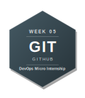
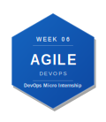
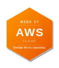
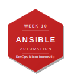
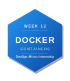

# DevOps Micro Internship with Agentic AI — My Journey

> 👋 **New here?** Read the [submission instructions](./onboarding) first — how to fork, fill in, and submit your assignments.
> Find all the required links & assignment guidelines from here [Required links](./dmi_cohort3_resources.md)

---

## About Me
|---|---|
| **Name** | Nji Menyonga Ariane Ruth |
| **LinkedIn** | [Nji Ariane Ruth](https://www.linkedin.com/in/nji-ariane-ruth-494805172) |
| **Location** | Douala, Cameroon |
| **Background** | Aspiring DevOps Engineer (currently building skills in Cloud, Linux, and CI/CD) |
---

## About the Program

**DevOps Micro Internship with Agentic AI** is a 14-week mentor-led cohort program by [Pravin Mishra](https://www.linkedin.com/in/pravin-mishra-aws-trainer/) — Cloud, DevOps & AI consultant with 15+ years of experience, 5,000+ learners trained, and 20K+ LinkedIn followers.

This is not a course. It is an internship-style program — real deployments, real pipelines, real evidence reviewed by mentors every week.

- 🌐 Program Website: https://dmi.pravinmishra.com
- 💬 Discord Community: https://discord.pravinmishra.com
- 📺 YouTube: [Pravin Mishra](https://www.youtube.com/@awswithpravinmishra)
- 🔗 Instructor: [LinkedIn](https://www.linkedin.com/in/pravin-mishra-aws-trainer/)

---

## 🏆 Achievements

### Champion of the Week

<!-- If you were named Champion of the Week, add the badge below and link to your LinkedIn post -->

| Week | Award | Post |
|------|-------|------|
| <!-- e.g. Week 03 --> | <!-- 🏆 Champion of the Week --> | <!-- [LinkedIn Post](#) --> |

### Leaderboard

<!-- Add your cohort leaderboard rank here as you progress -->

> 🥇 Cohort 3 Rank: **#__** <!-- Update this each week -->

---

## My DevOps Stack

*Earn a badge each week. To unlock: remove the `<!--` and `-->` from the badge line below.*

*Share your stack:* `https://github.com/YOUR-USERNAME/devops-micro-internship-pravinmishra#my-devops-stack`

**Preview — what your full stack looks like:**

---

**Your stack (uncomment each badge as you earn it):**

<!-- Week 00 → Internet & Networking Basics -->

<!-- Week 01 → Success Mindset -->

<!-- Week 02 → Agentic AI with Claude Code -->

<!-- Week 03 → Linux & Bash for DevOps -->

<!-- Week 04 → Git & GitHub -->
<!--  -->

<!-- Week 05 → DevOps Lifecycle & Agile -->
<!--  -->

<!-- Week 06 → AWS Cloud -->
<!--  -->

<!-- Week 07 → Azure Cloud -->
<!--  -->

<!-- Week 08 → Terraform -->
<!--  -->

<!-- Week 09 → Ansible -->
<!--  -->

<!-- Week 10 → Azure DevOps CI/CD -->
<!--  -->

<!-- Week 11 → Docker -->
<!--  -->

<!-- Week 12 → Kubernetes -->
<!--  -->

<!-- Week 13 → Final Project / Capstone -->
<!--  -->

*Complete a week → uncomment the badge → watch your stack grow.*

---

## Program Overview

| Phase | Weeks | Focus |
|-------|-------|-------|
| Foundation | 00 – 02 | Networking, Mindset, Agentic AI |
| Core DevOps | 03 – 05 | Linux & Bash, Git, DevOps Lifecycle |
| Cloud | 06 – 07 | AWS & Azure Real Deployments |
| Automation | 08 – 10 | Terraform, Ansible, CI/CD |
| Containers | 11 – 12 | Docker & Kubernetes |
| Capstone | 13 | Final Project |

---

## Weekly Progress
| 00 | Internet & Networking Basics | ✅ Completed | ✅ Solved | [Post](https://www.linkedin.com/posts/nji-ariane-ruth-494805172_epic-reads-shop-young-adult-ya-books-activity-7457318965690863616-OvN_?utm_source=share&utm_medium=member_desktop&rcm=ACoAACkN5HAB_6uWL_--MIEwRhEZ_BLCaqDxIoo) | — |
| 01 | Success Mindset | ✅ Completed | ✅ Solved | [Post](https://www.linkedin.com/posts/nji-ariane-ruth-494805172_week-1-reflection-what-i-learned-about-activity-7478581544467509248-ZtMo?utm_source=share&utm_medium=member_desktop&rcm=ACoAACkN5HAB_6uWL_--MIEwRhEZ_BLCaqDxIoo) | — |
| 02 | Agentic AI with Claude Code | ✅ Solved | ✅ Solved | [Post](https://www.linkedin.com/posts/nji-ariane-ruth-494805172_dmibypravinmishra-agenticai-claudecode-ugcPost-7481415269890899968-B4cE/?utm_source=share&utm_medium=member_desktop&rcm=ACoAACkN5HAB_6uWL_--MIEwRhEZ_BLCaqDxIoo) | [Blog](https://medium.com/@njiariana/week-02-agentic-ai-reflection-blog-md-ac3c547687f5?sharedUserId=njiariana) |
| 03 | Linux for DevOps | ✅ Solved | ✅ Solved | [Post](https://www.linkedin.com/posts/nji-ariane-ruth-494805172_devops-linux-bash-activity-7485082476235804673-igvk) | [Blog](https://medium.com/@njiariana/building-an-ai-assisted-linux-incident-triage-workflow-with-bash-and-claude-code-395cf8a9a8de?sharedUserId=njiariana) ||
| 04 | Bash Scripting | ⬜ Not Started | ⏳ Pending | — | — |
| 05 | Git & GitHub | ⬜ Not Started | ⏳ Pending | — | — |
| 06 | DevOps Lifecycle & Agile | ⬜ Not Started | ⏳ Pending | — | — |
| 07 | AWS Cloud | ⬜ Not Started | ⏳ Pending | — | — |
| 08 | Azure Cloud | ⬜ Not Started | ⏳ Pending | — | — |
| 09 | Terraform | ⬜ Not Started | ⏳ Pending | — | — |
| 10 | Ansible | ⬜ Not Started | ⏳ Pending | — | — |
| 11 | Azure DevOps (CI/CD) | ⬜ Not Started | ⏳ Pending | — | — |
| 12 | Docker | ⬜ Not Started | ⏳ Pending | — | — |
| 13 | Kubernetes | ⬜ Not Started | ⏳ Pending | — | — |
| 14 | Final Project | ⬜ Not Started | ⏳ Pending | — | — |
=======
| 00 | Internet & Networking Basics | ⬜ Not Started | ⏳ Pending | — | — |
| 01 | Success Mindset | ⬜ Not Started | ⏳ Pending | — | — |
| 02 | Agentic AI with Claude Code | ⬜ Not Started | ⏳ Pending | — | — |
| 03 | Linux & Bash for DevOps | ⬜ Not Started | ⏳ Pending | — | — |
| 04 | Git & GitHub | ⬜ Not Started | ⏳ Pending | — | — |
| 05 | DevOps Lifecycle & Agile | ⬜ Not Started | ⏳ Pending | — | — |
| 06 | AWS Cloud | ⬜ Not Started | ⏳ Pending | — | — |
| 07 | Azure Cloud | ⬜ Not Started | ⏳ Pending | — | — |
| 08 | Terraform | ⬜ Not Started | ⏳ Pending | — | — |
| 09 | Ansible | ⬜ Not Started | ⏳ Pending | — | — |
| 10 | Azure DevOps (CI/CD) | ⬜ Not Started | ⏳ Pending | — | — |
| 11 | Docker | ⬜ Not Started | ⏳ Pending | — | — |
| 12 | Kubernetes | ⬜ Not Started | ⏳ Pending | — | — |
| 13 | Final Project | ⬜ Not Started | ⏳ Pending | — | — |
>>>>>>> upstream/main

**Status:** ⬜ Not Started &nbsp;|&nbsp; 🔄 In Progress &nbsp;|&nbsp; ✅ Completed 
**Assignment:** ⏳ Pending &nbsp;|&nbsp; ✅ Solved

---

## Certificate of Completion

*Awarded upon completing Week 13 — Final Project.*

<!-- Drop your certificate image here -->

---

## Connect

If you found this repo useful or want to follow my DevOps journey:

- ⭐ Star this repo
- 🔗 Connect with me on [LinkedIn](#)
- 🌐 Learn more about the program: https://dmi.pravinmishra.com
- 💬 Join the community: https://discord.pravinmishra.com
