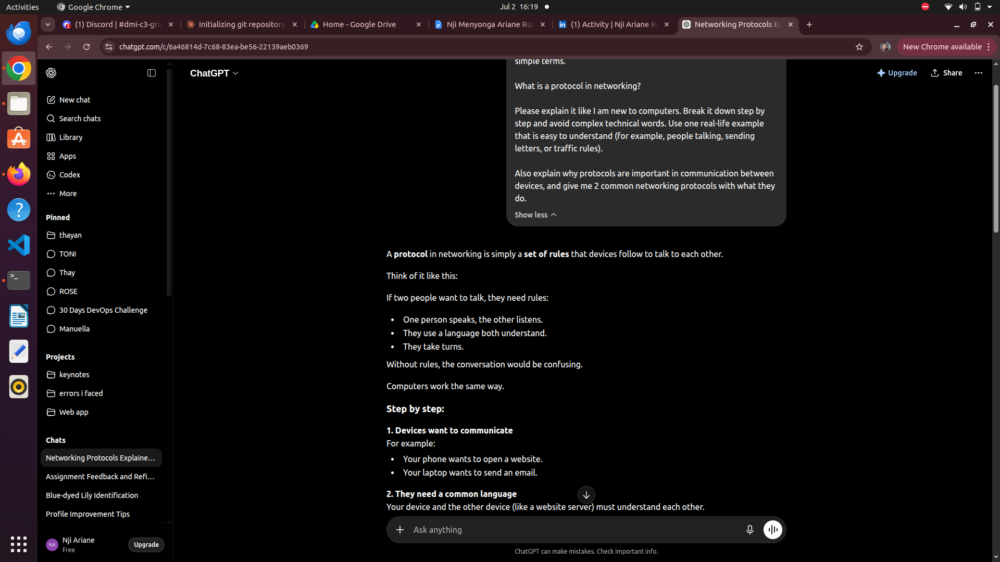
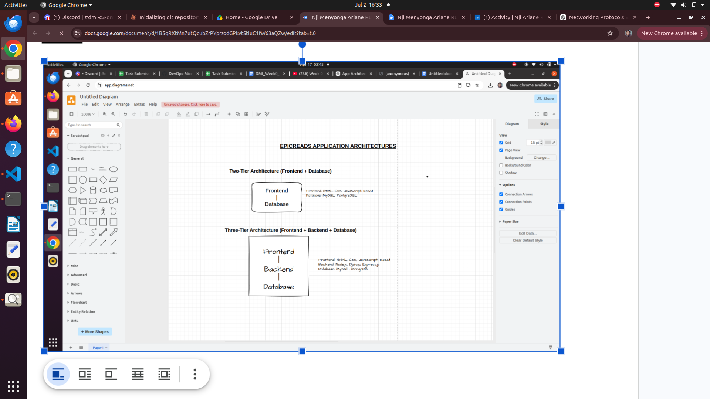
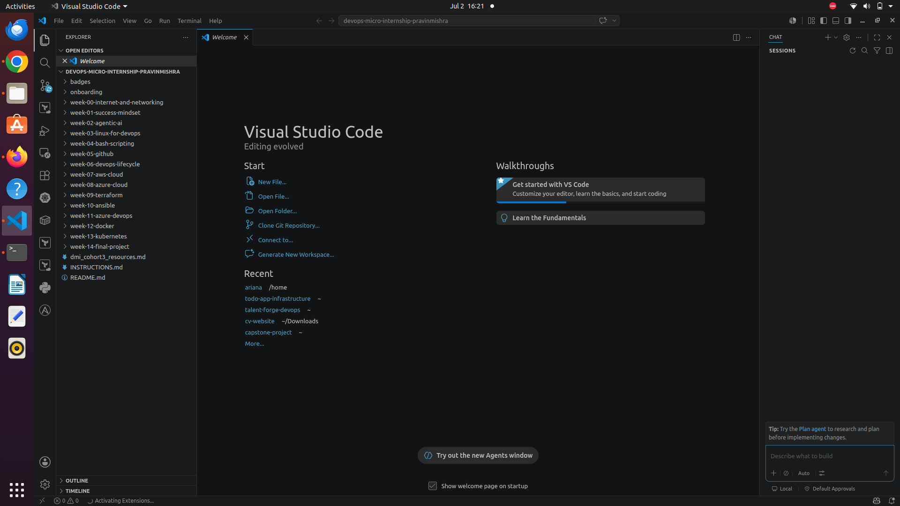

# Week 00 - Internet and Networking

Part of the DevOps Micro Internship (DMI) Cohort 3 with Agentic AI

---

# 🧑‍💻 Task 1: Using ChatGPT as Your Learning Assistant

## Scenario

You're new to DevOps and will frequently encounter technical questions. ChatGPT can be your learning companion.

## Your Task

Write a clear ChatGPT prompt to help you understand:

> "What is a protocol in networking? Explain with a simple real-life example."

Take a screenshot of your interaction showing:

* Your detailed prompt (with clear expectations)
* ChatGPT's simplified response with an example

## Screenshot

Save your screenshot in the `screenshots` folder and update the file name below.




Replace `task-1-chatgpt.png` with your actual screenshot file name.

---

## What I Learned (2–3 lines)

Add your answer here...

Using ChatGPT as a learning assistant helped me understand that a protocol is simply a set of agreed-upon rules that allow devices to communicate. Seeing a real-life example made an abstract concept much easier to grasp. I also learned that writing a clear, specific prompt gets a much more useful and simplified answer than a vague one.--

# 🌐 Task 2: Internet and Networking

## Scenario

Your friend is launching an online bookstore named **EpicReads**.

He asked you to explain how users globally can access his website hosted in Finland.

## Your Task

Write a short explanation (**100–150 words**) that includes:

* Packet Switching
* IP Address
* TCP/IP
* HTTP/HTTPS

💡 **Tip:** You may use ChatGPT (as demonstrated in Task 1) to refine your explanation.

## Answer

Add your answer here...

---Users around the world can access EpicReads because of how the internet moves data using packet switching. When someone visits the website, their request is broken into small pieces called packets and sent across different routes to reach the server in Finland. Each device on the internet has a unique IP address, which helps direct these packets to the correct destination. The TCP/IP protocol ensures that all packets arrive correctly and are reassembled in the right order. Once the request reaches the server, the website is delivered using HTTP or the more secure HTTPS, which protects user data. Together, these technologies allow users anywhere in the world to quickly and safely access the EpicReads online bookstore.

# 🏗️ Task 3: Application Architecture & Stack

## Scenario

EpicReads bookstore has two application versions:

### Two-Tier Application

* Frontend
* Database

### Three-Tier Application

* Frontend
* Backend
* Database

## Your Task

* Draw simple diagrams (hand-drawn or tool-based such as draw.io)
* Label each layer clearly
* List at least two common technologies or tools used for each layer
* Submit a screenshot or photo clearly showing your own drawing

## Diagram Screenshot / Photo

Save your diagram image in the `screenshots` folder and update the file name below.




Replace `task-3-diagram.png` with your actual diagram file name.

---

## Technologies Used

### Frontend

* HTML/CSS/JavaScript
* React

### Backend

* Node.js (Express)
* Python (Django/Flask)

### Database

* MySQL
* MongoDB
---

# 🌍 Task 4: Domain Name & DNS (Basic Concepts)

## Scenario

Your friend's bookstore **EpicReads** is currently accessible through:

```text
52.172.142.222:3000
```

He purchased the domain:

```text
epicreads.com
```

## Your Task

In **50–100 words**, explain in your own words:

1. What is DNS (Domain Name System)?
2. Which DNS record type should be used to connect the domain to the given IP, and why?

## Answer

The Domain Name System (DNS) is like the internet’s phonebook. It converts easy-to-remember names like  epicreads.com into an IP address like 52.172.142.222, so browsers can find the website.To connect the domain to the IP, you use an A record. This record links the domain name directly to the server’s IP address. When someone types epicreads.com, the A record tells the browser exactly which IP to go to, making the website accessible.


---

# 💻 Task 5: Visual Studio Code Setup (Hands-on)

## Your Task

Install Visual Studio Code (if not already installed).

Take a screenshot of your VS Code environment showing:

* Terminal open inside VS Code
* Running a basic command:

### Windows

```powershell
dir
```

### Linux / macOS

```bash
pwd
ls
```

* Your selected VS Code theme clearly visible

⚠️ **Important:** The screenshot must show your username or another identifiable detail to confirm it is your environment.

## Screenshot

Save your screenshot in the `screenshots` folder and update the file name below.




Replace `task-5-vscode.png` with your actual screenshot file name.

---

# 🔗 Task 6: Publish Your Assignment as a LinkedIn Post

## Objective

Publishing on LinkedIn helps you:

* Build your professional online presence
* Reinforce your learning
* Document your DevOps journey publicly

## Your Task

Summarize your answers from Tasks 1–5 into a LinkedIn post.

Clearly structure your post into the following sections:

* ChatGPT
* Internet & Networking
* App Architecture
* DNS
* VS Code Setup

Add the following credit note at the end of your post:

> **P.S. This post is a part of DevOps Micro Internship with Agentic AI Cohort-3 by Pravin Mishra. You can start your DevOps journey by joining this Discord community: https://discord.pravinmishra.com/**

---

## LinkedIn Post URL

Paste your LinkedIn post URL here:

```text
Add your URL here... 
```https://www.linkedin.com/posts/nji-ariane-ruth-494805172_epic-reads-shop-young-adult-ya-books-activity-7457318965690863616-OvN_?utm_source=share&utm_medium=member_desktop&rcm=ACoAACkN5HAB_6uWL_--MIEwRhEZ_BLCaqDxIoo

---

## LinkedIn Post Backup Copy

Paste the full text of your LinkedIn post here:

Add your post content here...

---DevOps Learning Journey Micro Internship (Tasks 1–5)
As part of my ongoing transition into DevOps, I have been strengthening my understanding of core infrastructure and web system concepts through a structured micro internship. Below is a concise overview of my progress so far.
 - ChatGPT (Learning Enablement Tool)
 Used as a support tool to clarify concepts, improve technical writing, and reinforce understanding of DevOps fundamentals.
- Internet & Networking Fundamentals
 Gained a clearer understanding of how distributed systems communicate over the internet using packet switching, IP addressing, TCP/IP protocols, and HTTP/HTTPS for secure and reliable data transfer.
- Application Architecture
Two-tier architecture: Direct communication between frontend and database
Three-tier architecture: Separation of concerns using frontend, backend, and database layers for improved scalability, maintainability, and security
- DNS (Domain Name System)
 Understood how DNS resolves human-readable domain names (e.g., epicreads.com) into IP addresses. Implemented understanding of A records for mapping domains to server endpoints.
- Development Environment (VS Code)
 Configured a development environment using VS Code with relevant extensions to improve productivity, code organization, and workflow efficiency.
This exercise has strengthened my foundational understanding of how modern applications are structured and how data flows across systems in production environments.
I am actively building toward a DevOps and Cloud Engineering career path with consistent hands-on learning. 

 P.S. This post is part of the FREE DevOps Micro Internship Cohort run by Pravin Mishra. You can start your DevOps journey for free from his YouTube Playlist.

# Reflection – Week 0

### What did you find easy?

Add your answer here...
Writing the Task 2 and Task 4 explanations was straightforward since I could clearly break down concepts like packet switching, TCP/IP, and DNS once I understood the analogy of the internet as a postal/phonebook system.
---

### What was difficult?

Add your answer here...
Setting up the repository and Git workflow was more challenging than expected — I ran into issues with remotes pointing to the wrong repository, permission errors when pushing to my mentor's repo instead of my own fork, and organizing screenshots and files into the correct folders.
---

### What will you improve next week?

Add your answer here...
I want to get more comfortable with Git remotes and branching so I don't run into permission or setup issues again, and be more organized about saving and naming screenshots as I go instead of after the fact.
---

## 📌 About DMI & CloudAdvisory

DevOps Micro Internship (DMI) is a project-based DevOps program run by Pravin Mishra (The CloudAdvisory) focused on real-world execution, systems thinking, and career readiness.

It helps learners build strong DevOps foundations with hands-on experience.


## 📌 Resources

- 🌐 **DMI Official Website:** https://pravinmishra.com/dmi  
- 🎓 **DevOps for Beginners (Udemy):** https://www.udemy.com/course/devops-for-beginners-docker-k8s-cloud-cicd-4-projects/  
- 🎓 **Ultimate Agentic AI DevOps with Clude Code** https://www.udemy.com/course/ultimate-agentic-ai-devops-with-claude-code/?referralCode=448389767BC96284087B
- 🎓 **DevOps with Claude Code: Terraform, EKS, ArgoCD & Helm** https://www.udemy.com/course/devops-with-claude-code-terraform-eks-argocd-helm/?referralCode=1C5B734505D65A010FA3
- ▶️ **YouTube Playlist (DMI Cohort 3):** https://www.youtube.com/playlist?list=PLFeSNDtI4Cho  
- 🔗 **Pravin Mishra (LinkedIn):** https://www.linkedin.com/in/pravin-mishra-aws-trainer/  
- 🏢 **CloudAdvisory (LinkedIn):** https://www.linkedin.com/company/thecloudadvisory/

---

*This submission is part of DevOps Micro Internship (DMI) Cohort 3 — Agentic AI Track*
