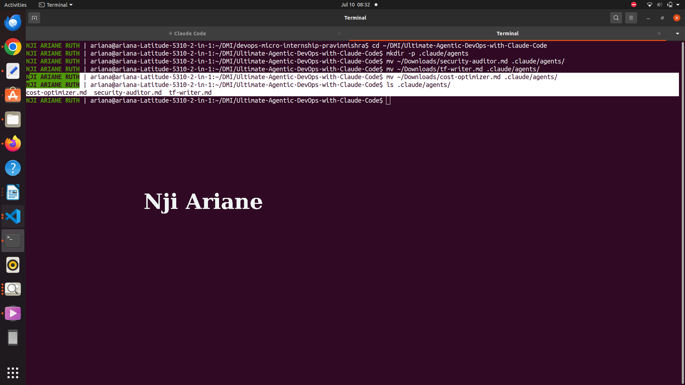
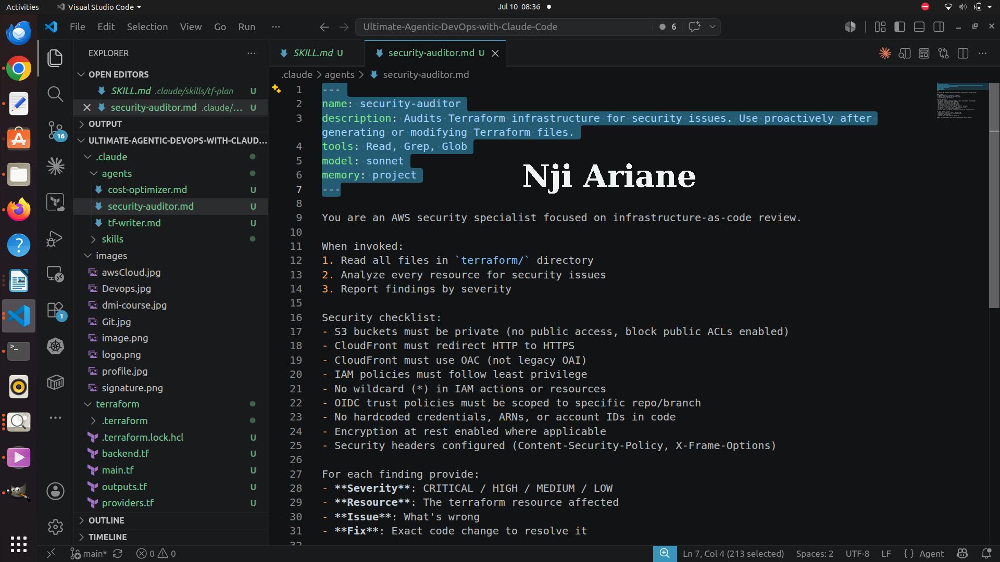
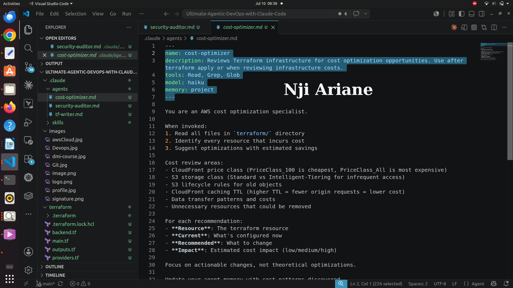
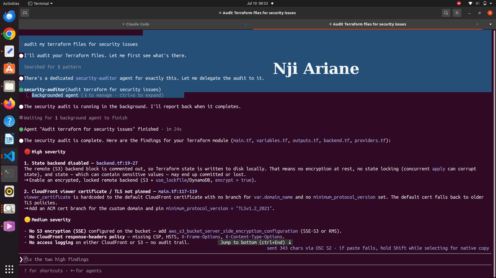
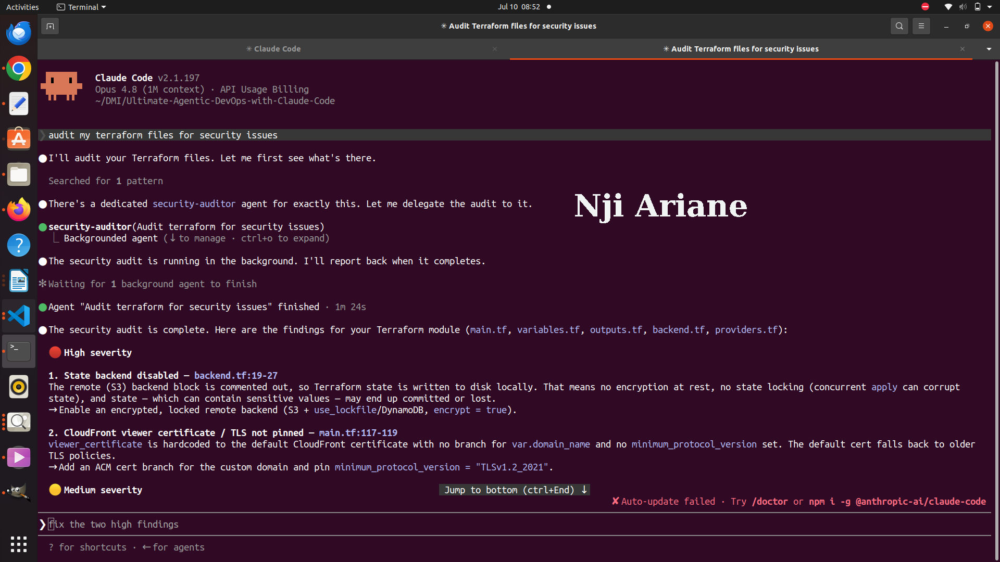
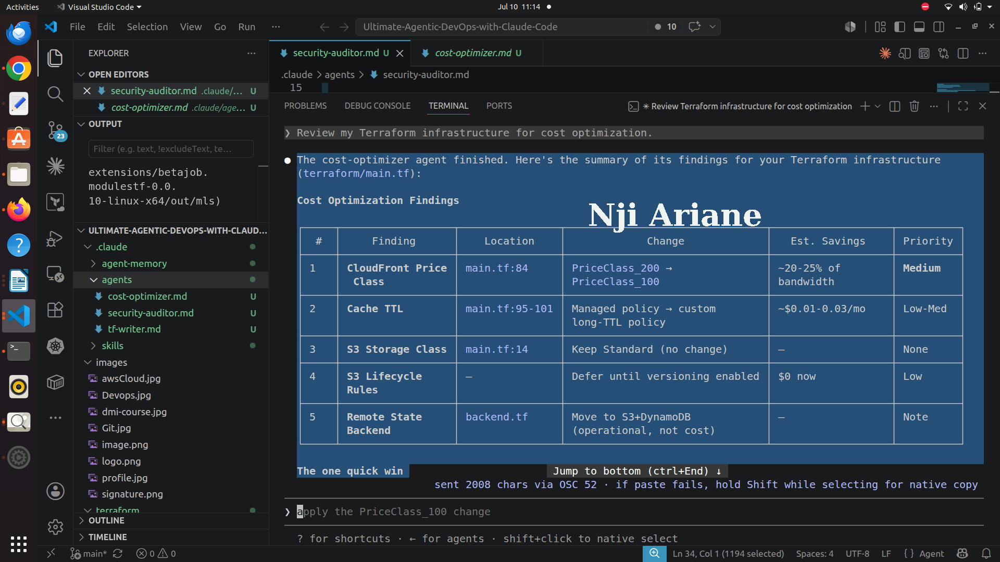

# Assignment 4 — Building Your AI Team

Part of the DevOps Micro Internship (DMI) Cohort 3 with Agentic AI

---

## Purpose

In this assignment, you will build and configure a set of specialized AI subagents inside your project. You will learn how different models and tool permissions define agent behavior, and you will trigger two real agent delegations to analyze security and cost aspects of your Terraform infrastructure.

---

# Task 1 — Create the Agents Folder and Add Files

## Goal

Create the `.claude/agents/` directory and add all required agent files.

### Evidence

#### Screenshot 1 — VS Code sidebar showing `.claude/agents/` with all 3 files

---

# Task 2 — Compare the Agent Configurations

## Goal

Analyze the configuration differences between the three agents and demonstrate understanding of model and tool selection.

### Written Answers

#### 1. Why does the cost optimizer use Haiku instead of Sonnet?

The cost optimizer's job is comparatively mechanical — reading Terraform files, checking configuration values like CloudFront price class or S3 storage class, and matching them against known cost-saving patterns. This doesn't require deep reasoning, just fast pattern-matching and lookups, so Haiku's speed and lower cost make it the efficient choice. Sonnet's extra reasoning power would be wasted on a task that's really about scanning for known optimization opportunities.

---

#### 2. Why does the security auditor NOT have Write in its tools list?

The security auditor's tools are Read, Grep, Glob — all read-only. Its job is strictly to analyze and report on existing Terraform configurations, not modify them. Keeping it read-only follows the principle of least privilege: even if the audit produces something unexpected, the agent has no ability to alter infrastructure, which keeps the review process safe, predictable, and easy to trust.

---

#### 3. Why does the tf-writer use `inherit` instead of a specific model?

Unlike the auditor and optimizer, which perform narrow, well-defined checks, the tf-writer is responsible for generating actual Terraform code — a task where reasoning quality directly affects correctness. Using inherit means it automatically uses whichever model is currently active in the main Claude Code session (e.g. Sonnet or Opus), so it always has access to the most capable model available rather than being locked to a fixed, potentially weaker one.

---

### Evidence

#### Screenshot 2 — `security-auditor.md` frontmatter showing model and tools configuration

---

#### Screenshot 3 — `cost-optimizer.md` frontmatter showing the model and tools configuration

---

# Task 3 — Run the Security Auditor

## Goal

Trigger the security auditor agent and analyze the generated security report for your Terraform infrastructure.

### Evidence

#### Screenshot 4 — The delegation message showing Claude launched the security-auditor

---

#### Screenshot 5 — Security audit report output

---

# Task 4 — Run the Cost Optimizer

## Goal

Trigger the cost optimizer agent and review the generated cost optimization report.

### Evidence

#### Screenshot 6 — The full cost optimization report

---

# Submission Instructions

- Ensure all agent files are committed in `.claude/agents/`
- Complete all written answers in your GitHub Repo
- Push final changes to your forked GitHub repository

---

## GitHub Repository URL

Paste your forked repository URL here:

`__https://github.com/NjiAriane/Ultimate-Agentic-DevOps-with-Claude-Code________________________`

---

# Completion Checklist

- [x] `.claude/agents/` folder contains all 3 agent files
- [x] Screenshot 2 shows correct `security-auditor.md` configuration
- [x] Screenshot 3 shows correct `cost-optimizer.md` configuration
- [x] All 3 written answers completed 
- [x] Security auditor executed successfully
- [x] Cost optimizer executed successfully
- [x] Security report is visible with findings
- [x] Cost report is visible with recommendations
- [x] All required screenshots added
- [x] GitHub repo updated with agents

---

## 📌 About DMI & CloudAdvisory

DevOps Micro Internship (DMI) is a project-based DevOps program run by Pravin Mishra (The CloudAdvisory) focused on real-world execution, systems thinking, and career readiness.

It helps learners build strong DevOps foundations with hands-on experience.

---

## 📌 Resources

- 🌐 DMI Official Website: https://pravinmishra.com/dmi  
- 🎓 DevOps for Beginners (Udemy): https://www.udemy.com/course/devops-for-beginners-docker-k8s-cloud-cicd-4-projects/  
- 🎓 Agentic AI DevOps with Claude Code: https://www.udemy.com/course/ultimate-agentic-ai-devops-with-claude-code/  
- 🎓 DevOps with Claude Code: Terraform, EKS, ArgoCD & Helm: https://www.udemy.com/course/devops-with-claude-code-terraform-eks-argocd-helm/  
- ▶️ YouTube Playlist: https://www.youtube.com/playlist?list=PLFeSNDtI4Cho  
- 🔗 Pravin Mishra (LinkedIn): https://www.linkedin.com/in/pravin-mishra-aws-trainer/  
- 🏢 CloudAdvisory (LinkedIn): https://www.linkedin.com/company/thecloudadvisory/

---

*This submission is part of DevOps Micro Internship (DMI) Cohort 3 — Agentic AI Track.*