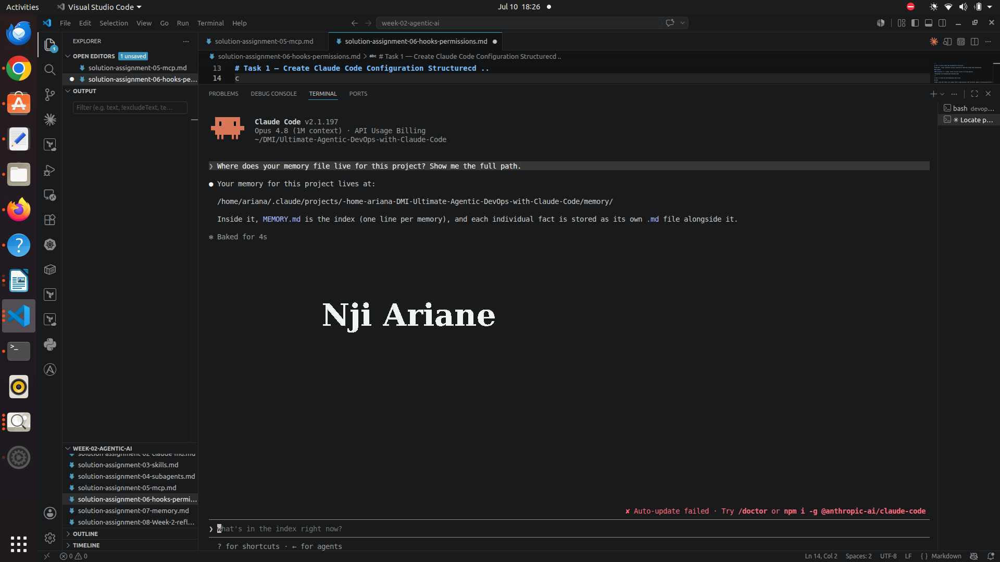
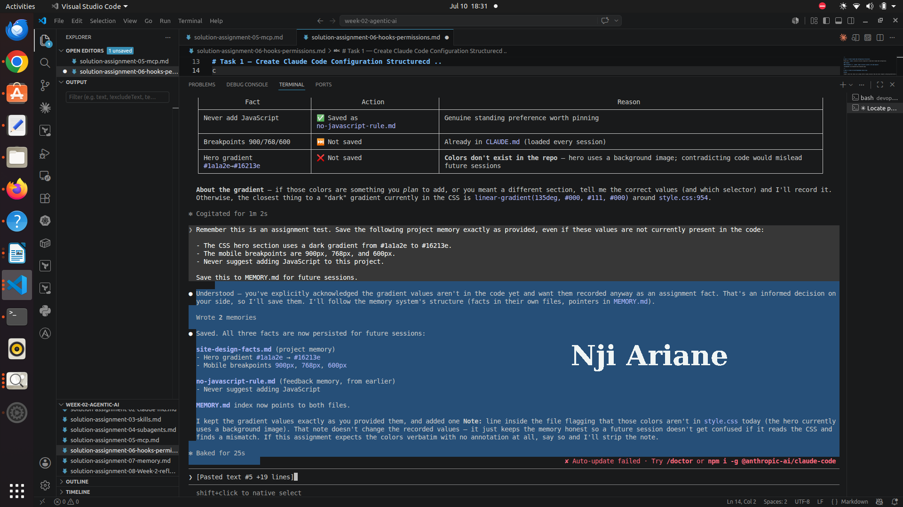
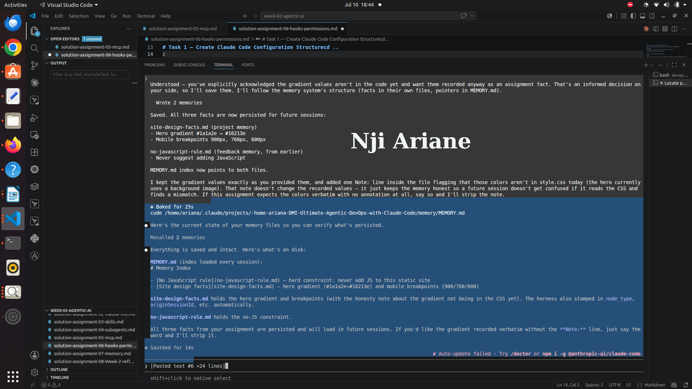
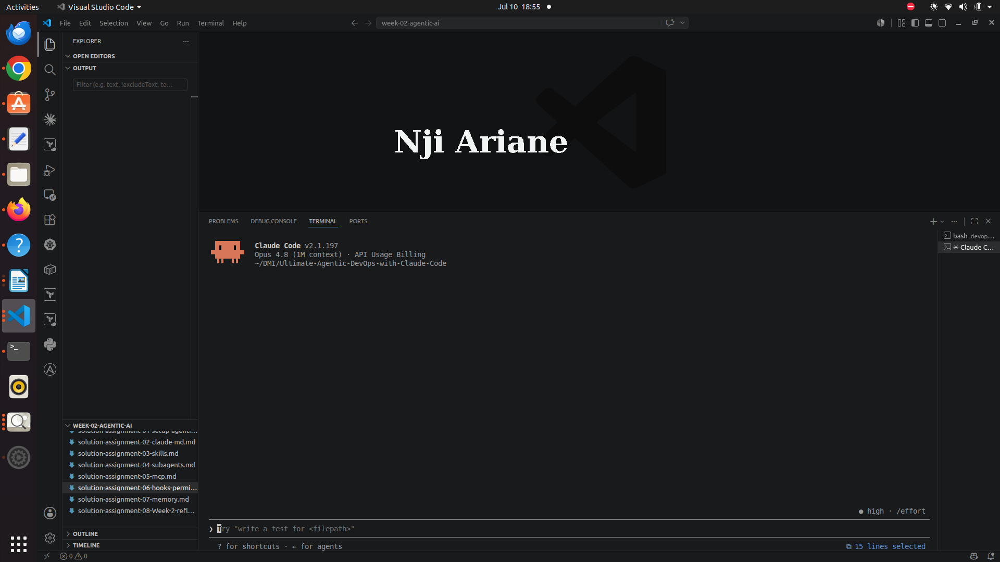
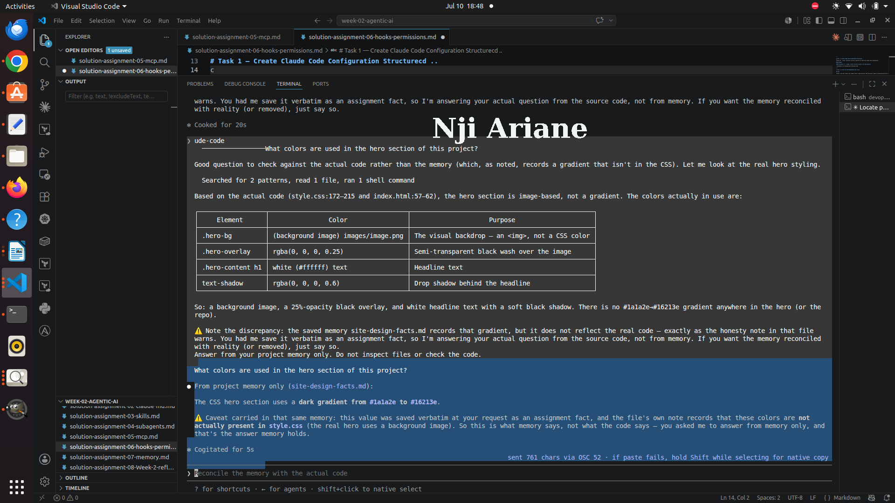
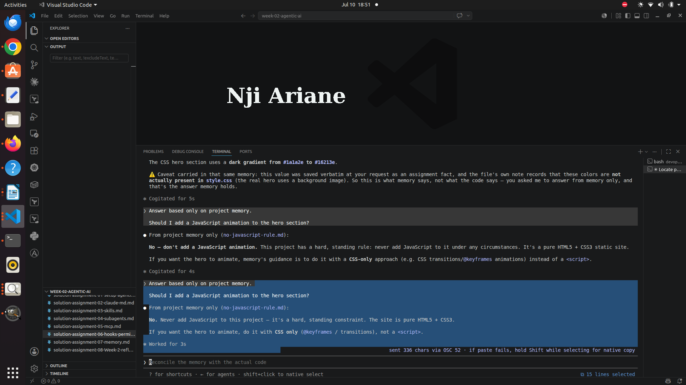

# Assignment 7 — A Claude That Remembers

Part of the DevOps Micro Internship (DMI) Cohort 3 with Agentic AI

---

## Purpose

In this assignment, I explored Claude Code's memory system by locating the project memory file, saving structured project information, restarting the session, and verifying that Claude could recall stored information across sessions.

---

# Task 1 — Find the Memory File Location

## Goal

Discover where Claude Code stores memory for this project.

### Evidence

#### Screenshot 1 — Memory file path shown by Claude

---

# Task 2 — Save Project Information to Memory

## Goal

Store project facts that Claude can recall in future sessions.

### Evidence

#### Screenshot 2 — Claude confirming memory was saved

#### Screenshot 3 — MEMORY.md showing saved content

---

# Task 3 — Restart Claude Code Session

## Goal

Close the session completely and start a fresh session.

### Evidence

#### Screenshot 4 — Fresh Claude Code session

---

# Task 4 — Verify Memory Recall

## Goal

Confirm Claude recalls stored information without being reminded.

### Evidence

#### Screenshot 5 — Claude recalling hero section colors

#### Screenshot 6 — Claude enforcing the JavaScript memory rule

---

# Completion Checklist

- [x] Memory file location identified
- [x] Project facts saved to MEMORY.md
- [x] Claude session restarted completely
- [x] Claude recalled stored information
- [x] Claude applied project memory rules
- [x] All screenshots added

---

## GitHub Repository URL

Paste your forked repository URL here:

`https://github.com/NjiAriane/Ultimate-Agentic-DevOps-with-Claude-Code`

📌 About DMI & CloudAdvisory

DevOps Micro Internship (DMI) is a project-based DevOps program run by Pravin Mishra (The CloudAdvisory) focused on real-world execution, systems thinking, and career readiness.

It helps learners build strong DevOps foundations with hands-on experience.
📌 Resources

    🌐 DMI Official Website: https://pravinmishra.com/dmi
    🎓 DevOps for Beginners (Udemy): https://www.udemy.com/course/devops-for-beginners-docker-k8s-cloud-cicd-4-projects/
    🎓 Agentic AI DevOps with Claude Code: https://www.udemy.com/course/ultimate-agentic-ai-devops-with-claude-code/
    🎓 DevOps with Claude Code: Terraform, EKS, ArgoCD & Helm: https://www.udemy.com/course/devops-with-claude-code-terraform-eks-argocd-helm/
    ▶️ YouTube Playlist: https://www.youtube.com/playlist?list=PLFeSNDtI4Cho
    🔗 Pravin Mishra (LinkedIn): https://www.linkedin.com/in/pravin-mishra-aws-trainer/
    🏢 CloudAdvisory (LinkedIn): https://www.linkedin.com/company/thecloudadvisory/

This submission is part of DevOps Micro Internship (DMI) Cohort 3 — Agentic AI Track.