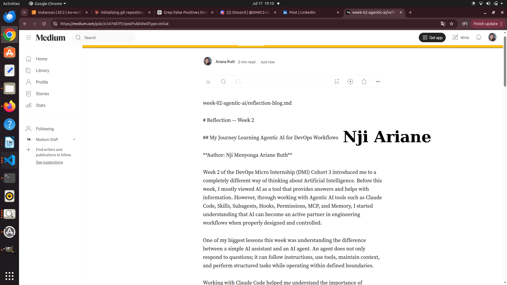
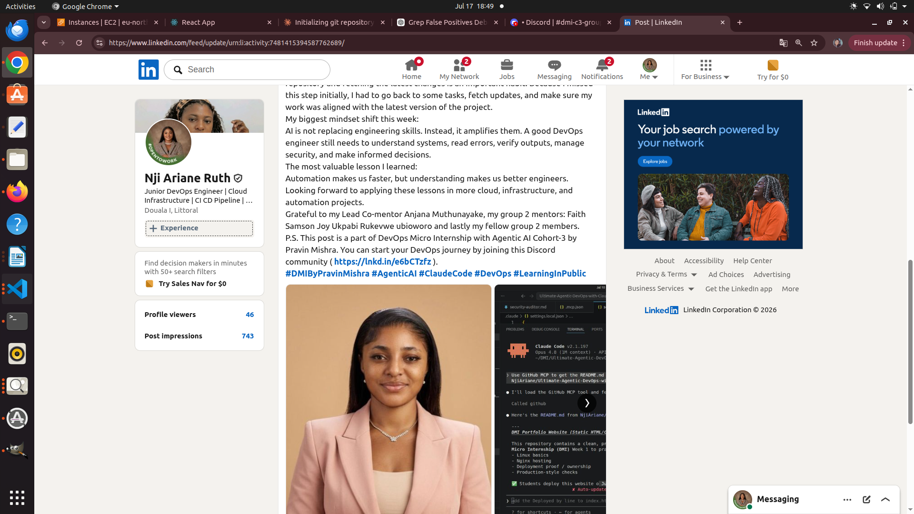

<<<<<<< HEAD:week-02-agentic-ai/solution-assignment-08-Week-2-reflection.md
=======
# Assignment 8 — Week 2 Reflection Blog

Part of the DevOps Micro Internship (DMI) Cohort 3 with Agentic AI

---

# Purpose

In this assignment, you will reflect on your Week 2 learning journey and write a short blog capturing your experience working with Agentic AI tools such as Claude Code, Skills, Subagents, MCP, Hooks, Permissions, and Memory.

You will also publish a LinkedIn post summarizing your learning and share both links for evaluation.

---

# Task 1 — Write Your Reflection Blog

## Goal

Write a reflection blog covering your Week 2 learning experience.

### Blog Requirements

Your blog must include:

* Title: **Reflection – Week 2**
* Minimum 300 words
* At least 2–3 topics from Week 2 (Claude Code, Skills, Subagents, MCP, Hooks, Permissions, Memory)
* Honest personal reflection (learning, challenges, mindset)
* One habit/system you plan to implement
* Your full name clearly visible

### Allowed Platforms

You can publish your blog on:

* Hashnode
* Medium
* Dev.to
* LinkedIn Article
* GitHub Markdown file
* Substack

---

### Evidence

#### Screenshot 1 — Blog published and visible




### Submission Field

Blog Link:

`__https://medium.com/@njiariana/week-02-agentic-ai-reflection-blog-md-ac3c547687f5?sharedUserId=njiariana________________________________________`

---

# Task 2 — Create LinkedIn Post

## Goal

Share your Week 2 learning publicly on LinkedIn.

---

### LinkedIn Post Requirements

Your post must include:

* One screenshot from any Week 2 assignment
* Short reflection (what you learned or built)
* Required P.S. line exactly as given below

---

### Required P.S. Line (Must Include Exactly)

> **P.S. This post is a part of DevOps Micro Internship with Agentic AI Cohort-3 by [Pravin Mishra](https://www.linkedin.com/in/pravin-mishra-aws-trainer/). You can start your DevOps journey by joining [DMI waiting list](https://forms.gle/3hvrWJBDzsDeJoPs6) (https://forms.gle/3hvrWJBDzsDeJoPs6).**

---

### Suggested Hashtags

#DMIByPravinMishra #AgenticAI #ClaudeCode #DevOps #LearningInPublic

---

### Evidence

#### Screenshot 2 — LinkedIn post published



### Submission Field

LinkedIn Post Content (copy-paste here):

```
Week 2 Reflection: Learning Agentic AI with Claude Code and DevOps
This week of the DevOps Micro Internship has been a major learning experience. I moved beyond seeing AI as just a question-answering tool and started understanding how Agentic AI can become part of a real engineering workflow.
I explored how Claude Code can support DevOps tasks through structured instructions, automation, and safety controls.Some of my key learnings:
🔹 Agentic Loop & CLAUDE.md
I learned that AI agents work better when they have clear context, rules, and project instructions. A well-structured CLAUDE.md file helps guide Claude’s behavior and keeps the workflow consistent.
🔹 Skills and Subagents
I discovered how reusable skills and specialized subagents can improve productivity by breaking complex tasks into smaller, focused workflows. Instead of repeating long instructions, we can create reusable processes that make our work more efficient.
🔹 MCP (Model Context Protocol)
Connecting Claude to external systems showed me how AI agents can interact with real-world tools and data sources. This changed my perspective on AI from being only conversational to being capable of supporting engineering operations.
🔹 Hooks and Permissions
One of my biggest highlights was implementing safety rails for Claude Code. Learning about UserPromptSubmit hooks, PreToolUse hooks, PostToolUse logging, and permission controls showed me that automation must always come with security and governance.
Giving AI more power requires giving it the right boundaries.
🔹 Memory
The memory system helped me understand how AI assistants can maintain project knowledge across sessions. This is important for long-term projects where decisions, conventions, and rules need to remain consistent.
One of my biggest personal lessons this week was about Git upstream workflows.
I learned that before starting work on any project, checking the upstream repository and fetching the latest changes is an important habit. Because I missed this step initially, I had to go back to some tasks, fetch updates, and make sure my work was aligned with the latest version of the project.
My biggest mindset shift this week:
AI is not replacing engineering skills. Instead, it amplifies them. A good DevOps engineer still needs to understand systems, read errors, verify outputs, manage security, and make informed decisions.
The most valuable lesson I learned:
Automation makes us faster, but understanding makes us better engineers.
Looking forward to applying these lessons in more cloud, infrastructure, and automation projects.
Grateful to my Lead Co-mentor Anjana Muthunayake, my group 2 mentors: Faith Samson Joy Ukpabi Rukevwe ubioworo and lastly my fellow group 2 members. 
P.S. This post is a part of DevOps Micro Internship with Agentic AI Cohort-3 by Pravin Mishra. You can start your DevOps journey by joining this Discord community ( https://lnkd.in/e6bCTzfz ).
#DMIByPravinMishra #AgenticAI #ClaudeCode #DevOps #LearningInPublic
---

### LinkedIn Post Link:

`________https://www.linkedin.com/posts/nji-ariane-ruth-494805172_dmibypravinmishra-agenticai-claudecode-ugcPost-7481415269890899968-B4cE/?utm_source=share&utm_medium=member_desktop&rcm=ACoAACkN5HAB_6uWL_--MIEwRhEZ_BLCaqDxIoo__________________________________`

---

# Submission Instructions

* Blog must be publicly accessible
* LinkedIn post must be visible (public or unlisted where applicable)
* All required fields must be filled
* Screenshot proofs must be added to GitHub repository
* Do not include sensitive information in blog or post

---

# Completion Checklist

* [x] Blog written with required structure
* [x] Blog includes at least 2–3 Week 2 topics
* [x] Blog is publicly accessible
* [x] LinkedIn post created
* [x] Required P.S. line included
* [x] LinkedIn post content copied in submission field
* [x] Blog link added
* [x] LinkedIn post link added
* [x] Screenshots added to GitHub repo

---

# About DMI & CloudAdvisory

DevOps Micro Internship (DMI) is a project-based DevOps program run by Pravin Mishra (The CloudAdvisory), focused on real-world execution, systems thinking, and agentic AI workflows.

It helps learners build strong DevOps foundations through hands-on experience.

---

# Resources

* 🌐 DMI Official Website: [https://pravinmishra.com/dmi](https://pravinmishra.com/dmi)
* 🎓 DevOps for Beginners (Udemy): [https://www.udemy.com/course/devops-for-beginners-docker-k8s-cloud-cicd-4-projects/](https://www.udemy.com/course/devops-for-beginners-docker-k8s-cloud-cicd-4-projects/)
* 🎓 Agentic AI DevOps with Claude Code: [https://www.udemy.com/course/ultimate-agentic-ai-devops-with-claude-code/](https://www.udemy.com/course/ultimate-agentic-ai-devops-with-claude-code/)
* 🎓 DevOps with Claude Code: Terraform, EKS, ArgoCD & Helm: [https://www.udemy.com/course/devops-with-claude-code-terraform-eks-argocd-helm/](https://www.udemy.com/course/devops-with-claude-code-terraform-eks-argocd-helm/)
* ▶️ YouTube Playlist: [https://www.youtube.com/playlist?list=PLFeSNDtI4Cho](https://www.youtube.com/playlist?list=PLFeSNDtI4Cho)
* 🔗 Pravin Mishra (LinkedIn): [https://www.linkedin.com/in/pravin-mishra-aws-trainer/](https://www.linkedin.com/in/pravin-mishra-aws-trainer/)
* 🏢 CloudAdvisory (LinkedIn): [https://www.linkedin.com/company/thecloudadvisory/](https://www.linkedin.com/company/thecloudadvisory/)

>>>>>>> upstream/main:week-02-agentic-ai/assignment-08-week-2-reflection.md
