# Assignment 3 — Production Maintenance Drill (OPS Checklist)

Part of the DevOps Micro Internship (DMI) Cohort 3 with Agentic AI

---

## Purpose

In this assignment, you will treat your already deployed React application (on Ubuntu VM with Nginx) as a live production system. You will perform structured operational checks covering network validation, service health, log analysis, resource monitoring, configuration verification, and incident simulation with recovery — mirroring real on-call DevOps responsibilities.

---

# Task 1 — Server Access & Networking Validation

## Goal

Verify that the deployed React application is reachable from the browser and confirm basic network connectivity of the Ubuntu VM.

### Evidence

#### Screenshot 1 — Browser showing the React app with your Full Name visible on the UI

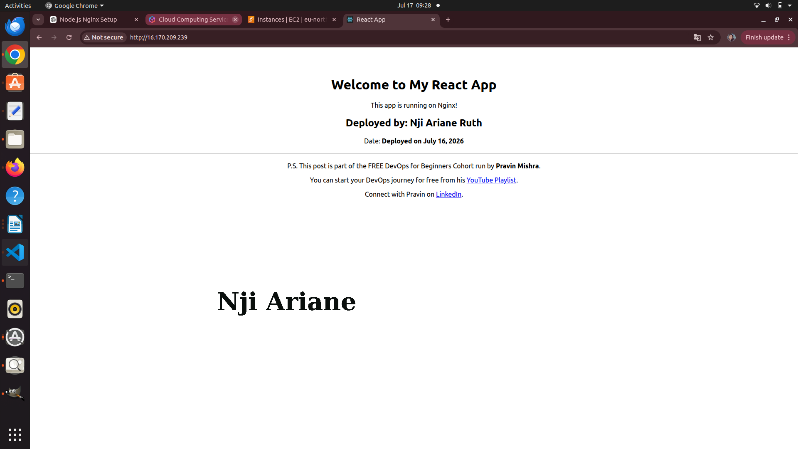

---

#### Screenshot 2 — Output of `ip a`

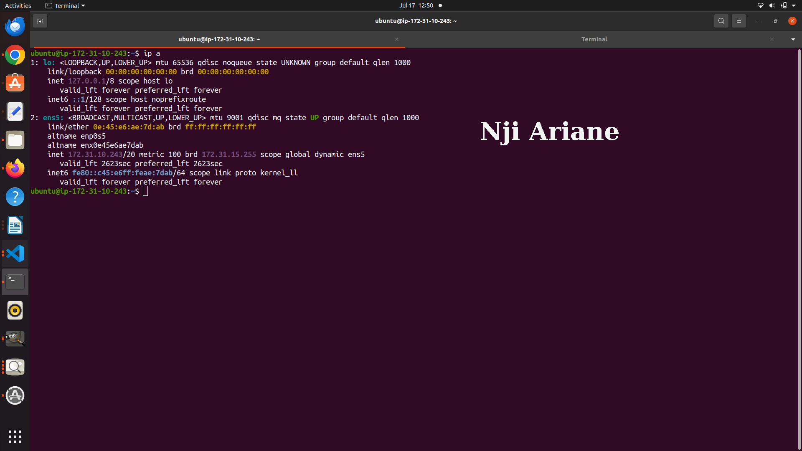

---

#### Screenshot 3 — Output of `sudo ss -tulpen`

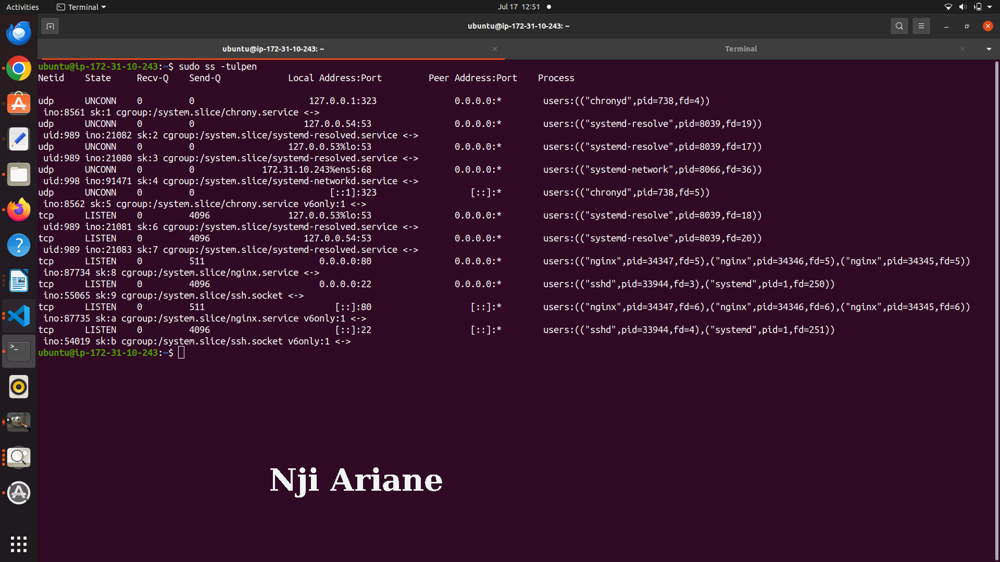
---

#### Screenshot 4 — Output of `sudo ufw status`

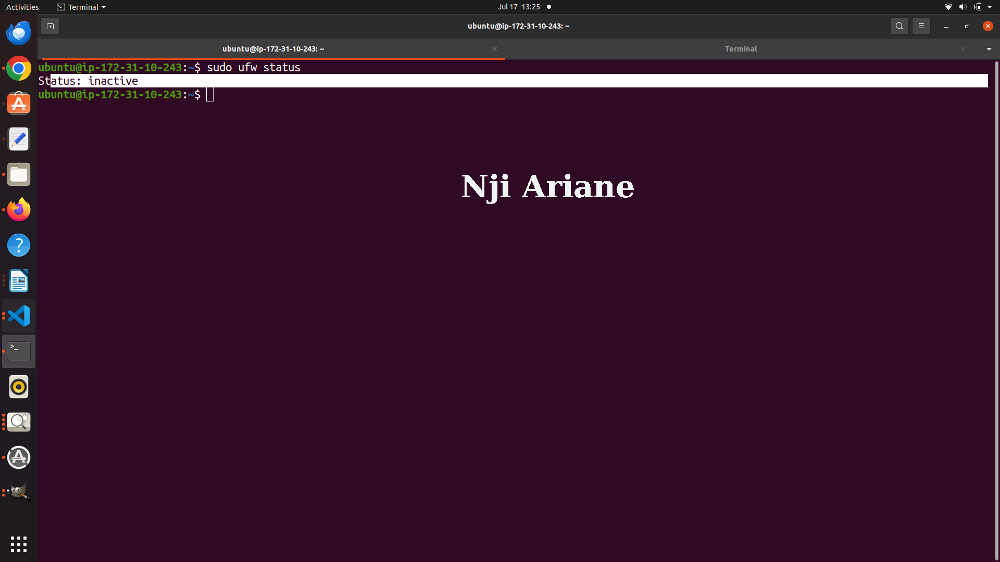

---

### Notes

Answer the following in your own words:

**1. What proves Nginx is listening on 0.0.0.0:80?**

Write your answer here.

---

**2. What proves SSH is active on port 22?**

Write your answer here.

---

**3. Did you find any unexpected open ports? Explain briefly.**

Write your answer here.

---

# Task 2 — Service Health & Systemd Validation (Nginx)

## Goal

Verify that Nginx is properly installed, running, enabled at boot, and safely configured.

### Evidence

#### Screenshot 1 — Output of `systemctl status nginx --no-pager`

Add your screenshot here.

---

#### Screenshot 2 — Output of `sudo nginx -t`

Add your screenshot here.

---

#### Screenshot 3 — Output of `sudo ss -lptn '( sport = :80 )'`

Add your screenshot here.

---

### Notes

Answer the following in your own words:

**1. What happens if Nginx fails to restart in production?**

Write your answer here.

---

**2. What's your basic rollback plan?**

Write your answer here.

---

# Task 3 — Logs & Request Trace

## Goal

Verify real traffic flow and analyze logs to understand system behavior and errors.

### Evidence

#### Screenshot 1 — Output of `sudo tail -n 30 /var/log/nginx/access.log`

Add your screenshot here.

---

#### Screenshot 2 — Output of `sudo tail -n 30 /var/log/nginx/error.log`

Add your screenshot here.

---

#### Screenshot 3 — Output of `sudo journalctl -u nginx --no-pager -n 50`

Add your screenshot here.

---

### Notes

Answer the following in your own words:

**1. Were there any errors in the logs?**

- If yes, mention 1–2 example error lines from the logs and explain what each one means in simple terms.
- If no, explain what it means if the error log is empty or shows no recent errors during your check.

Write your answer here.

---

**2. If there were no errors, what does that indicate about the system?**

Write your answer here.

---

**3. Based on the access logs, were your curl requests visible in the log entries? What does that prove about traffic flow?**

Write your answer here.

---

# Task 4 — System Resource Health Check (Capacity Red Flags)

## Goal

Assess server capacity and detect potential performance or failure risks.

### Evidence

#### Screenshot 1 — Output of `uptime`

Add your screenshot here.

---

#### Screenshot 2 — Output of `free -h`

Add your screenshot here.

---

#### Screenshot 3 — Output of `df -h`

Add your screenshot here.

---

#### Screenshot 4 — Output of `sudo du -sh /var/* | sort -h`

Add your screenshot here.

---

### Notes

Answer the following in your own words:

**1. Which resource looks most critical right now? (CPU/load, memory, or disk) Explain why.**

Memory appears to be the most critical resource. Although the server still has available RAM, it is running on a small cloud instance with limited memory. If more applications or user traffic are added, the available memory could be exhausted, causing slower performance or forcing the system to use swap space. In comparison, CPU usage is low and disk usage is moderate, so memory is the resource that requires the closest monitoring.

---

**2. What happens if disk becomes 100% full in a production server?**

If the disk reaches 100% capacity, the server can no longer write new data. Applications may fail to save files, log files will stop updating, databases may experience errors, and services such as Nginx might fail to restart if they cannot create temporary files or PID files. In severe cases, the server can become unstable or unavailable. Regular monitoring, log rotation, and storage alerts help prevent this situation.

---

# Task 5 — Configuration & Deployment Verification

## Goal

Ensure the correct React build is deployed and Nginx is serving it properly.

### Evidence

#### Screenshot 1 — Output of `ls -lah /var/www/html | head -n 20`

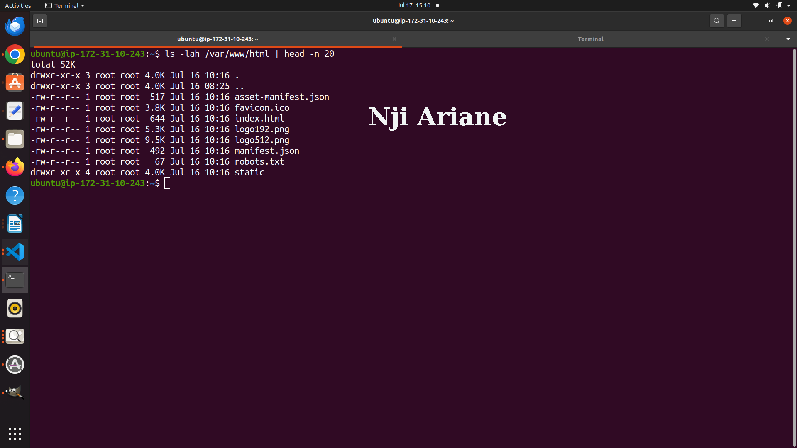
---

#### Screenshot 2 — Output of `grep -R "Deployed by" -n /var/www/html 2>/dev/null | head`

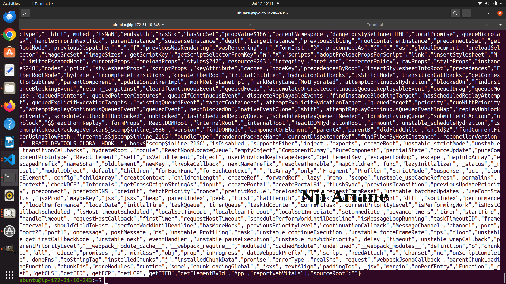

---

#### Screenshot 3 — Output of `grep -n "try_files" /etc/nginx/sites-available/default`

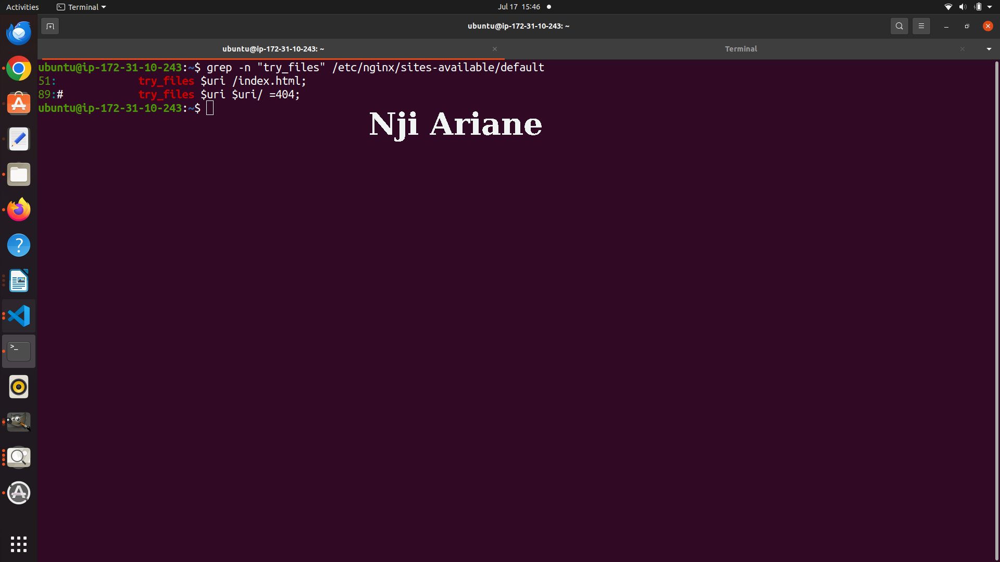
---

### Notes

Answer the following in your own words:

**1. How do you confirm that the correct version of the application is deployed?**

I confirmed that the correct version of the application was deployed by verifying the contents of /var/www/html and ensuring the expected React production build files were present, including index.html, asset-manifest.json, and the static directory containing the compiled JavaScript and CSS assets. I also checked the Nginx configuration to confirm the try_files directive was correctly configured for React routing. Finally, I accessed the application through the browser and verified that my personalized content (full name and deployment details) was displayed correctly, confirming that the latest build was being served by Nginx.

---

# Task 6 — Nginx Configuration Failure Simulation

## Goal

Simulate a real-world Nginx misconfiguration and recover the service safely.

### Evidence

#### Screenshot 1 — Output of `sudo nginx -t` showing the syntax error (broken config)

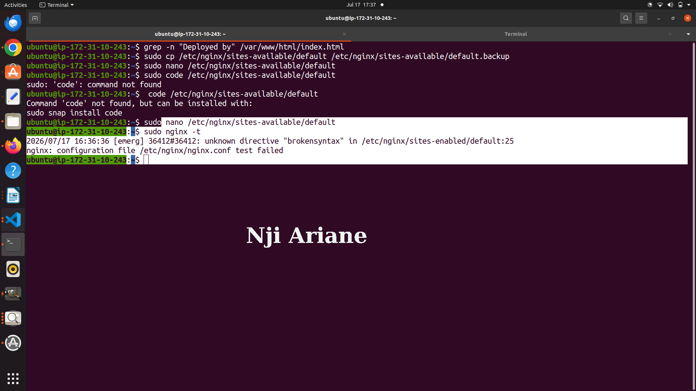

---

#### Screenshot 2 — Output of `sudo nginx -t` showing syntax ok (fixed config)

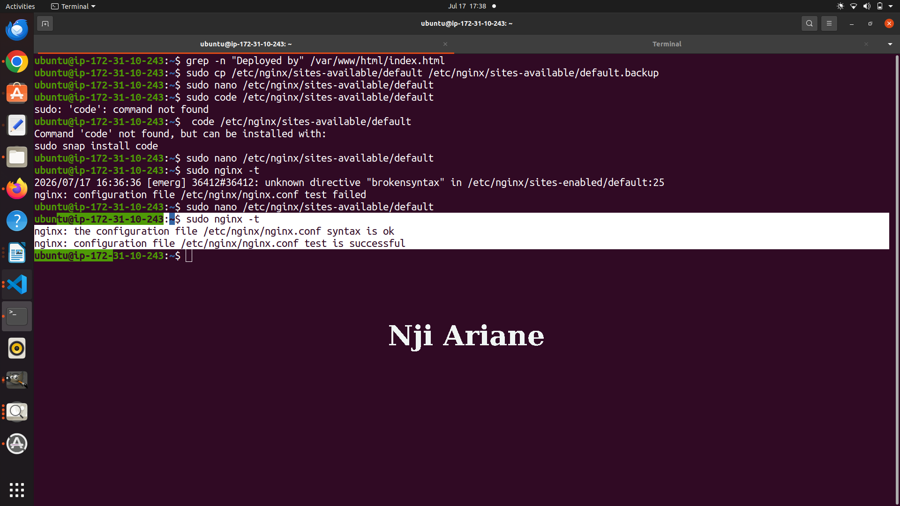

---

#### Screenshot 3 — Output of `curl -I http://<public-ip>` confirming recovery (200 OK)

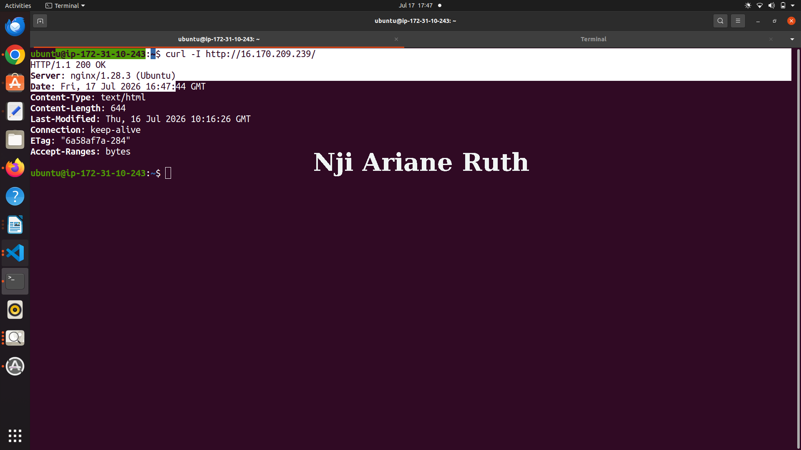

---

### Notes

Answer the following in your own words:

**1. What caused the configuration failure?**

The configuration failure was caused by intentionally adding an invalid directive (brokensyntax) to the Nginx configuration file. When I ran sudo nginx -t, Nginx detected the invalid directive and reported a syntax error, preventing the configuration from being used.

---

**2. How did you fix the issue?**
I fixed the issue by removing the invalid line from the Nginx configuration file and running sudo nginx -t again to verify that the configuration was valid. Once the syntax test passed successfully, I confirmed the web server was working by sending a request with curl -I and receiving an HTTP 200 OK response.

---

**3. How can you avoid this kind of issue in real production systems?**

To avoid this type of issue, I would always test configuration changes with sudo nginx -t before reloading or restarting Nginx. I would also keep configuration files under version control, maintain backups of known working configurations, and apply changes through a testing or staging environment before deploying them to production. These practices help reduce downtime and make it easier to recover if a configuration error occurs.

---

# Task 7 — Web Application Failure Simulation

## Goal

Simulate missing deployment content and recover the application safely.

### Evidence

#### Screenshot 1 — Output of `curl -I http://<public-ip>` showing failure (non-200 response)

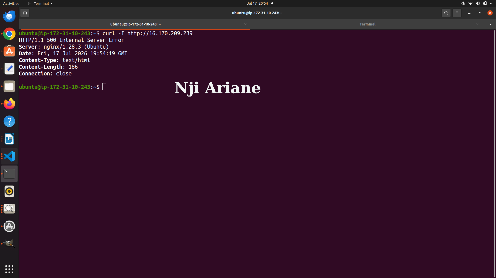

---

#### Screenshot 2 — Output of `curl -I http://<public-ip>` confirming recovery (200 OK)

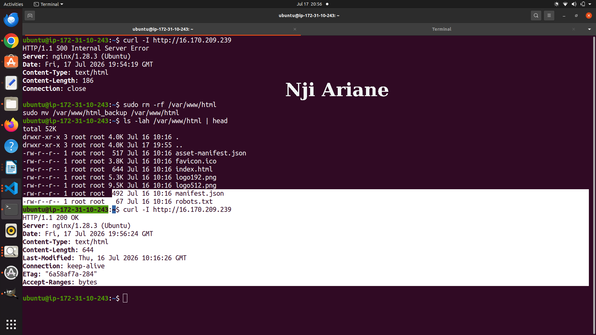
---

### Notes

Answer the following in your own words:

**1. What caused the application to break in this scenario?**

The application broke because I temporarily moved the React deployment files out of the /var/www/html directory, leaving Nginx without the files it needed to serve the website. As a result, requests to the application returned an HTTP 500 Internal Server Error, indicating that the application could not be served correctly.

---

**2. How did you fix the issue and restore the application?**

I restored the original deployment by moving the React build files back into the /var/www/html directory. After restoring the files, I verified that the application was working correctly by running curl -I against the server and confirming that it returned an HTTP 200 OK response.

---

**3. What steps would you take to prevent this kind of issue in real production systems?**

To prevent this type of issue, I would use automated deployment tools, keep backups of production files, and test deployments in a staging environment before releasing them. I would also implement health checks, monitoring, and rollback procedures so that any deployment problem can be detected quickly and the previous working version can be restored with minimal downtime.

---

# Task 8 — Security & Reliability Review

## Goal

Review and reflect on the security and reliability practices applied during this assignment.

### Security & Reliability Notes

Answer the following in your own words:

**1. Why is SSH key-based authentication more secure than sharing passwords?**

SSH key-based authentication is more secure because it uses a cryptographic key pair instead of a password. Private keys are much harder to guess or brute-force, and they are never transmitted over the network during authentication. This reduces the risk of unauthorized access compared to using passwords.

---

**2. Why should only required ports be open on a production server?**
Only the ports required for the application's services should be open because every open port increases the server's attack surface. Closing unnecessary ports reduces the chances of attackers exploiting unused services and improves the overall security of the server.

---

**3. Why is it important for Nginx to be enabled on boot?**

Enabling Nginx on boot ensures that the web server starts automatically whenever the server is restarted. This minimizes downtime and allows users to access the application without requiring manual intervention after a reboot.
---

**4. What are the risks of sharing secrets, keys, or credentials publicly?**

Sharing secrets, API keys, SSH keys, or passwords can allow unauthorized users to access servers, cloud resources, or sensitive data. This can lead to data breaches, unauthorized changes, financial costs, or complete compromise of the infrastructure. Sensitive credentials should always be stored securely and never committed to public repositories.

---

**5. Why should cloud resources be stopped or terminated when they are no longer needed?**

Unused cloud resources continue to consume compute, storage, and networking resources, which can generate unnecessary costs. Stopping or terminating resources that are no longer needed helps reduce expenses, minimizes security risks, and keeps the cloud environment clean and easier to manage.
---

# LinkedIn Post (Required)

## Evidence

#### LinkedIn Post URL

Paste your LinkedIn post URL here:

`___https://www.linkedin.com/posts/nji-ariane-ruth-494805172_devops-aws-ec2-ugcPost-7483840321639038976-y4Dk/?utm_source=share&utm_medium=member_desktop&rcm=ACoAACkN5HAB_6uWL_--MIEwRhEZ_BLCaqDxIoo_______________________`

---

#### Screenshot — Published LinkedIn post

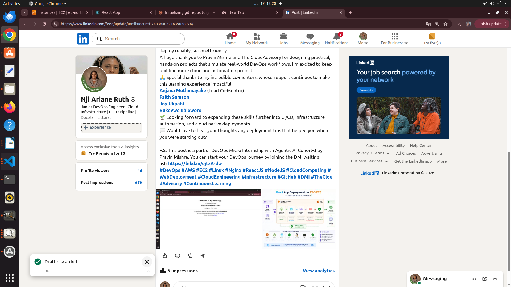

---

# Submission Instructions

- Add all required screenshots in your submission
- Full name must be visible in required screenshots
- Do not expose sensitive information (keys, passwords, account IDs)

---

# Completion Checklist

- [x] Task 1: Screenshots (browser, ip a, ss -tulpen, ufw status) + Notes answered
- [x] Task 2: Screenshots (nginx status, nginx -t, ss port 80) + Notes answered
- [x] Task 3: Screenshots (access log, error log, journalctl) + Notes answered
- [x] Task 4: Screenshots (uptime, free -h, df -h, du -sh) + Notes answered
- [x] Task 5: Screenshots (ls html, grep deployed by, grep try_files) + Notes answered
- [x] Task 6: Screenshots (nginx -t fail, nginx -t pass, curl recovery) + Notes answered
- [x] Task 7: Screenshots (curl failure, curl recovery) + Notes answered
- [x] Task 8: Security & Reliability Notes answered
- [x] LinkedIn post published and URL submitted
- [x] Full Name visible in all required screenshots
- [x] No sensitive data exposed

---

## 📌 About DMI & CloudAdvisory

DevOps Micro Internship (DMI) is a project-based DevOps program run by Pravin Mishra (The CloudAdvisory) focused on real-world execution, systems thinking, and career readiness.

It helps learners build strong DevOps foundations with hands-on experience.

---

## 📌 Resources

- 🌐 DMI Official Website: https://pravinmishra.com/dmi  
- 🎓 DevOps for Beginners (Udemy): https://www.udemy.com/course/devops-for-beginners-docker-k8s-cloud-cicd-4-projects/  
- 🎓 Agentic AI DevOps with Claude Code: https://www.udemy.com/course/ultimate-agentic-ai-devops-with-claude-code/  
- 🎓 DevOps with Claude Code: Terraform, EKS, ArgoCD & Helm: https://www.udemy.com/course/devops-with-claude-code-terraform-eks-argocd-helm/  
- ▶️ YouTube Playlist: https://www.youtube.com/playlist?list=PLFeSNDtI4Cho  
- 🔗 Pravin Mishra (LinkedIn): https://www.linkedin.com/in/pravin-mishra-aws-trainer/  
- 🏢 CloudAdvisory (LinkedIn): https://www.linkedin.com/company/thecloudadvisory/

---

*This submission is part of DevOps Micro Internship (DMI) Cohort 3 — Agentic AI Track.*
