# Assignment 5 — Bash Script Automation Drill (OPS Checklist)

Part of the DevOps Micro Internship (DMI) Cohort 3 with Agentic AI

---

## Purpose

In this assignment, you will practice Bash scripting by building a series of small automation scripts covering environment setup, variables, arrays, loops, file conditionals, if-else logic, and functions. These scripts form the foundation of real-world Linux automation used in DevOps, cloud, and production support environments.

---

# Task 1 — Bash Environment & Workspace Setup

## Goal

Verify that Bash is available on your system and create a clean workspace for this assignment.

### Evidence

#### Screenshot 1 — Output of `echo $SHELL` and `bash --version`

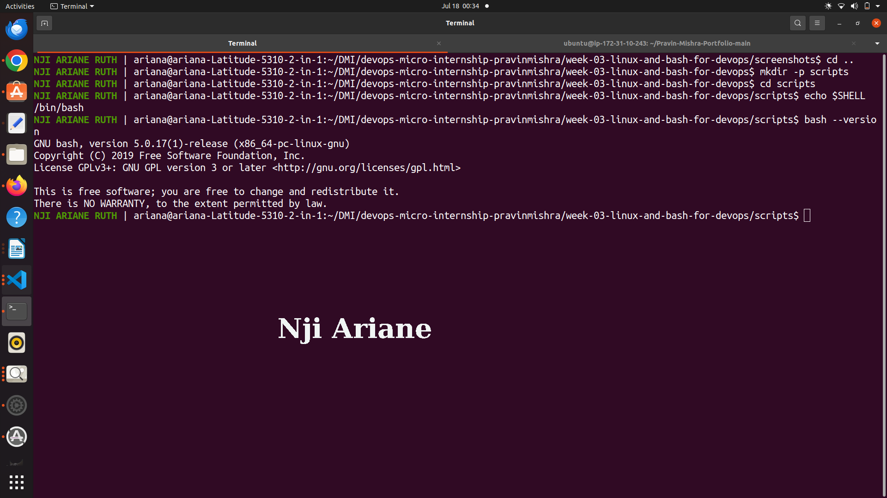

---

#### Screenshot 2 — Output of `pwd` and `ls -lah` showing the scripts directory

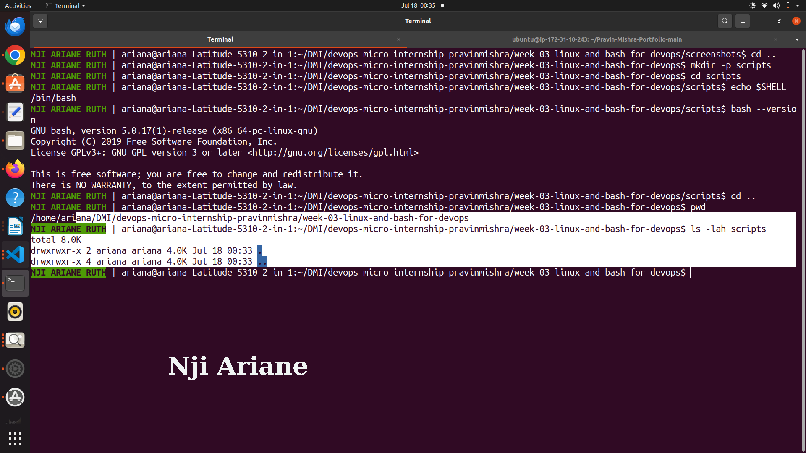

---

### Notes

Answer the following in your own words:

**1. What is Bash?**

Bash (Bourne Again Shell) is a command line shell and scripting language used in Linux systems to execute commands and automate tasks. It allows administrators and DevOps engineers to create scripts for system management, deployment, and automation.

---

**2. What is the difference between shell and Bash?**

A shell is a general interface between a user and the operating system that interprets commands. Bash is one specific type of shell that provides additional features such as scripting, variables, loops, and functions.

---

**3. Why is it important to confirm the Bash version before writing scripts?**

Checking the Bash version ensures that the environment supports the features and syntax required by the scripts. Different Bash versions may support different capabilities, so verification helps avoid compatibility issues.

---

# Task 2 — Your First Bash Script

## Goal

Create your first Bash script, make it executable, and run it from the terminal.

### Evidence

#### Screenshot 1 — Content of `first-script.sh`

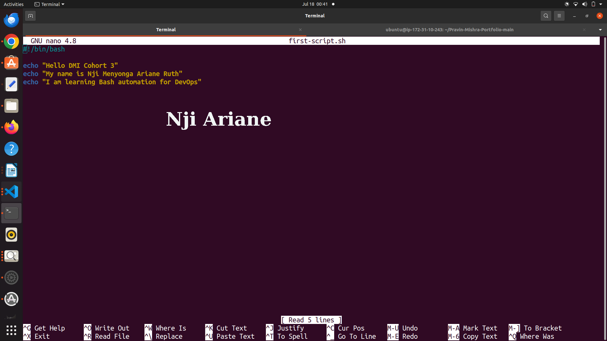

---

#### Screenshot 2 — Output of `./first-script.sh`

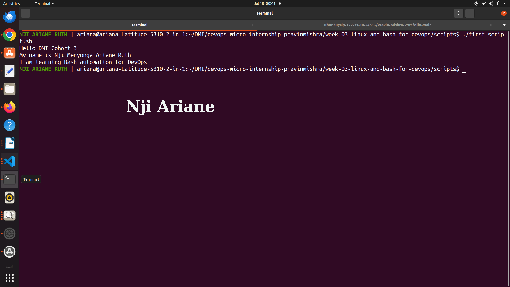

---

#### Screenshot 3 — Output of `ls -l first-script.sh` showing executable permission

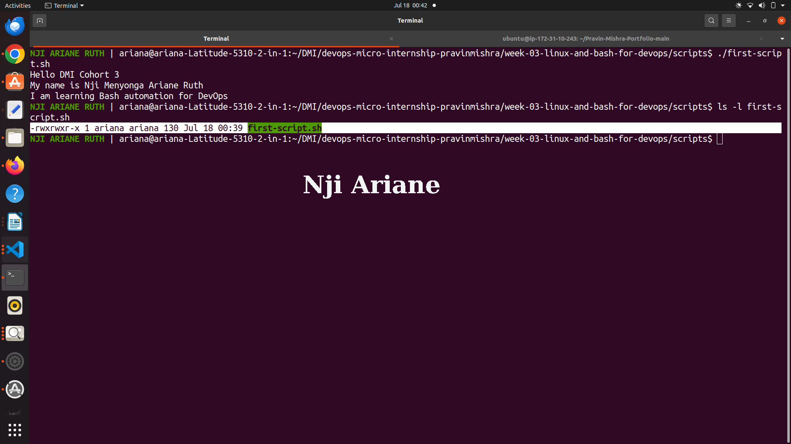

---

### Notes

Answer the following in your own words:

**1. What is the purpose of `#!/bin/bash`?**

#!/bin/bash is called a shebang. It tells the operating system to use the Bash interpreter to execute the script, ensuring the script runs with Bash regardless of the user's default shell.

---

**2. Why do we use `chmod +x` before running a script?**

We use chmod +x to give the script execute permission. This allows Linux to recognize the file as an executable program so it can be run directly with ./script.sh.

---

**3. What is the difference between running a script using `./script.sh` and `bash script.sh`?**

./script.sh runs the script as an executable file and requires the script to have execute (x) permission.
bash script.sh runs the script by passing it directly to the Bash interpreter, so it does not require the script to have execute permission.

---

# Task 3 — Variables: User Information Script

## Goal

Use variables to store and display user-related information.

### Evidence

#### Screenshot 1 — Content of `user-info.sh`

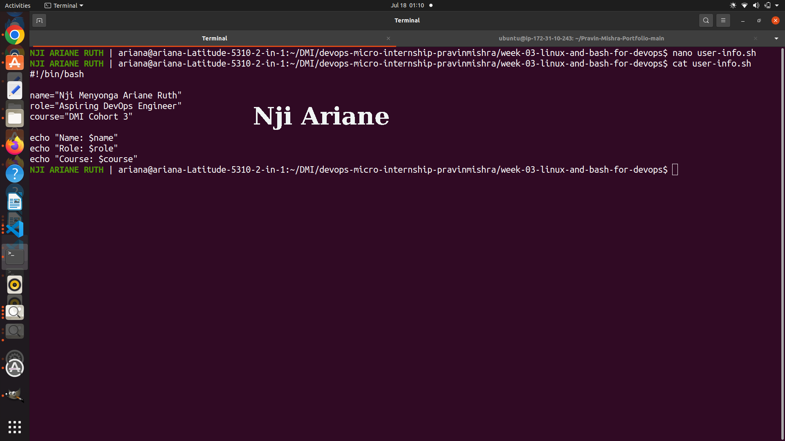

---

#### Screenshot 2 — Output of `./user-info.sh`

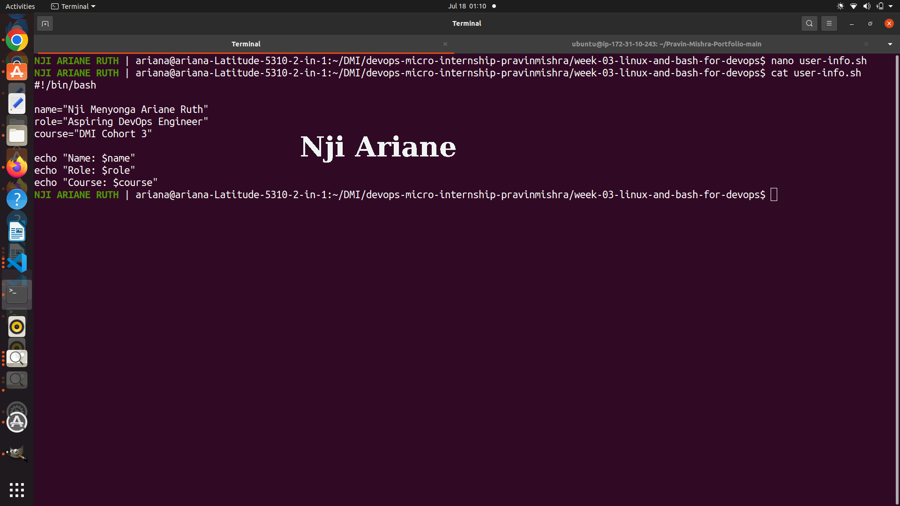

---

### Notes

Answer the following in your own words:

**1. What is a variable in Bash?**

A variable in Bash is a container used to store information such as text, numbers, or command results that can be reused throughout a script.

---

**2. Why should we avoid spaces around the `=` sign when creating variables?**

Bash uses the format variable=value. Adding spaces makes Bash interpret the assignment as a command, causing an error.

---

**3. How do you access the value stored inside a Bash variable?**

A variable value is accessed by placing a dollar sign ($) before the variable name, for example $name.

---

# Task 4 — Arrays & Loops: Tools Checklist Script

## Goal

Use arrays and loops to print a checklist of tools used in Bash scripting.

### Evidence

#### Screenshot 1 — Content of `tools-checklist.sh`

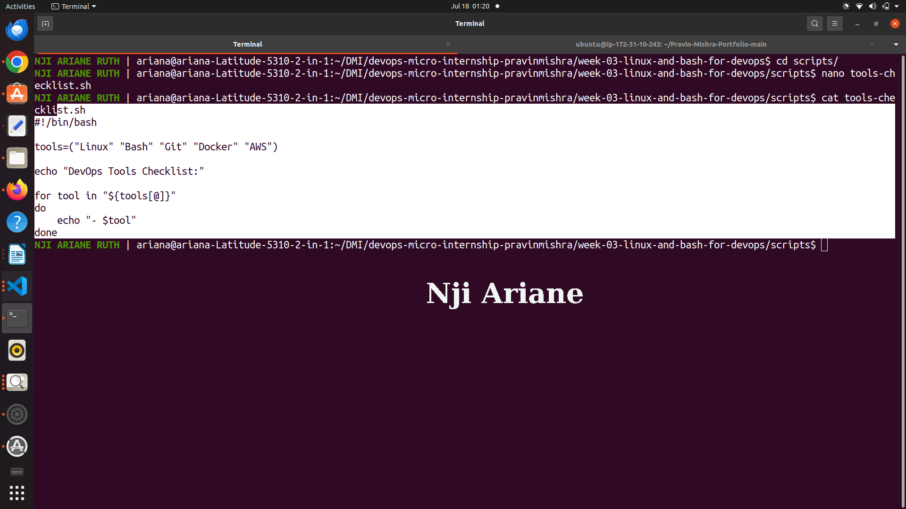
---

#### Screenshot 2 — Output of `./tools-checklist.sh`

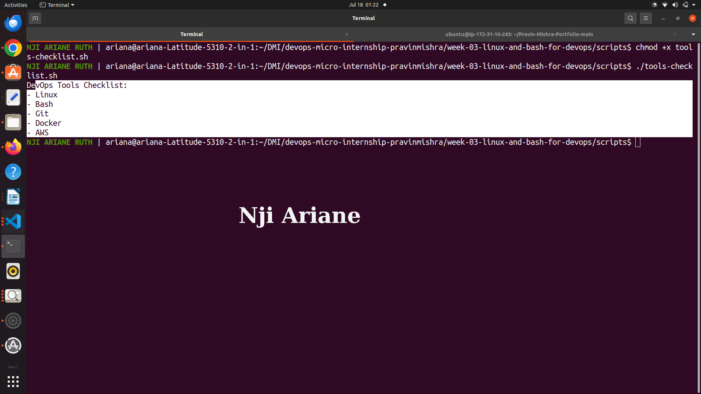

---

### Notes

Answer the following in your own words:

**1. What is an array in Bash?**

An array in Bash is a variable that can store multiple values under one name. Each value can be accessed using an index position.

---

**2. Why are arrays useful in scripts?**

Arrays are useful because they allow scripts to store and process multiple related items efficiently, such as lists of tools, servers, or files.
---

**3. What does `"${tools[@]}"` mean?**

"${tools[@]}" represents all elements inside the tools array. It allows the loop to access each item separately while preserving the values correctly.

---

**4. What is the purpose of the `for` loop in this script?**

The for loop repeats a command for every item in the array. In this script, it prints each DevOps tool from the checklist.

---

# Task 5 — Loops: Number Counter Script

## Goal

Use loops to repeat a task multiple times.

### Evidence

#### Screenshot 1 — Content of `counter.sh`

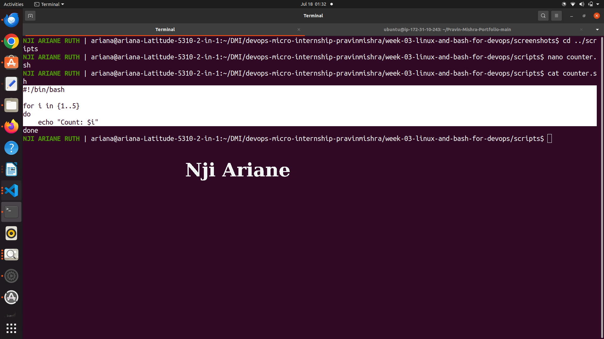

---

#### Screenshot 2 — Output of `./counter.sh`

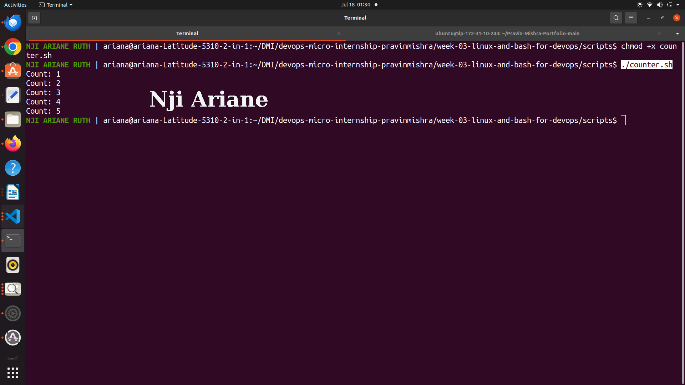

---

### Notes

Answer the following in your own words:

**1. What is a loop?**

A loop is a programming structure that repeats a set of commands multiple times until a condition is met.
---

**2. Why do we use loops in Bash scripting?**

Loops reduce repetitive work by allowing scripts to automatically perform the same task multiple times.

---

**3. How many times did the loop run in your script?**

The loop ran 5 times, counting from 1 to 5.

---

**4. What would you change if you wanted the loop to run 10 times?**

I would change {1..5} to {1..10}.

---

# Task 6 — Files & Conditionals: File Validation Script

## Goal

Use file checks and conditionals to verify whether files and directories exist.

### Evidence

#### Screenshot 1 — Output of `ls -lah ../test-folder`

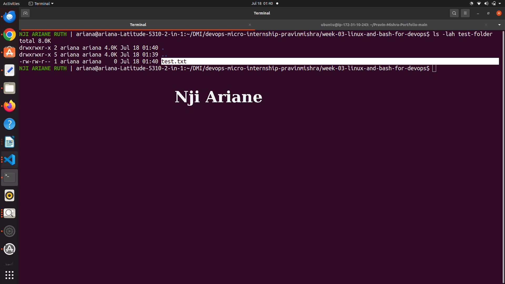

---

#### Screenshot 2 — Content of `file-check.sh`

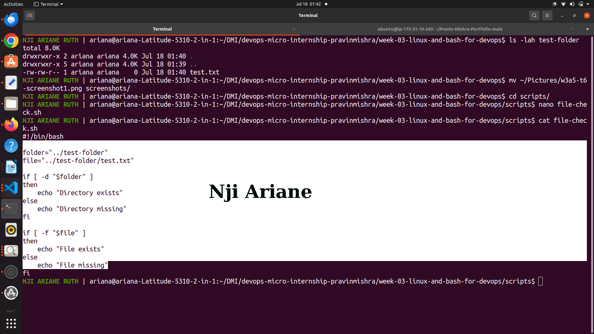

---

#### Screenshot 3 — Output of `./file-check.sh`

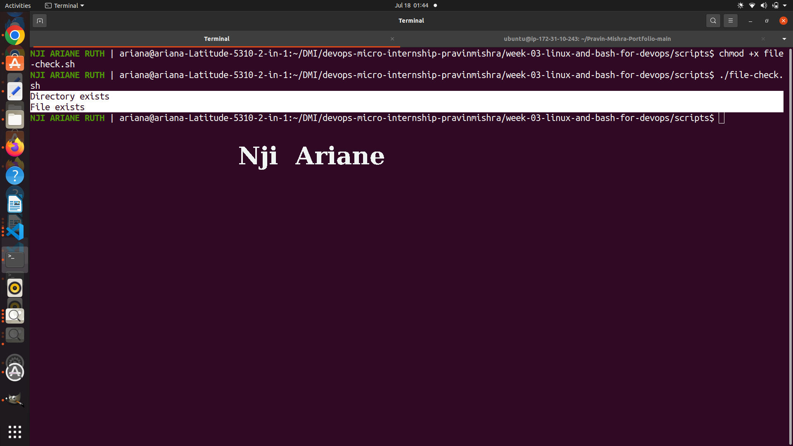

---

### Notes

Answer the following in your own words:

**1. What does `-d` check in Bash?**

-d checks whether a specified path exists and is a directory.

---

**2. What does `-f` check in Bash?**

-f checks whether a specified path exists and is a regular file.

---

**3. Why should file and directory paths be stored in variables?**

Storing paths in variables makes scripts easier to read, maintain, and update without changing multiple lines.

---

**4. What happens if the file does not exist?**

The condition becomes false and the script executes the else statement, displaying that the file is missing.

---

# Task 7 — Conditionals: Pass or Retry Script

## Goal

Use if-else conditionals to make decisions based on a variable value.

### Evidence

#### Screenshot 1 — Content of `score-check.sh` with `score=85`

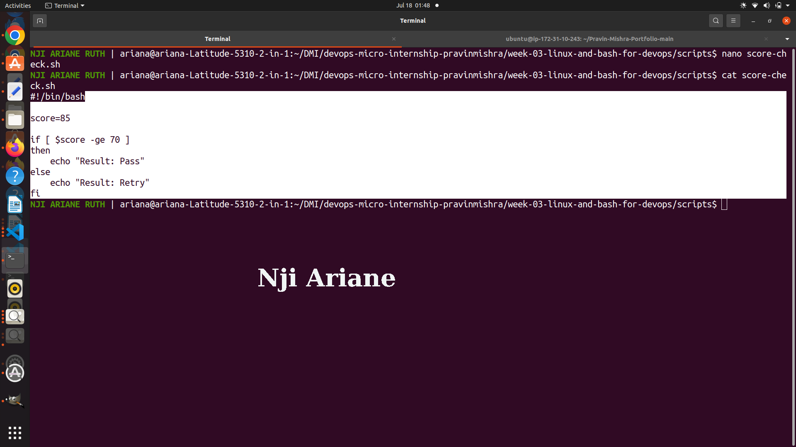

---

#### Screenshot 2 — Output showing `Result: Pass`

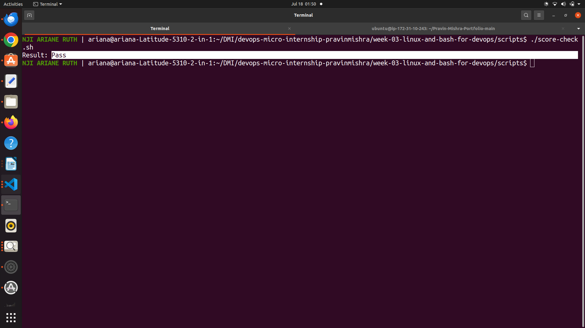

---

#### Screenshot 3 — Content of `score-check.sh` with `score=55`

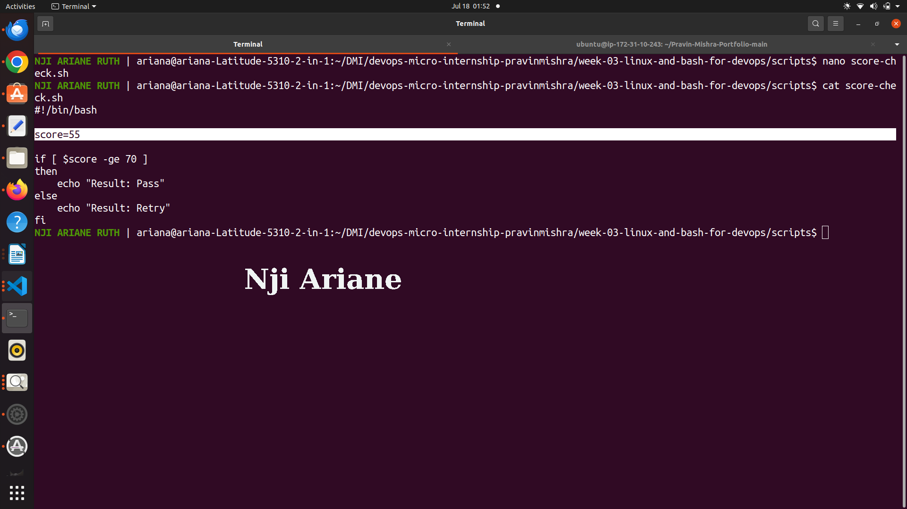

---

#### Screenshot 4 — Output showing `Result: Retry`

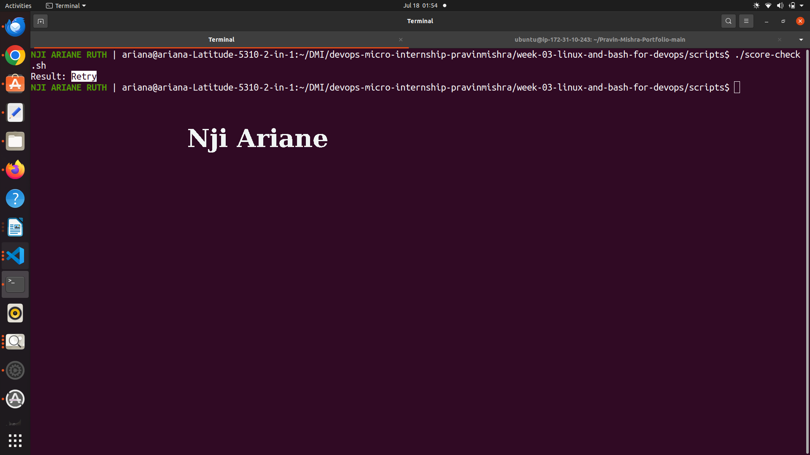

---

### Notes

Answer the following in your own words:

**1. What is the purpose of if-else in Bash?**

if-else allows scripts to make decisions by executing different commands depending on whether a condition is true or false.

---

**2. What does `-ge` mean?**

-ge means "greater than or equal to". It is used for comparing numerical values.

---

**3. Why should conditions be tested with different values?**

Testing different values ensures the script behaves correctly in different situations and handles expected outcomes.

---

**4. How can conditionals help in automation scripts?**

Conditionals allow automation scripts to make decisions automatically, such as checking system status, validating files, or determining whether an action should continue.

---

# Task 8 — Functions: Final Bash Automation Script

## Goal

Create a final Bash script using functions to organize reusable code.

### Evidence

#### Screenshot 1 — Content of `final-automation.sh`

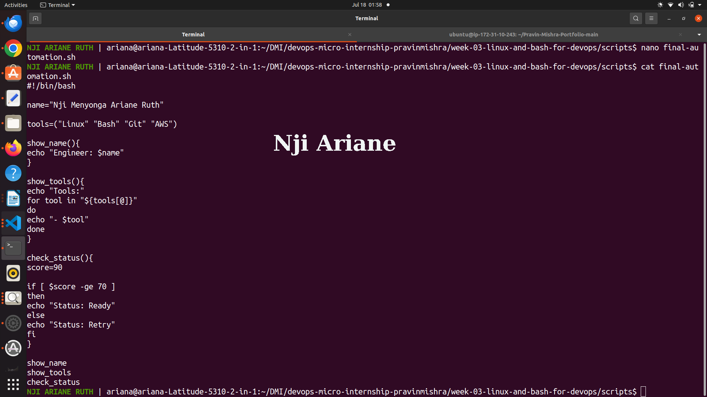

---

#### Screenshot 2 — Output of `./final-automation.sh`

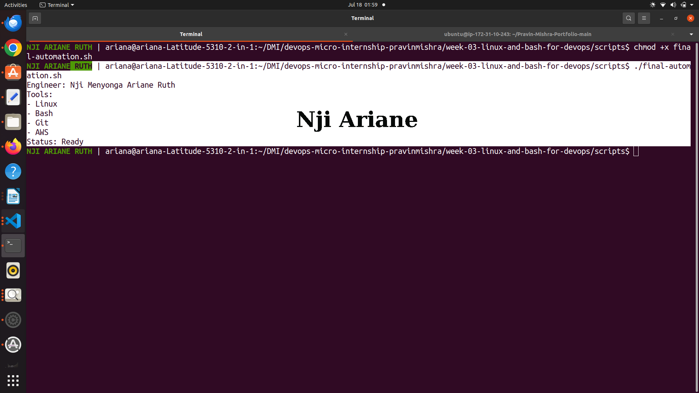

---

#### Screenshot 3 — Output of `ls -lah` showing all created scripts

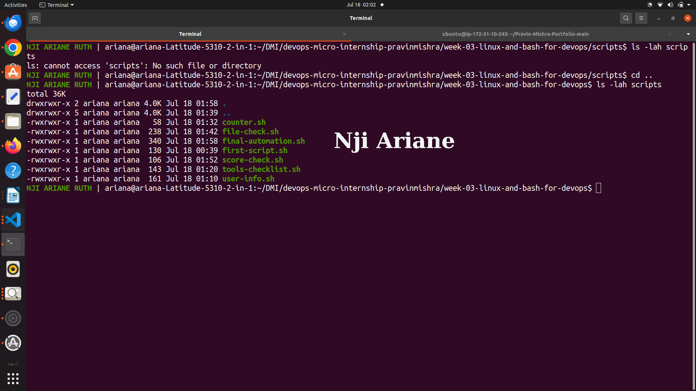

---

### Notes

Answer the following in your own words:

**1. What is a function in Bash?**

A function in Bash is a reusable block of commands grouped together under a name. It allows code to be organized and executed whenever needed.

---

**2. Why are functions useful in scripts?**

Functions make scripts easier to read, maintain, and reuse by separating tasks into smaller manageable sections.

---

**3. Which functions did you create in this script?**

I created three functions:
- show_name() to display the engineer name
- show_tools() to display the DevOps tools list
- check_status() to check the readiness status using a condition

---

**4. How does this final script combine variables, arrays, loops, conditionals, files, and functions?**

The final script uses variables to store information, arrays to store multiple tools, loops to display array values, conditionals to check the status, and functions to organize reusable sections of code. These concepts together create a simple automation workflow similar to real DevOps scripts.

---

# LinkedIn Post (Required)

## Evidence

#### LinkedIn Post URL

Paste your LinkedIn post URL here:

`_____https://www.linkedin.com/posts/nji-ariane-ruth-494805172_devops-linux-bash-share-7484052108879642624-4VX5/?utm_source=share&utm_medium=member_desktop&rcm=ACoAACkN5HAB_6uWL_--MIEwRhEZ_BLCaqDxIoo_____________________`

---

#### Screenshot — Published LinkedIn post

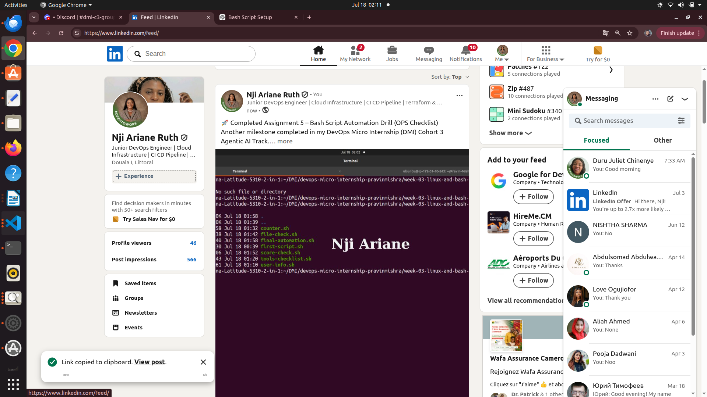

---

# Submission Instructions

- Add all required screenshots in your submission
- Full name must be visible in required screenshots
- All script files must be created and run successfully
- Required notes must be answered clearly for every task
- Do not expose sensitive information (keys, passwords, credentials)

---

# Completion Checklist

- [x] Task 1: Environment setup verified, workspace created (Screenshots 1–2, Notes answered)
- [x] Task 2: First script created, executed, permissions verified (Screenshots 1–3, Notes answered)
- [x] Task 3: Variables script created and run (Screenshots 1–2, Notes answered)
- [x] Task 4: Arrays and loops script created and run (Screenshots 1–2, Notes answered)
- [x] Task 5: Counter loop script created and run (Screenshots 1–2, Notes answered)
- [x] Task 6: File validation script created and run (Screenshots 1–3, Notes answered)
- [x] Task 7: Pass/Retry conditional script tested with both values (Screenshots 1–4, Notes answered)
- [x] Task 8: Final automation script created and run (Screenshots 1–3, Notes answered)
- [x] All scripts run without errors
- [x] Full Name visible in all required screenshots
- [x] LinkedIn post published and URL submitted
- [x] No sensitive data exposed

---

## 📌 About DMI & CloudAdvisory

DevOps Micro Internship (DMI) is a project-based DevOps program run by Pravin Mishra (The CloudAdvisory) focused on real-world execution, systems thinking, and career readiness.

It helps learners build strong DevOps foundations with hands-on experience.

---

## 📌 Resources

- 🌐 DMI Official Website: https://pravinmishra.com/dmi  
- 🎓 DevOps for Beginners (Udemy): https://www.udemy.com/course/devops-for-beginners-docker-k8s-cloud-cicd-4-projects/  
- 🎓 Agentic AI DevOps with Claude Code: https://www.udemy.com/course/ultimate-agentic-ai-devops-with-claude-code/  
- 🎓 DevOps with Claude Code: Terraform, EKS, ArgoCD & Helm: https://www.udemy.com/course/devops-with-claude-code-terraform-eks-argocd-helm/  
- ▶️ YouTube Playlist: https://www.youtube.com/playlist?list=PLFeSNDtI4Cho  
- 🔗 Pravin Mishra (LinkedIn): https://www.linkedin.com/in/pravin-mishra-aws-trainer/  
- 🏢 CloudAdvisory (LinkedIn): https://www.linkedin.com/company/thecloudadvisory/

---

*This submission is part of DevOps Micro Internship (DMI) Cohort 3 — Agentic AI Track.*