# Assignment 6 — Build an AI-Assisted Linux Health Check (AI-Assisted Linux Incident Triage)

Part of the DevOps Micro Internship (DMI) Cohort 3 with Agentic AI

---

## Purpose

In this assignment, you will build a read-only Bash triage script that checks the health of your Ubuntu server and Nginx application, connect it to Claude Code as a reusable `/linux-triage` skill, simulate a controlled Nginx incident, use the skill to gather and analyze evidence, recover the service manually, and verify recovery. The workflow follows the Agentic Loop: Gather → Analyze → Human Act → Verify.

---

# Task 1 — Confirm the Healthy Baseline and Create the Workspace

## Goal

Confirm that Nginx and the React application are healthy before building the automation.

### Evidence

#### Screenshot 1 — Output of `systemctl is-active nginx`, `ss -ltn | grep ':80'`, and `curl -I http://localhost`

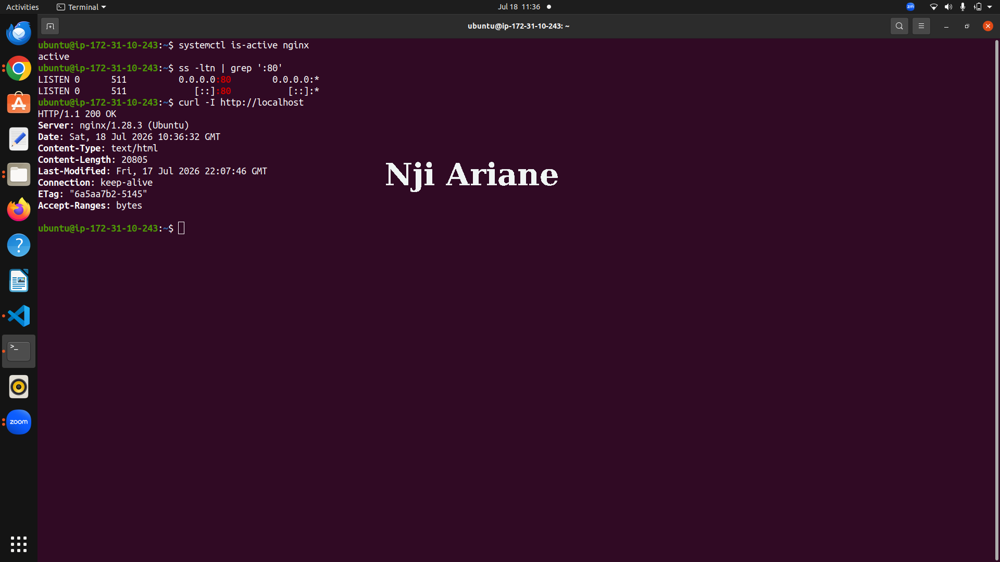

---

#### Screenshot 2 — Output of `pwd` and `find . -maxdepth 4 -type d | sort` showing the workspace folder structure
 
 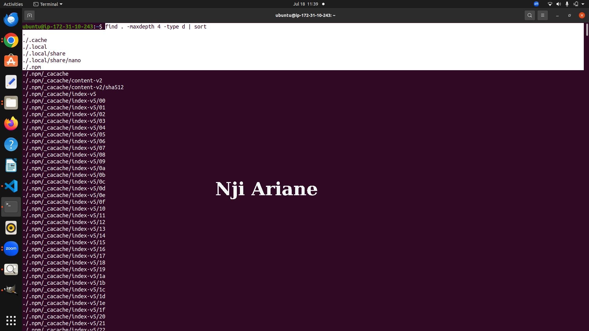

---

### Notes

Answer the following in your own words:

**1. What proves that Nginx is running?**

The command systemctl is-active nginx returning active proves that the Nginx service is currently running. The systemd status also shows the Nginx master and worker processes are active.

---

**2. What proves that the server is listening for HTTP traffic?**

The command ss -ltn | grep ':80' shows that a process is listening on TCP port 80, which is the default HTTP port used by Nginx.

---

**3. Why must you capture a healthy baseline before simulating an incident?**

A healthy baseline provides a reference point for comparison. It helps identify what changed during an incident and confirms whether recovery actions successfully restored the system.

---

# Task 2 — Create Project Context and Safety Rules in CLAUDE.md

## Goal

Tell Claude exactly what this project does and what it is not allowed to do.

### Evidence

#### Screenshot 3 — CLAUDE.md open in VS Code showing all four sections (Project Overview, Incident Workflow, Safety Rules, Output Rules)

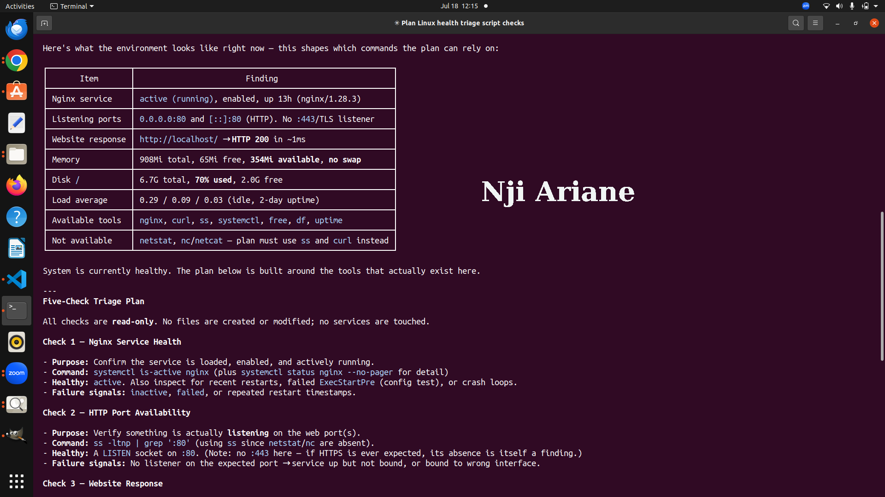

---

### Notes

Answer the following in your own words:

**1. Why should Claude receive project-specific operational rules?**

Claude should receive project-specific operational rules so it understands the purpose of the project, follows the correct workflow, and avoids performing actions that could negatively affect the system. These rules provide clear boundaries for safe and reliable operations.

---

**2. Why is the human required to execute the recovery command?**

The human is required to execute the recovery command because recovery actions can change the system state and may have unexpected consequences. Human approval ensures that changes are reviewed and authorized before being applied.

---

**3. Which rule prevents Claude from making an unsupported diagnosis?**

The rule that requires Claude to base its analysis only on collected evidence prevents unsupported diagnosis. Claude must inspect actual command outputs, logs, and reports instead of making assumptions about the system.

---

# Task 3 — Use Agentic AI to Plan Before Writing the Script

## Goal

Use Claude Code to inspect the environment and produce a read-only plan before creating any Bash code.

### Evidence

#### Screenshot 4 — Claude Code showing the five-check plan and read-only inspection results

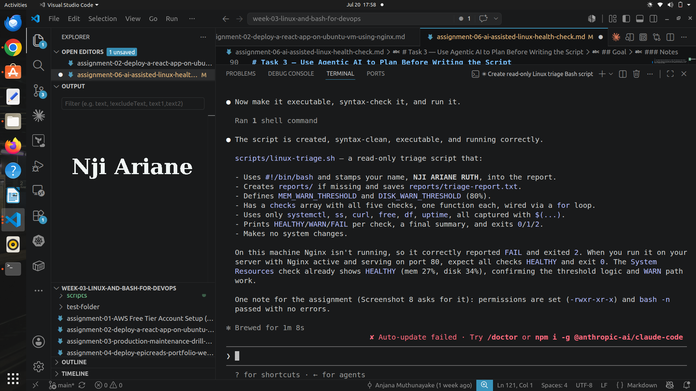

---

### Notes

Answer the following in your own words:

**1. Which part of this task represents the Gather phase?**

The Gather phase is represented by Claude inspecting the server using read-only commands such as systemctl, ss, curl, free, df, and uptime to collect operational evidence.

---

**2. Did Claude follow the instruction not to create files? How did you verify this?**

Yes. Claude only inspected the environment and created a troubleshooting plan. I verified this by checking the project directory with the find command and confirming that no new files or scripts were created.

---

**3. Why is planning before coding useful in DevOps automation?**

Planning before coding helps define the required checks, prevents unnecessary changes, improves script reliability, and ensures the automation collects meaningful operational evidence.
---

# Task 4 — Build the Linux Triage Bash Script

## Goal

Create one Bash script that gathers consistent Linux and Nginx health evidence.

### Evidence

#### Screenshot 5 — Top section of `linux-triage.sh` showing variables, thresholds, and the checks array

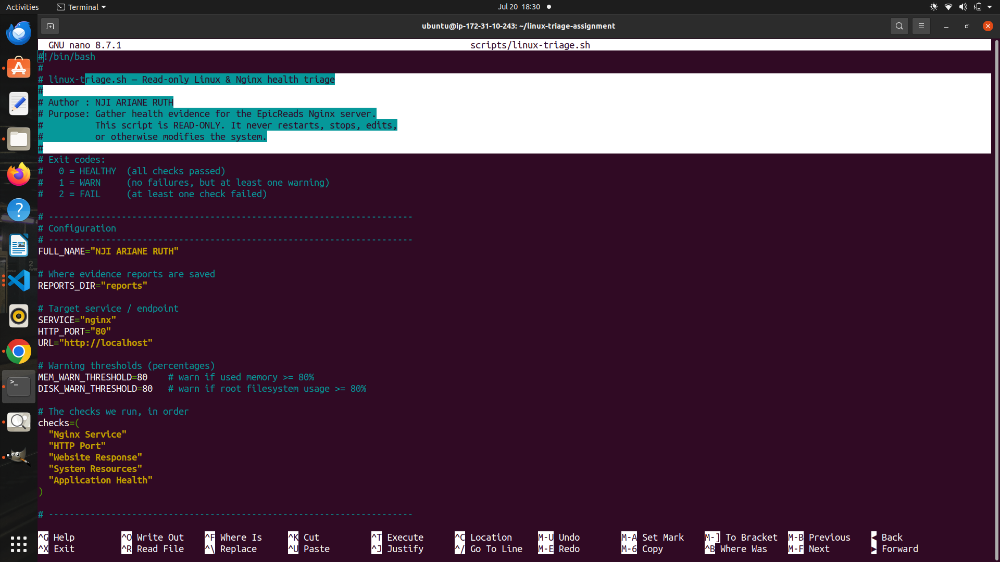

---

#### Screenshot 6 — Middle section showing check functions and conditionals

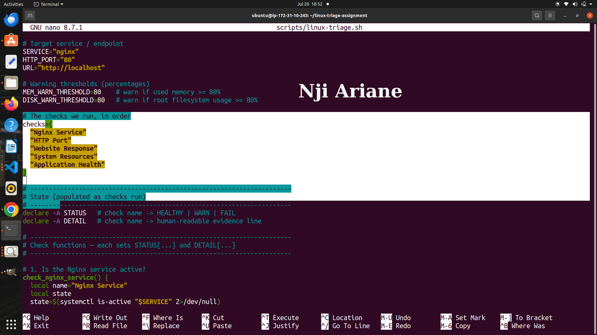

---

#### Screenshot 7 — Bottom section showing the loop, summary function, and exit behavior

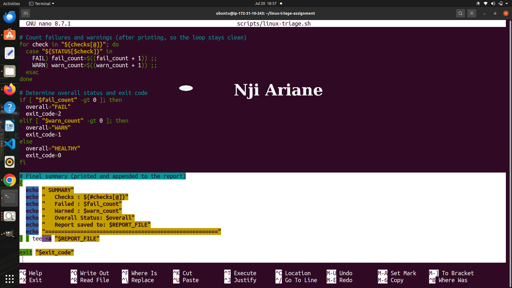

---

#### Screenshot 8 — Output of `bash -n scripts/linux-triage.sh` (no syntax errors) and `ls -l scripts/linux-triage.sh` showing executable permission

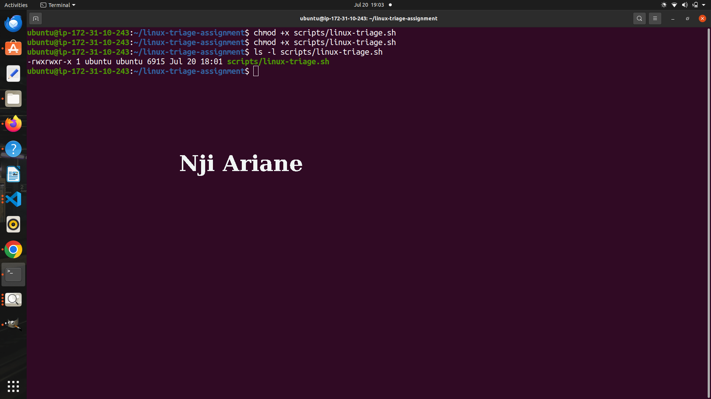

---

### Notes

Answer the following in your own words:

**1. What is stored in the checks array?**

The checks array stores the names or identifiers of all health checks that the script needs to perform, such as checking Nginx status, HTTP availability, memory usage, and disk usage.

---

**2. How does the `for` loop use that array?**

The for loop goes through each item in the checks array one by one and executes the matching health check function for each item. This allows the script to run all checks automatically in a consistent order.

---

**3. Why are the health checks separated into functions?**

The health checks are separated into functions to make the script easier to read, maintain, test, and troubleshoot. Each function handles one specific responsibility, which makes future updates easier.
---

**4. What is the purpose of `$(...)` in this script?**

$(...) is used for command substitution. It runs a command and stores its output so it can be used by the script in a variable or comparison.

Example:

STATUS=$(systemctl is-active nginx)
---

**5. Why does the script use different exit codes for HEALTHY, WARN, and FAIL?**

The script uses different exit codes so other automation tools can understand the result of the health check. Exit code 0 indicates a healthy system, 1 indicates warnings that may need attention, and higher failure codes indicate serious problems requiring action.

---

# Task 5 — Run and Understand the Healthy-State Report

## Goal

Run the Bash script against the healthy server and verify that it creates a report.

### Evidence

#### Screenshot 9 — Output of `./scripts/linux-triage.sh` showing your Full Name and all five check results

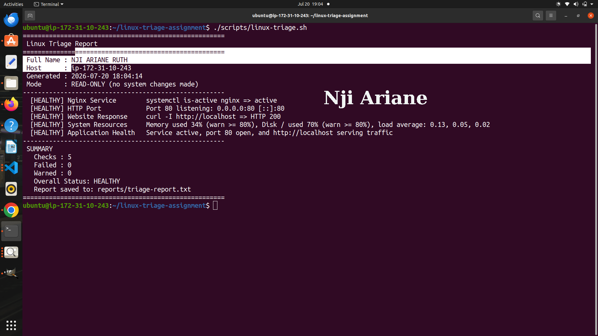

---

#### Screenshot 10 — Output showing the captured exit code and final summary

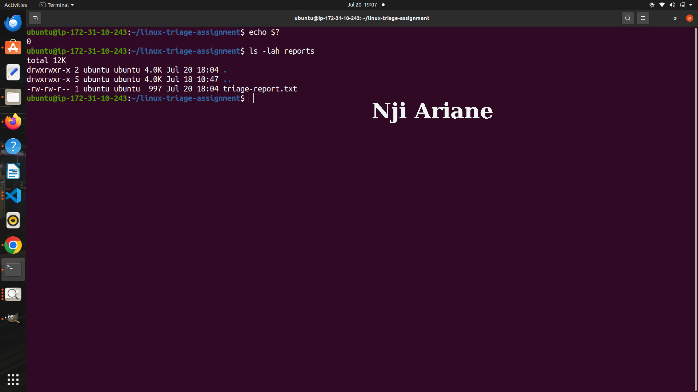

---

### Notes

Answer the following in your own words:

**1. What is the overall status of your healthy baseline?**

The overall status of my healthy baseline is HEALTHY because all required checks passed successfully. Nginx was running, the HTTP service was reachable, and system resource checks were within the expected thresholds.

---

**2. Which exact Linux evidence proves the application is serving traffic?**

The evidence proving the application is serving traffic is the curl -I http://localhost response returning HTTP 200 OK, along with Nginx listening on port 80 from the ss -ltn | grep ':80' command.

---

**3. Did your script return exit code 0 or 1? Explain why.**

The script returned exit code 0 because all health checks completed successfully without any failures or warnings. Exit code 0 indicates that the system is healthy.

---

**4. What is the difference between a warning and a failure in this script?**

A warning means the system has a condition that should be monitored or investigated but the service is still operating. A failure means a critical health check did not pass and the system requires attention or corrective action.

---

# Task 6 — Create and Run the /linux-triage Skill

## Goal

Turn the Bash script into a reusable, manually invoked Agentic AI workflow.

### Evidence

#### Screenshot 11 — `SKILL.md` showing the frontmatter, allowed tool restrictions, and safety rules

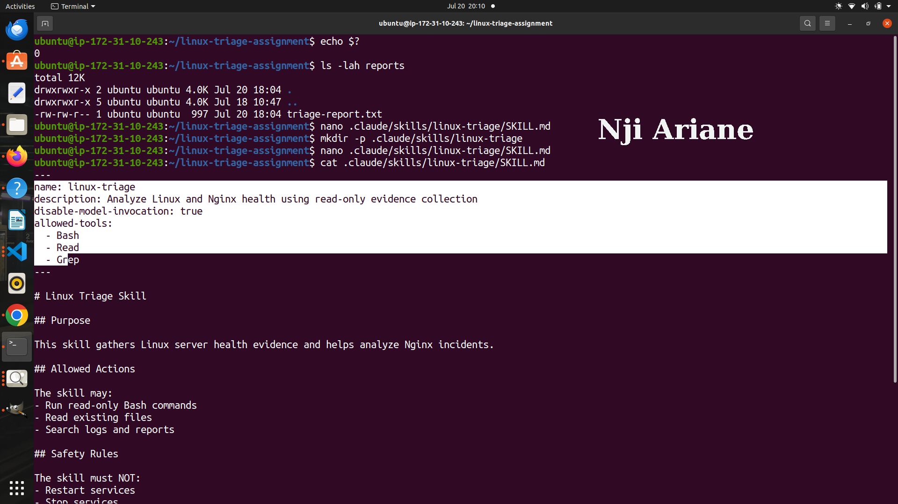

---

#### Screenshot 12 — `/linux-triage` output for the healthy server

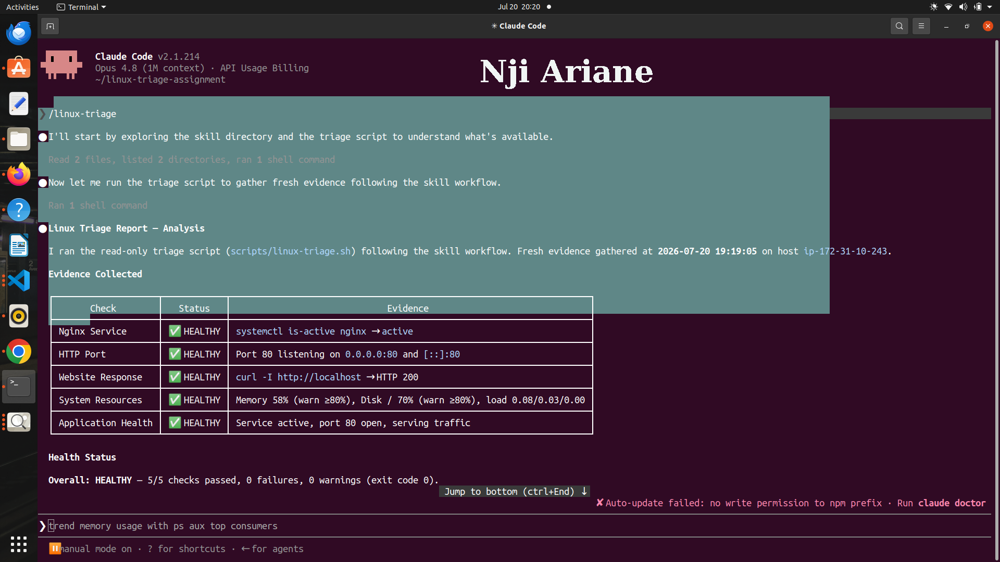

---

### Notes

Answer the following in your own words:

**1. Why does this skill have Bash, Read, and Grep, but not Write?**

The skill only needs tools for collecting and analyzing evidence. Removing Write prevents accidental modification of files or system changes during diagnosis.

---

**2. Why is `disable-model-invocation: true` useful for this skill?**

It ensures the skill only runs when a human explicitly requests it, preventing automatic execution during unrelated tasks.

---

**3. What part is performed by Bash, and what part is performed by Claude?**

Bash performs the actual server health checks and collects evidence. Claude analyzes the evidence and explains the findings.

---

**4. Why is this better than asking Claude "Is my server healthy?" without giving it evidence?**

Because Claude receives real system evidence instead of guessing. The analysis is based on actual command output from the server.

---

# Task 7 — Simulate an Nginx Incident and Let the Skill Diagnose It

## Goal

Create a controlled service failure, gather evidence through Bash, and let Claude analyze the evidence without taking recovery action.

### Evidence

#### Screenshot 13 — Output showing Nginx is inactive and the HTTP request fails

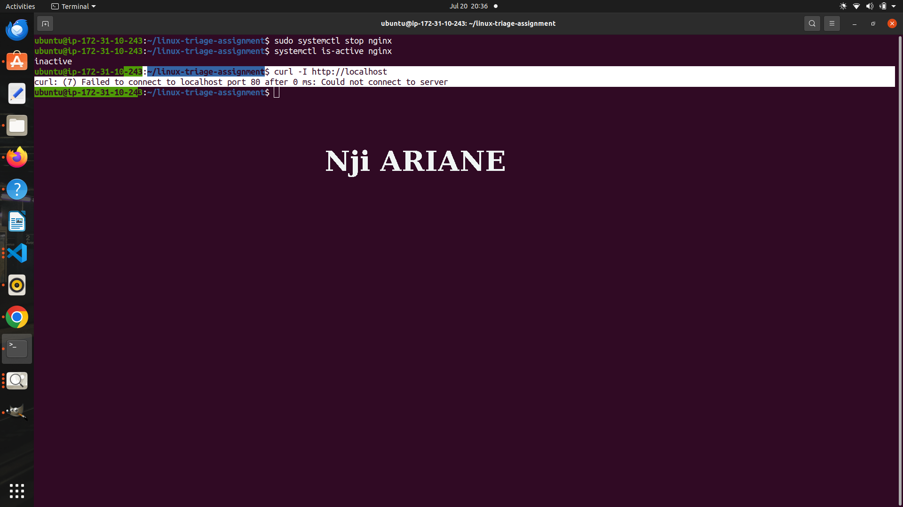

---

#### Screenshot 14 — `/linux-triage` output showing failed evidence, most likely cause, and a suggested recovery command

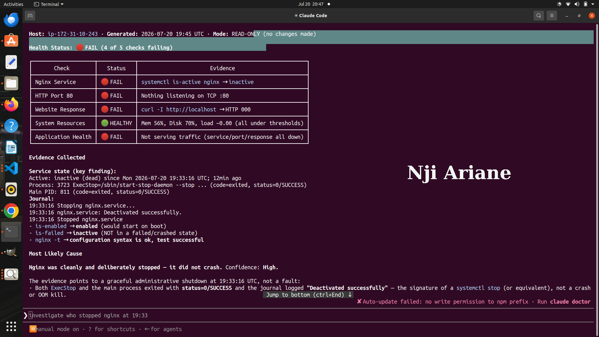

---

#### Screenshot 15 — `incident-failure-report.txt` showing the failed checks and your Full Name

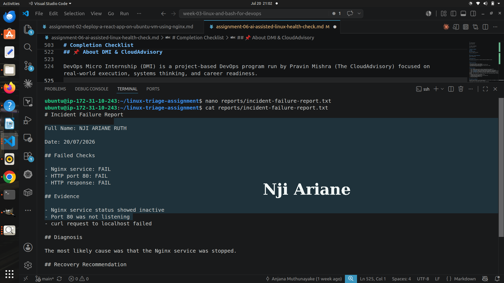

---

### Notes

Answer the following in your own words:

**1. Which three checks failed?**

The three failed checks were the Nginx service check, HTTP port availability check, and HTTP response check because the Nginx service was stopped.

---

**2. What evidence supports the conclusion that Nginx is unavailable?**

The evidence was the inactive Nginx service status, the absence of a listener on port 80, and the failed curl -I http://localhost request.

---

**3. Did Claude execute the recovery command? Why is that important?**

No, Claude did not execute the recovery command. This is important because service recovery changes the system state and requires human approval to prevent unsafe automatic changes.

---

**4. Which phase of the Agentic Loop is represented by the Bash report?**

The Bash report represents the Gather phase because it collects system evidence and health information

---

**5. Which phase is represented by Claude's explanation?**

Claude's explanation represents the Analyze phase because it interprets the collected evidence and provides possible causes and recommendations.

---

# Task 8 — Recover Manually, Verify Again, and Write the Incident Summary

## Goal

Recover the service as the human operator and prove that the system is healthy again.

### Evidence

#### Screenshot 16 — Output showing Nginx is active and `curl -I http://localhost` returns 200 OK

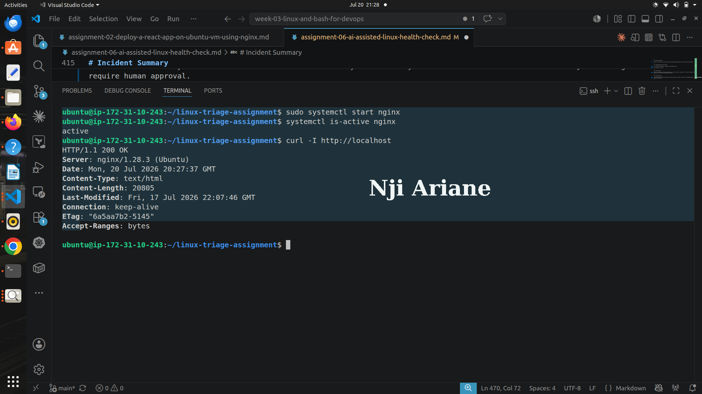

---

#### Screenshot 17 — Second `/linux-triage` output showing successful recovery with no FAIL results

---

#### Screenshot 18 — Output of `ls -lah reports` showing both `incident-failure-report.txt` and `recovery-report.txt`

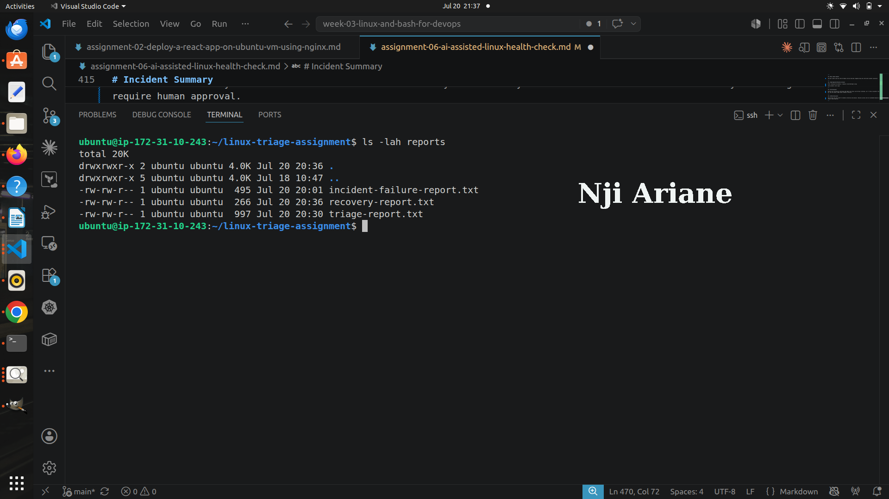

---

#### Screenshot 19 — `incident-summary.md` showing all required sections and your Full Name

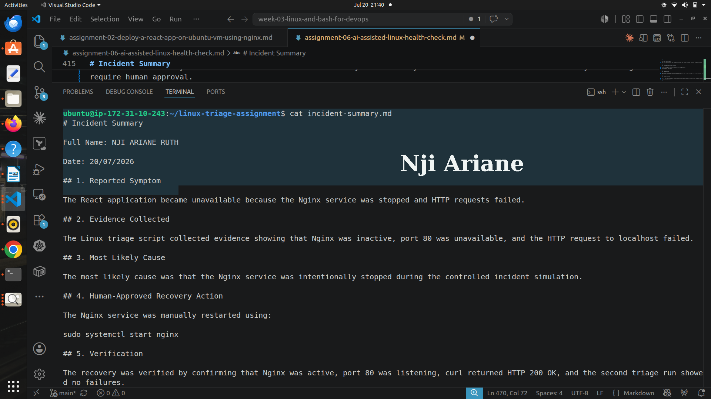

---

### Notes

Answer the following in your own words:

**1. What action did you execute manually?**

I manually restarted the Nginx service using the recovery command sudo systemctl start nginx after reviewing the triage report and confirming that the service failure required intervention.

---

**2. What evidence proves that the service recovered?**

The service recovery was confirmed by systemctl is-active nginx returning active, port 80 listening again, and curl -I http://localhost returning HTTP 200 OK.

---

**3. Why is the second triage run necessary?**

The second triage run is necessary to verify that the recovery action successfully fixed the issue and that all health checks are passing again. It provides evidence that the system returned to a healthy state.

---

**4. What could go wrong if an AI agent automatically restarted every failed service?**

An AI agent restarting every failed service could make unsafe changes, hide the real cause of an issue, interrupt important processes, or create additional problems without human approval.

---

**5. In one sentence, explain the difference between using AI as a chatbot and using AI in this agentic workflow.**

A chatbot only provides answers based on a conversation, while an agentic workflow uses AI to analyze real evidence, follow defined rules, and support human-approved operational decisions.

---

# Incident Summary

Fill in all seven sections below in your own words.

**Full Name:**  Nji Menyonga Ariane Ruth

**Date:** 20/07/2026

---

**1. Reported Symptom**

The web application became unavailable because the Nginx service was stopped, causing HTTP requests to fail.

---

**2. Evidence Collected**

The triage script collected evidence showing that Nginx was inactive, port 80 was no longer listening, and curl -I http://localhost could not reach the application.

---

**3. Most Likely Cause**

The most likely cause was that the Nginx service had been stopped during the controlled incident simulation.

---

**4. Human-Approved Recovery Action**

After reviewing the evidence, I manually restarted Nginx using:

sudo systemctl start nginx

---

**5. Verification**

Recovery was verified by confirming that Nginx was active, port 80 was listening, curl -I http://localhost returned HTTP 200 OK, and the second triage report showed no failures.

---

**6. Safety Decision**

The AI skill was only used for evidence collection and analysis. Recovery actions were not automated because system changes require human approval.

---

**7. Agentic Loop Mapping**

The workflow followed the Agentic Loop:

Gather: Bash triage script collected server health evidence.
Analyze: Claude reviewed the evidence and identified the likely cause.
Human Act: I manually restarted the Nginx service.
Verify: A second triage run confirmed the system was healthy again.clea

---

# LinkedIn Post (Required)

## Evidence

#### LinkedIn Post URL

Paste your LinkedIn post URL here:

`_______https://www.linkedin.com/posts/nji-ariane-ruth-494805172_devops-linux-bash-activity-7485082476235804673-igvk?utm_source=share&utm_medium=member_desktop&rcm=ACoAACkN5HAB_6uWL_--MIEwRhEZ_BLCaqDxIoo____________________`

---

#### Screenshot — Published LinkedIn post

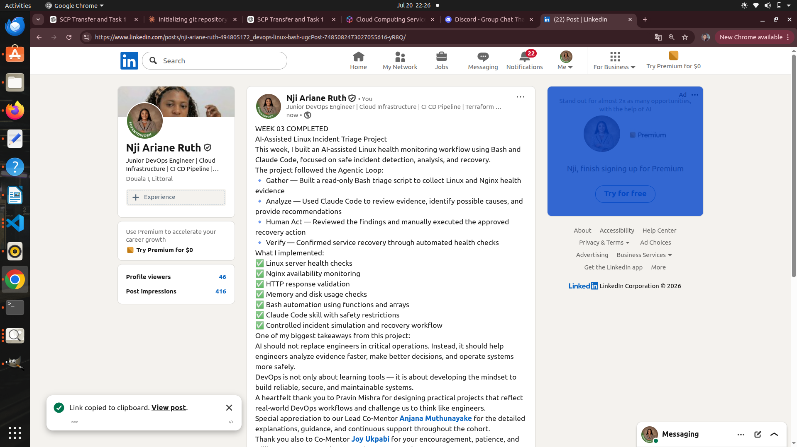

---

# GitHub Repository URL

Paste the URL of your GitHub folder or repository containing the assignment files here:

`_____https://github.com/NjiAriane/devops-micro-internship-pravinmishra.git____________________`

---

# Submission Instructions

- Add all required screenshots in your submission
- Full Name must be visible in required screenshots and the Bash report
- All written answers must be in your own words
- Do not expose sensitive information (keys, passwords, AWS account IDs, tokens)
- GitHub URL must be included in this document

---

# Completion Checklist

- [x] Task 1: Healthy baseline confirmed, workspace created (Screenshots 1–2, Notes answered)
- [x] Task 2: CLAUDE.md created with all four sections (Screenshot 3, Notes answered)
- [x] Task 3: Five-check plan produced by Claude using read-only tools (Screenshot 4, Notes answered)
- [x] Task 4: `linux-triage.sh` created, syntax validated, executable permission set (Screenshots 5–8, Notes answered)
- [x] Task 5: Healthy-state report generated with no FAIL result (Screenshots 9–10, Notes answered)
- [x] Task 6: `/linux-triage` skill created and run successfully on healthy server (Screenshots 11–12, Notes answered)
- [x] Task 7: Nginx incident simulated, failed evidence captured, Claude did not execute recovery (Screenshots 13–15, Notes answered)
- [x] Task 8: Nginx recovered manually, recovery verified, reports saved, incident summary complete (Screenshots 16–19, Notes answered)
- [x] Incident summary contains all seven required sections
- [x] LinkedIn post published and URL submitted
- [x] Full Name visible in all required screenshots and the Bash report
- [x] Skill does not have Write permission
- [x] Skill did not execute any recovery commands
- [x] No sensitive data exposed

---

## 📌 About DMI & CloudAdvisory

DevOps Micro Internship (DMI) is a project-based DevOps program run by Pravin Mishra (The CloudAdvisory) focused on real-world execution, systems thinking, and career readiness.

It helps learners build strong DevOps foundations with hands-on experience.

---

## 📌 Resources

- 🌐 DMI Official Website: https://pravinmishra.com/dmi  
- 🎓 DevOps for Beginners (Udemy): https://www.udemy.com/course/devops-for-beginners-docker-k8s-cloud-cicd-4-projects/  
- 🎓 Agentic AI DevOps with Claude Code: https://www.udemy.com/course/ultimate-agentic-ai-devops-with-claude-code/  
- 🎓 DevOps with Claude Code: Terraform, EKS, ArgoCD & Helm: https://www.udemy.com/course/devops-with-claude-code-terraform-eks-argocd-helm/  
- ▶️ YouTube Playlist: https://www.youtube.com/playlist?list=PLFeSNDtI4Cho  
- 🔗 Pravin Mishra (LinkedIn): https://www.linkedin.com/in/pravin-mishra-aws-trainer/  
- 🏢 CloudAdvisory (LinkedIn): https://www.linkedin.com/company/thecloudadvisory/

---

*This submission is part of DevOps Micro Internship (DMI) Cohort 3 — Agentic AI Track.*