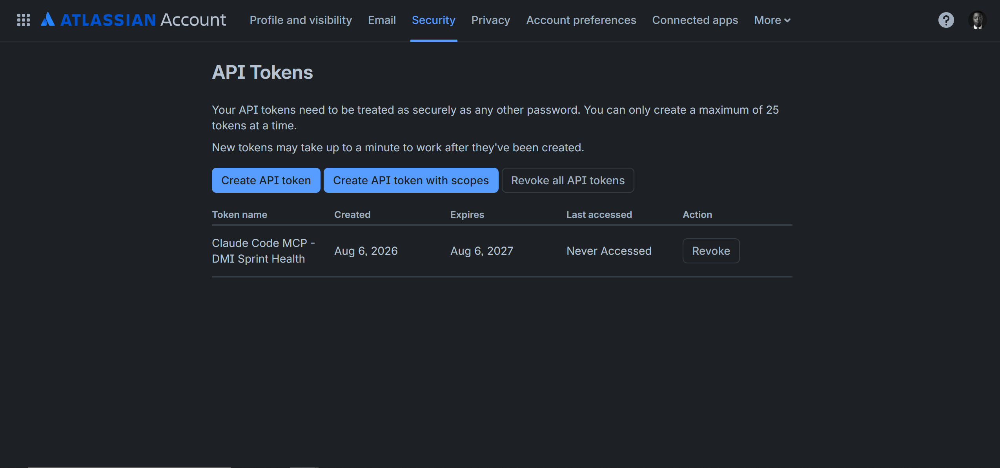
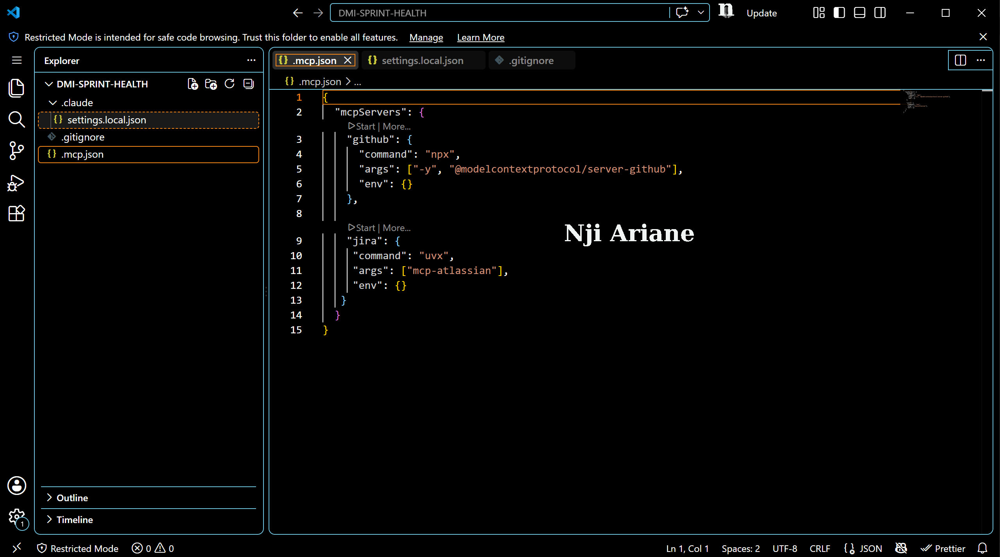
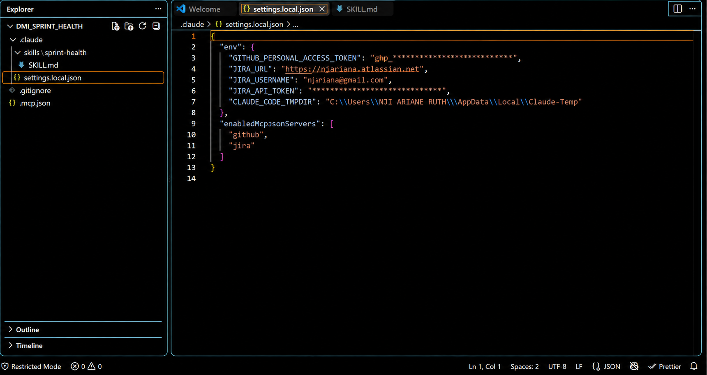
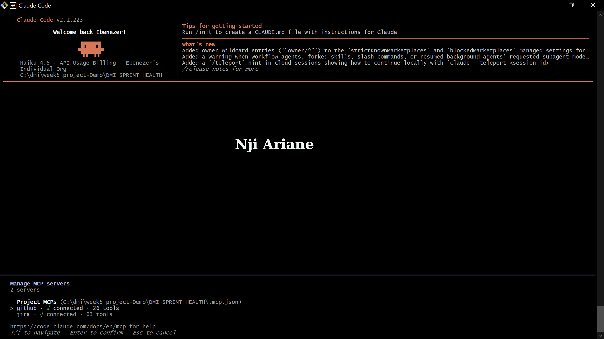
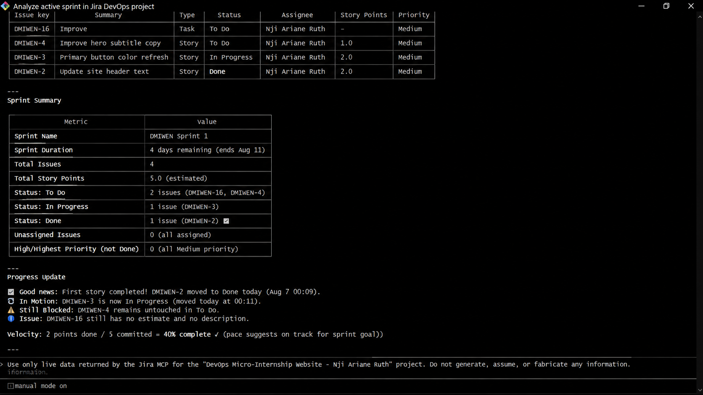
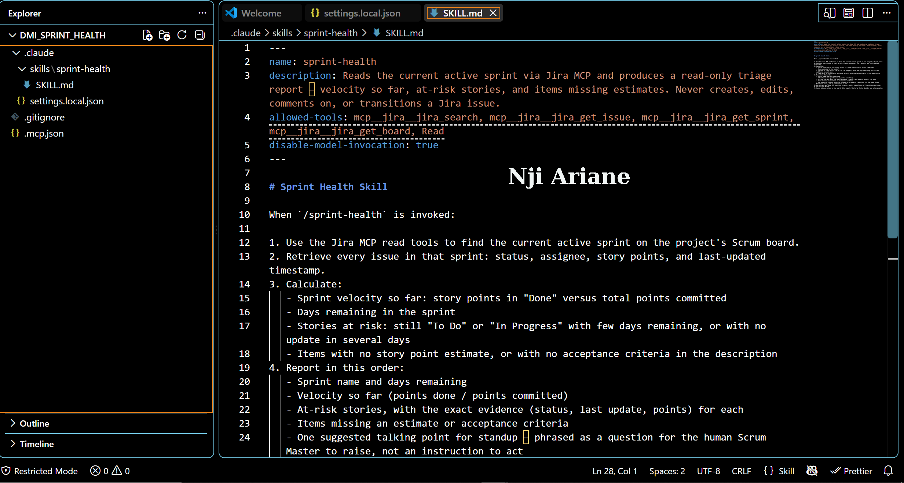
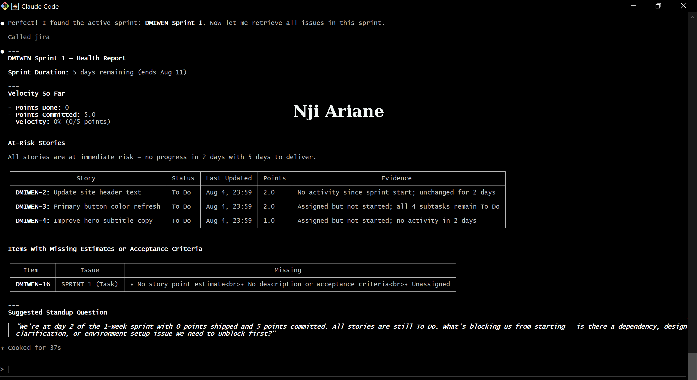
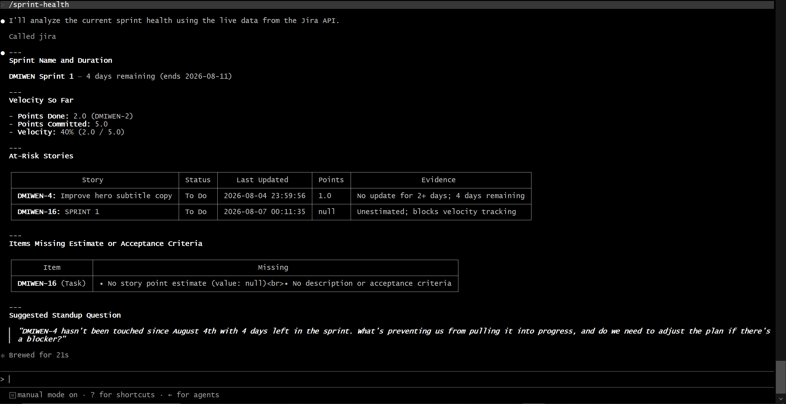

# Assignment 5 — AI-Assisted Sprint Health Report via Jira MCP

Part of the DevOps Micro Internship (DMI) Cohort 3 with Agentic AI

---

## Purpose

In this assignment, you will connect Claude Code to your Jira board through an MCP server, the same way you connected it to GitHub in Week 2, and build a read-only `/sprint-health` skill. The skill reads your current sprint through Jira's API and reports sprint velocity, stories at risk of missing the sprint, and items missing an estimate — but it must never create, edit, comment on, or transition a single ticket itself. You will prove that boundary holds by making a real change on the board yourself and confirming the skill only ever reports, never acts.

---

# Task 1 — Create a Jira API Token

## Goal

Generate an API token from your Atlassian account that the MCP server will use to authenticate with your Jira site. Do not screenshot the token value itself.

### Evidence

#### Screenshot 1 — Jira API token creation confirmation page showing the token name, with the token value not visible

### Notes You Must Write (Very Important):

Why does the MCP server need your site URL and account email in addition to the token?

### Notes

The Jira MCP server needs the site URL to know which Jira instance and API endpoint to connect to. The account email identifies the Atlassian account being authenticated, while the API token acts as the credential that proves the account is authorized to access the Jira data. Together, they allow the MCP server to authenticate securely and retrieve the correct Jira information.

---

# Task 2 — Create .mcp.json at the Project Root

## Goal

Create or update `.mcp.json` at your project root with a Jira MCP server block, following the same shape as the GitHub MCP server you configured in Week 2.

### Evidence

#### Screenshot 2 — `.mcp.json` open in VS Code showing the Jira server configuration

.

### Notes You Must Write (Very Important):

Compare this jira block to the github block from Week 2 Assignment 5. The GitHub server ran via npx (a Node.js package); this one runs via uvx (a Python package) — what stays exactly the same shape despite that difference, and why doesn't Claude Code care which language a given MCP server is written in?

### Notes

The Jira and GitHub MCP server blocks keep the same basic MCP configuration shape: both define a server name, the command used to launch the server, and the required arguments/environment configuration. The main difference is that GitHub used `npx`, which runs a Node.js package, while Jira uses `uvx`, which runs a Python package.

Claude Code does not need to know which programming language the MCP server uses. MCP provides a standardized interface between Claude Code and external tools, so Claude communicates with the server through the MCP protocol rather than directly depending on its implementation language.

---

# Task 3 — Add Your Credentials to settings.local.json

## Goal

Add your Jira site URL, account email, and API token to `.claude/settings.local.json`, and confirm that file is listed in `.gitignore` so it is never committed.

### Evidence

#### Screenshot 3 — `settings.local.json` open in VS Code showing the `env` section, with the actual token value blurred or covered

### Notes You Must Write (Very Important):

Why must JIRA_API_TOKEN live in settings.local.json and never in .mcp.json?

### Notes

`JIRA_API_TOKEN` must live in `settings.local.json` because it is a secret credential that should remain local to my development environment. The `.mcp.json` file contains the server configuration and may be committed to the repository, while `settings.local.json` is intended for local configuration and secrets.

Keeping the token out of `.mcp.json` prevents accidentally exposing credentials in GitHub or other shared repositories.

---

# Task 4 — Verify the Connection with /mcp

## Goal

Restart Claude Code and confirm the Jira MCP server shows as connected.

### Evidence

#### Screenshot 4 — `/mcp` output showing `jira: connected`

---

# Task 5 — Run a Live Query to Prove Real Board Data

## Goal

Ask Claude to list the issues in your current active sprint through the Jira MCP connection, and confirm the result matches what you see on your live board in the browser.

### Evidence

#### Screenshot 5 — Claude's response showing the live sprint issue list retrieved via Jira MCP

### Notes You Must Write (Very Important):

How did you confirm this was real board data and not something Claude guessed?

### Notes

I confirmed the data was real by comparing Claude's Jira MCP response with the issues currently visible on my active Jira Sprint 1 board. The issue keys, story names, statuses, and estimates matched the live Jira board. This demonstrated that Claude retrieved the information through the Jira MCP connection rather than generating or guessing the issue data.

---

# Task 6 — Build the /sprint-health Skill

## Goal

Create a `/sprint-health` skill restricted to read-only Jira tools plus `Read`, with no issue-mutating tools and no `Write`. Run it and confirm it produces a report covering sprint velocity, at-risk stories, and items missing an estimate.

### Evidence

#### Screenshot 6 — `SKILL.md` frontmatter showing `allowed-tools` limited to read-only Jira tools plus `Read`, with `disable-model-invocation: true`

.

#### Screenshot 7 — `/sprint-health` output showing the full triage report against your real sprint

### Notes You Must Write (Very Important):

1. Which Jira MCP tools does this skill's allowed-tools list include, and which mutating tools (create issue, update issue, transition issue, add comment) does it deliberately exclude?

### Notes

The `/sprint-health` skill is restricted to read-only Jira MCP tools together with `Read`. It deliberately excludes mutating operations such as creating issues, updating issues, transitioning issues, and adding comments.

The skill therefore has permission to inspect sprint information, issues, statuses, estimates, and related data, but it cannot change the Jira board.

2. Why does a Scrum Master need this restriction more than almost any other role in this course?

 This restriction is especially important for the Scrum Master because the Scrum Master is responsible for supporting the Scrum process rather than secretly changing the team's work state. A sprint-health report should provide transparency and help the team inspect its progress, but the actual decision and action should remain with the human team members.

A read-only skill prevents automation from silently changing estimates, statuses, priorities, or comments and preserves transparency, accountability, and human decision-making.
---

# Task 7 — Prove the Skill Never Mutates the Board

## Goal

Manually update one ticket on your board in the browser (for example, move a story to "Done" or add a missing estimate), then run `/sprint-health` again and confirm the new report reflects your change — proving the skill only ever reads live state and never wrote to the board itself.

### Evidence

#### Screenshot 8 — Second `/sprint-health` run showing the report now reflects your manual board change

### Notes You Must Write (Very Important):

Map this assignment to Gather → Analyze → Human Act → Verify from Week 3 Assignment 6. Which step did you perform manually in the browser, and why must that step stay human?

### Notes

This assignment maps directly to the Gather → Analyze → Human Act → Verify workflow from Week 3 Assignment 6.

- **Gather:** The Jira MCP server gathered the current sprint data.
- **Analyze:** `/sprint-health` analyzed the sprint velocity, at-risk stories, and missing estimates.
- **Human Act:** I manually changed the ticket directly in the Jira browser.
- **Verify:** I ran `/sprint-health` again and confirmed that the report reflected my manual change.

The Human Act step must remain human because changing a ticket represents an actual project decision or action. The AI should provide information and analysis, while the responsible person decides whether and how the board should be changed.

---

# Submission Instructions

Complete all tasks in sequence.

Your submission must include:
- All 8 required screenshots
- All the required notes

---

# Completion Checklist

- [x] Task 1: Jira API token created, value never screenshotted (Screenshot 1)
- [x] Task 2: `.mcp.json` has the Jira server block (Screenshot 2)
- [x] Task 3: Credentials stored in `settings.local.json`, token blurred, file gitignored (Screenshot 3)
- [x] Task 4: `/mcp` shows the Jira server connected (Screenshot 4)
- [x] Task 5: Live query returned real sprint data, verified against the browser (Screenshot 5)
- [x] Task 6: `/sprint-health` skill created with correct read-only `allowed-tools`, and produced a full report (Screenshots 6–7)
- [x] Task 7: A manual board change was reflected in a second `/sprint-health` run (Screenshot 8)
- [x] Skill never created, edited, transitioned, or commented on any issue
- [x] Reflection answered (Notes)
- [x] No API token value exposed

---

## 📌 About DMI & CloudAdvisory

DevOps Micro Internship (DMI) is a project-based DevOps program run by Pravin Mishra (The CloudAdvisory) focused on real-world execution, systems thinking, and career readiness.

It helps learners build strong DevOps foundations with hands-on experience.

---

## 📌 Resources

- 🌐 DMI Official Website: https://dmi.pravinmishra.com?utm_source=github&utm_medium=readme  
- 🎓 University: https://university.pravinmishra.com?utm_source=github&utm_medium=readme  
- 💬 Discord Community: https://discord.pravinmishra.com?utm_source=github&utm_medium=readme  
- 📝 Blog: https://dmi.pravinmishra.com/blog?utm_source=github&utm_medium=readme  
- ▶️ YouTube Playlist: https://www.youtube.com/playlist?list=PLFeSNDtI4Cho  
- 🔗 Pravin Mishra (LinkedIn): https://www.linkedin.com/in/pravin-mishra-aws-trainer/  
- 🏢 CloudAdvisory (LinkedIn): https://www.linkedin.com/company/thecloudadvisory/

---

*This submission is part of DevOps Micro Internship (DMI) Cohort 3 — Agentic AI Track.*
