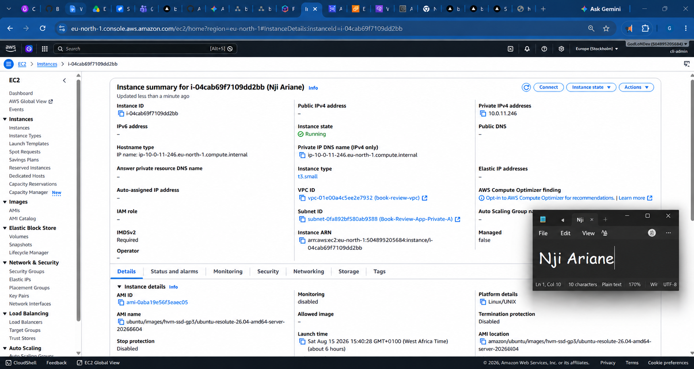
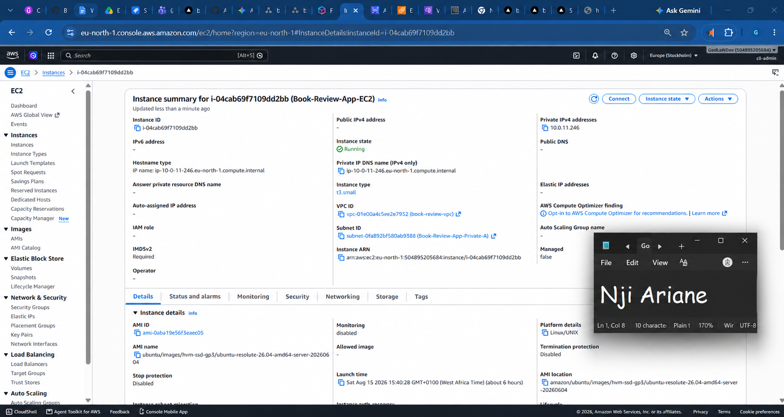
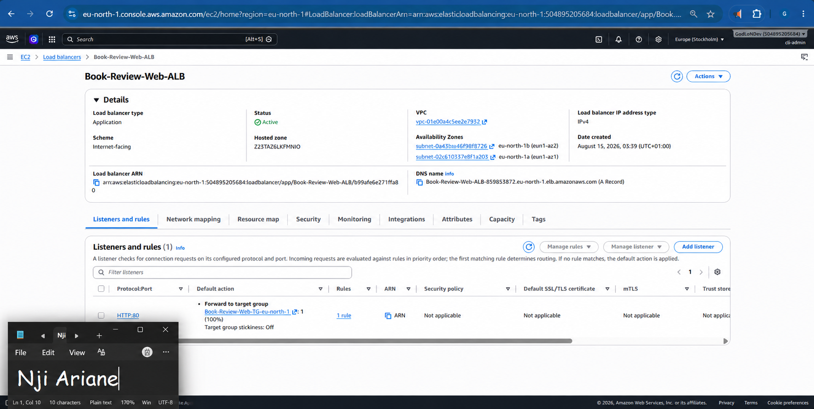
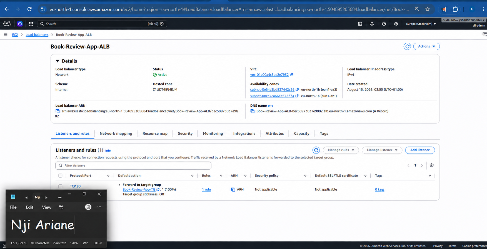
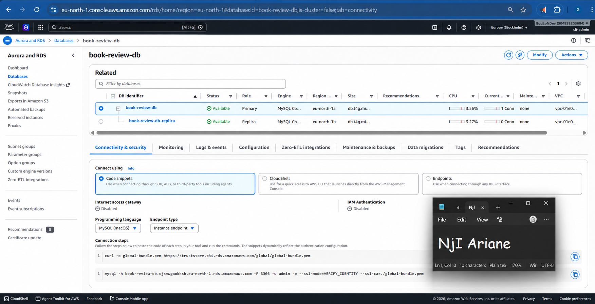
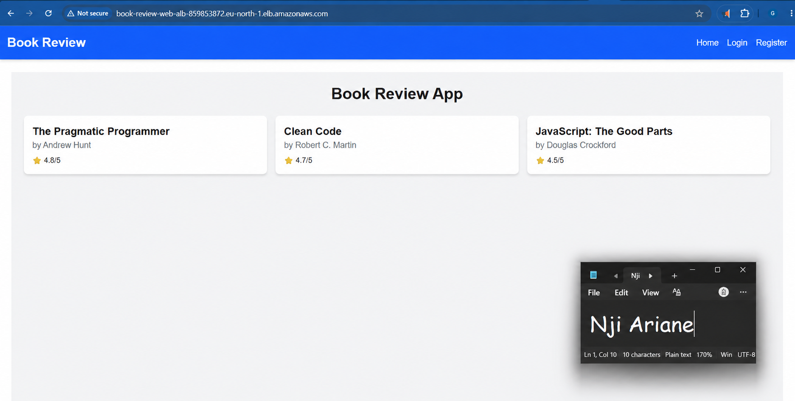
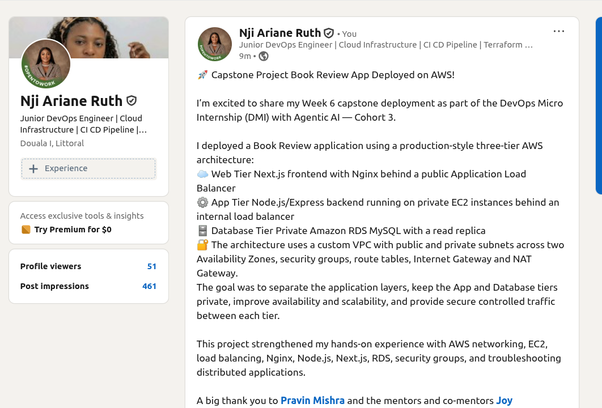

# Assignment 6 — Capstone Assignment — Deploy Book Review App (Three-Tier Architecture) on AWS

Part of the DevOps Micro Internship (DMI) with Agentic AI

---

## Purpose

This is the most important assignment of the course. You will deploy the Book Review App in a fully production-style three-tier architecture on AWS: a Next.js Web Tier behind Nginx and a public ALB, a private Node.js/Express App Tier behind an internal ALB, and a private Multi-AZ MySQL RDS database with a read replica. You are expected to design, deploy, isolate, debug, and document the result independently.

---

# Task 1 — Architecture Diagram

## Goal

Create an architecture diagram showing the custom VPC (10.0.0.0/16), the six subnets across two Availability Zones (two public Web Tier, two private App Tier, two private Database Tier), the public ALB, Web Tier EC2/Nginx, internal ALB, private App Tier EC2, private Multi-AZ RDS with its read replica, and the permitted traffic flow.

### Evidence

#### Diagram image or link

https://drive.google.com/file/d/1F_AesO0v7Mvvni5KR9SYfB8b54HVe1Eg/view?usp=sharing

---

# Task 2 — AWS Region & Services Used

## Goal

Record the AWS Region used and list every AWS service used across networking, compute, load balancing, security, and the database.

### Notes

**Region:**

`eu-north-1 (Europe - Stockholm)`

---

**Services:**

- Amazon VPC
- Amazon EC2
- Elastic Load Balancing — Application Load Balancer (ALB)
- Amazon RDS for MySQL
- Amazon RDS Read Replica
- Internet Gateway
- NAT Gateway
- Amazon EBS
- Amazon CloudWatch
- Security Groups

---

# Task 3 — Public Entry Point

## Goal

Confirm the Book Review App loads through the public ALB DNS name.

### Evidence

#### Public ALB DNS

Book-Review-Web-ALB-859853872.eu-north-1.elb.amazonaws.com

---

# Task 4 — Evidence Screenshots

## Goal

Capture visual proof of every tier and load balancer.

### Evidence

#### Web EC2

---

#### App EC2

---

#### Public ALB

---

#### Internal ALB

---

#### RDS + Replica

---

#### App UI proof

---

# Task 5 — Summary

## Goal

Summarize what worked in the final deployment, the issues encountered and how each was fixed, and the tools or sources used to research and debug.

### Notes

**What worked:**

The Book Review application was successfully deployed on AWS using a three-tier architecture. The deployment separates the Web Tier, App Tier, and Database Tier within a custom VPC.

The Web Tier runs the Book Review frontend behind an internet-facing Application Load Balancer. The App Tier runs the backend on private EC2 instances behind an internal load balancer, while the MySQL database runs privately in Amazon RDS with a read replica.

The application was successfully accessed through the public ALB DNS, and the Book Review interface loaded successfully in the browser. The database and application resources were kept private and were not exposed directly to the internet.

**Issues + fixes:**

During the deployment, configuration and connectivity issues were investigated across the different application layers. The troubleshooting process involved checking EC2 networking, security-group rules, load-balancer target groups, application connectivity, and database configuration.

Security-group rules were configured so that traffic is allowed only between the required tiers. The Web Tier accepts traffic from the public load balancer, the App Tier accepts application traffic from the internal load balancer, and the database accepts MySQL traffic only from the App Tier.

Load-balancer target health and application connectivity were also checked during troubleshooting to ensure that traffic was reaching the correct backend resources.

---

**Tools/sources used:**

- AWS Management Console
- Amazon VPC
- Amazon EC2
- Elastic Load Balancing
- Amazon RDS for MySQL
- AWS Security Groups
- AWS Route Tables
- Internet Gateway
- NAT Gateway
- Linux/Ubuntu terminal
- Nginx
- Node.js / Express
- Next.js
- GitHub
- AWS Documentation
- DMI course resources and community guidance

---

# LinkedIn Post (Required)

## Goal

Publish a LinkedIn post sharing the capstone deployment, including the public ALB DNS (or a redacted screenshot), three to five lines on what you built and why it is production-style, and one proof screenshot.

## Evidence

#### LinkedIn Post URL

https://www.linkedin.com/posts/nji-ariane-ruth-494805172_aws-devops-cloudcomputing-activity-7506075694708293632-Ab2L?utm_source=share&utm_medium=member_desktop&rcm=ACoAACkN5HAB_6uWL_--MIEwRhEZ_BLCaqDxIoo

---

#### Screenshot of LinkedIn post

---

# Submission Instructions

- Add all required screenshots and links in your submission
- Do not expose passwords, RDS credentials, connection strings, private keys, or account IDs

---

# Completion Checklist

- [x] Task 1: Architecture diagram completed
- [x] Task 2: AWS Region and services documented
- [x] Task 3: Public ALB DNS confirmed working
- [x] Task 4: All six evidence screenshots captured (Web Tier, App Tier, both ALBs, RDS + replica, app UI)
- [x] Task 5: Deployment summary completed (what worked, issues/fixes, tools/sources)
- [x] LinkedIn post published and URL submitted
- [x] App Tier and Database Tier confirmed not publicly accessible
- [x] No sensitive data exposed

---

## 📌 About DMI & CloudAdvisory

DevOps Micro Internship (DMI) is a project-based DevOps program run by Pravin Mishra (The CloudAdvisory) focused on real-world execution, systems thinking, and career readiness.

It helps learners build strong DevOps foundations with hands-on experience.

---

## 📌 Resources

- 🌐 DMI Official Website: https://dmi.pravinmishra.com?utm_source=github&utm_medium=readme  
- 🎓 University: https://university.pravinmishra.com?utm_source=github&utm_medium=readme  
- 💬 Discord Community: https://discord.pravinmishra.com?utm_source=github&utm_medium=readme  
- 📝 Blog: https://dmi.pravinmishra.com/blog?utm_source=github&utm_medium=readme  
- ▶️ YouTube Playlist: https://www.youtube.com/playlist?list=PLFeSNDtI4Cho  
- 🔗 Pravin Mishra (LinkedIn): https://www.linkedin.com/in/pravin-mishra-aws-trainer/  
- 🏢 CloudAdvisory (LinkedIn): https://www.linkedin.com/company/thecloudadvisory/

---

*This submission is part of DevOps Micro Internship (DMI) — Agentic AI Track.*
