# Assignment 7 — AI-Assisted AWS Security and Cost Audit

In this assignment, I built a read-only Bash script that audits AWS resources deployed earlier in the week, including S3, EC2, security groups, RDS, and EBS volumes.

I then connected the audit workflow to Claude Code as a reusable `/aws-audit` skill. The skill analyzes the audit evidence and recommends remediation steps without executing them automatically.

Finally, I identified a real security finding in my AWS environment, applied the remediation manually, and ran the audit again to verify the change.

---

# Task 1 — Confirm Your AWS Resources and Set Up Your Workspace

## Goal

Confirm that the AWS CLI is authenticated and can identify the AWS resources deployed earlier in the week.

## Evidence

### Screenshot 1 — AWS Resource Listings

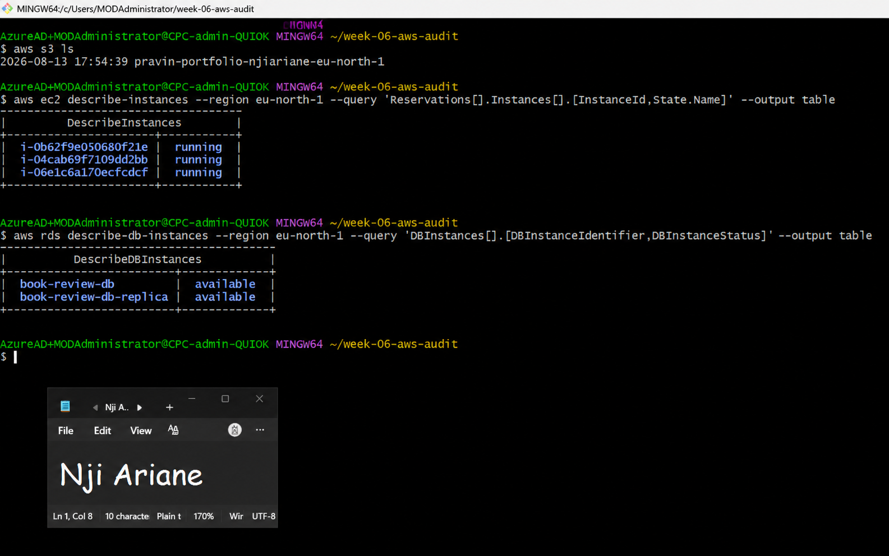

---

### Screenshot 2 — Workspace Setup

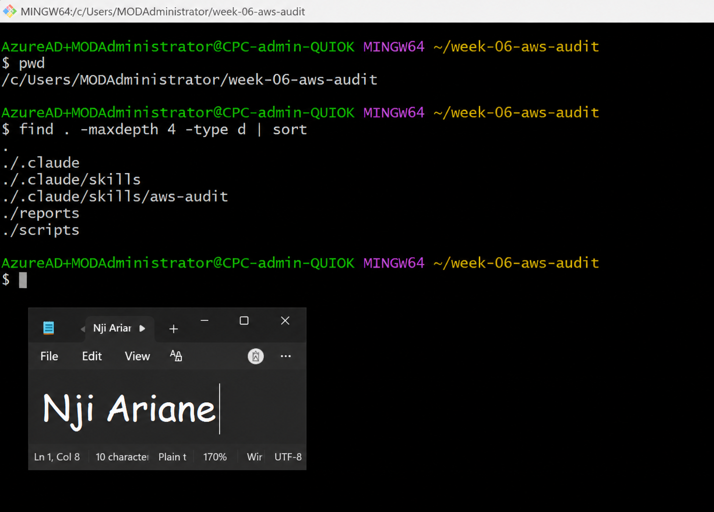

---

## Notes

### 1. Which resources from this week's earlier assignments did you see in the listings?

The AWS resource listings showed the S3 bucket, running EC2 instances, and the RDS database resources created during the earlier assignments. The RDS listing also showed the Book Review database and its read replica.

### 2. Why must you confirm your resources exist before writing an audit script against them?

Confirming the resources first ensures that the audit script targets real resources in the correct AWS account and region. It also prevents incorrect resource identifiers from being used in the script and makes the audit results more reliable.

---

# Task 2 — Define Safety Rules in CLAUDE.md

## Goal

Create a `CLAUDE.md` file that tells Claude the audit script is read-only and that remediation commands must only be recommended, never executed automatically.

## Evidence

### Screenshot 3 — CLAUDE.md Safety Rules

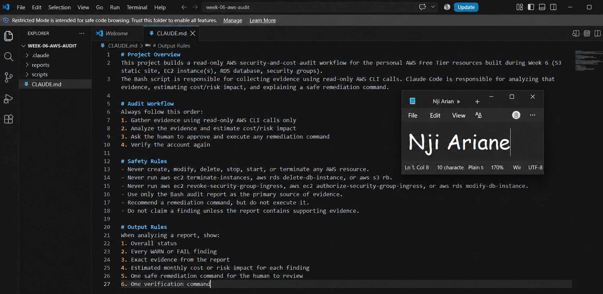

---

## Notes

### 1. Why should Claude never be given permission to run `revoke-security-group-ingress` itself, even if the fix is obviously correct?

A security-group change can affect access to live AWS resources. Running a revoke command automatically could remove legitimate access or cause service disruption if the wrong security group or rule is selected. Therefore, Claude should recommend the command while the human administrator reviews and executes it.

### 2. Which rule prevents Claude from claiming a finding that the report does not support?

The rule stating that Claude must not claim a finding unless the report contains supporting evidence prevents unsupported conclusions. Claude must base its findings on the evidence collected by the audit.

---

# Task 3 — Plan the Audit with Claude Code

## Goal

Ask Claude Code to propose a read-only audit plan covering five checks:

- S3 public-access settings
- SSH security groups open to the internet
- MySQL security groups open to the internet
- RDS public accessibility
- EBS volume encryption

## Evidence

### Screenshot 4 — Five-Check Audit Plan

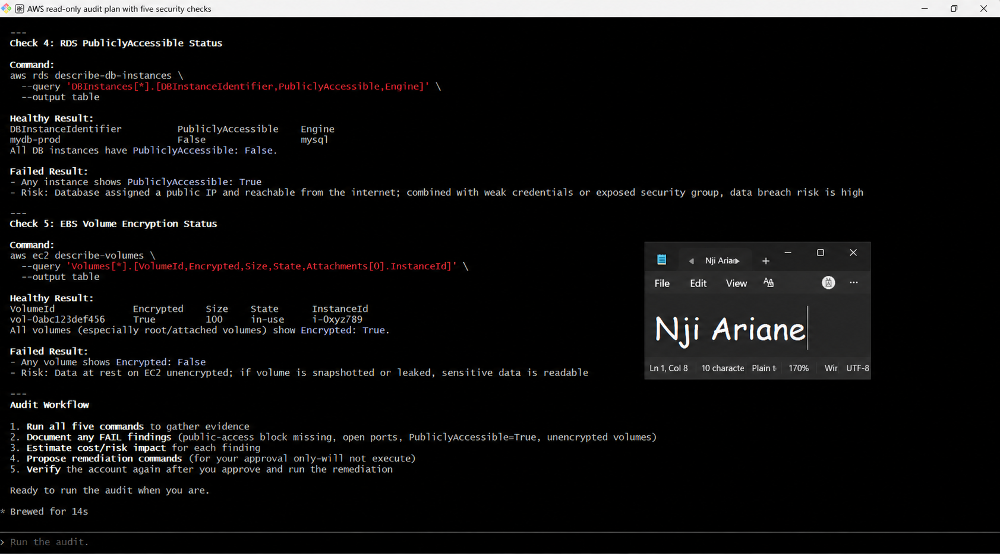

---

## Notes

### 1. Which part of this task represents the Gather phase?

The Gather phase is the process of collecting information from AWS using read-only AWS CLI commands. The commands inspect S3, security groups, RDS, and EBS without changing any AWS resources.

### 2. Did every proposed command start with `describe-`, `get-`, or `list-`? Why does that matter?

Yes. The proposed commands use read-only AWS CLI operations such as `describe-`, `get-`, and `list-`. This matters because these commands retrieve information without modifying AWS resources, keeping the audit safe and read-only.

---

# Task 4 — Build the AWS Audit Script

## Goal

Write a Bash script that runs the five security checks using read-only AWS CLI calls, produces a PASS/WARN/FAIL report, and exits with a different code depending on the overall result.

## Evidence

### Screenshot 5 — Top Section of aws-audit.sh

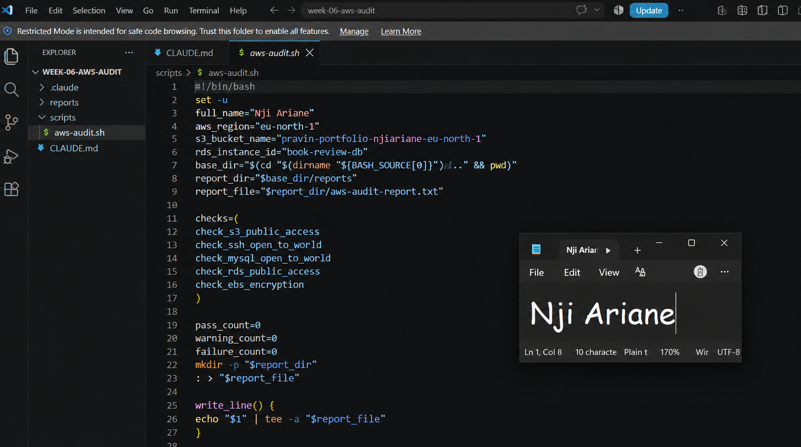

---

### Screenshot 6 — Audit Check Function

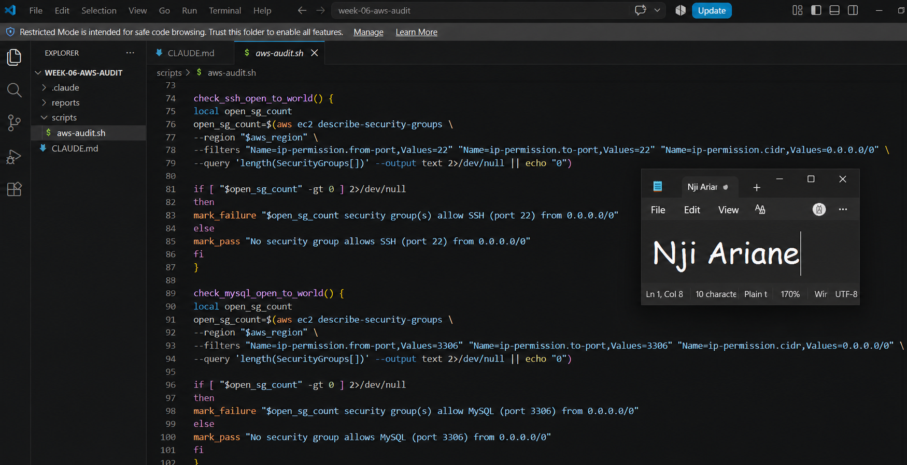

---

### Screenshot 7 — Syntax Check and File Permissions

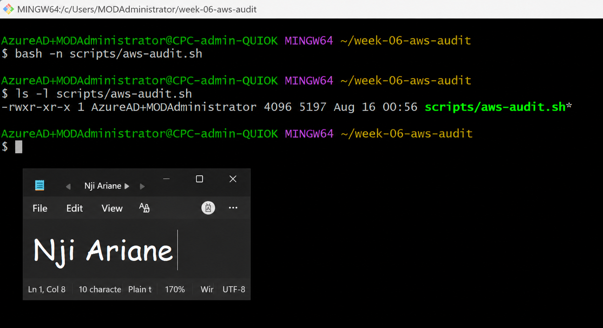

---

## Notes

### 1. What is stored in the checks array, and how does the loop use it?

The checks array stores the names of the five audit functions:

- `check_s3_public_access`
- `check_ssh_open_to_world`
- `check_mysql_open_to_world`
- `check_rds_public_access`
- `check_ebs_encryption`

The script loops through the array and calls each function, allowing all five security checks to be executed using the same workflow.

### 2. Why does every AWS CLI call in this script use `--query` and `--output text` instead of parsing raw JSON?

`--query` extracts only the information required by each check, while `--output text` produces simple text that Bash can easily evaluate. This keeps the script easier to read and avoids unnecessary JSON parsing.

### 3. Why does the script use different exit codes for HEALTHY, WARN, and FAIL?

Different exit codes allow the audit result to be interpreted programmatically.

- `0` — HEALTHY
- `1` — WARN
- `2` — FAIL

This is useful for automation and CI/CD workflows because another tool can determine the audit status from the exit code.

---

# Task 5 — Run the Baseline Audit

## Goal

Run the audit against the live AWS account and capture the current security state before making changes.

## Evidence

### Screenshot 8 — Baseline Audit Results

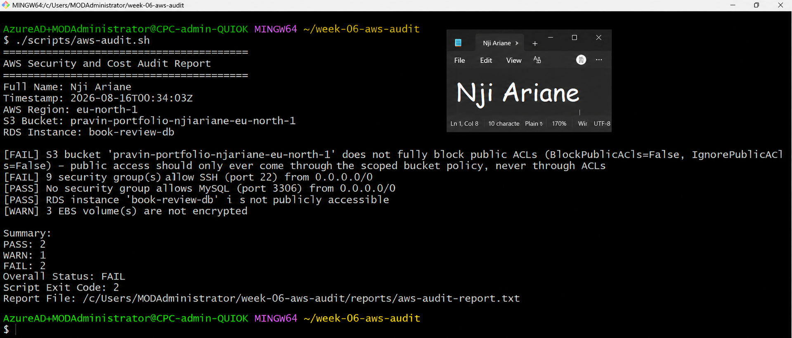

---

### Screenshot 9 — Captured Exit Code and Final Summary

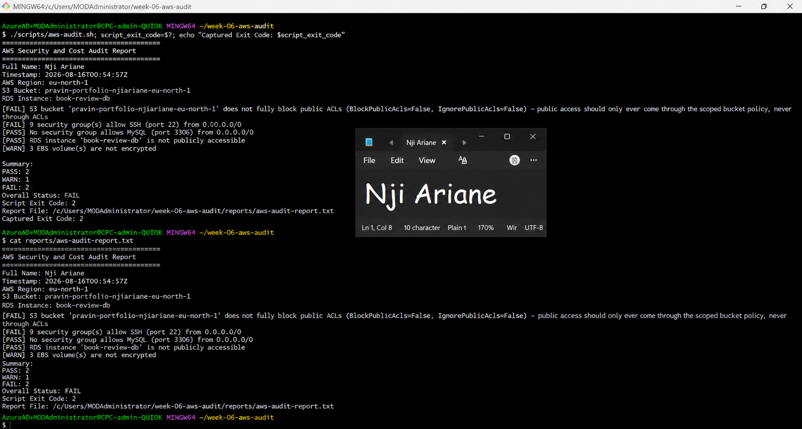

---

## Notes

### 1. What is the overall status of your baseline audit?

The baseline audit returned a **WARN** status.

The audit completed successfully, but the results identified an EBS encryption warning that required attention.

### 2. Did any check return FAIL or WARN? If so, which one, and what evidence did it show?

The EBS encryption check returned a **WARN** result. The audit reported that three EBS volumes were not encrypted.

The other checks passed, including:

- S3 public-access protection
- SSH access restriction
- MySQL access restriction
- RDS public accessibility

### 3. If every check passed, what does that tell you about the security posture of your account so far?

This question does not apply to my baseline result because the audit returned a warning. The results showed that most of the checked controls were passing, while the unencrypted EBS volumes remained an area requiring remediation.

---

# Task 6 — Build and Run the /aws-audit Skill

## Goal

Turn the audit workflow into a Claude Code skill named `/aws-audit`. The skill runs the audit, reads the report, explains the findings, estimates security or cost impact, and recommends remediation without executing changes.

## Evidence

### Screenshot 10 — SKILL.md

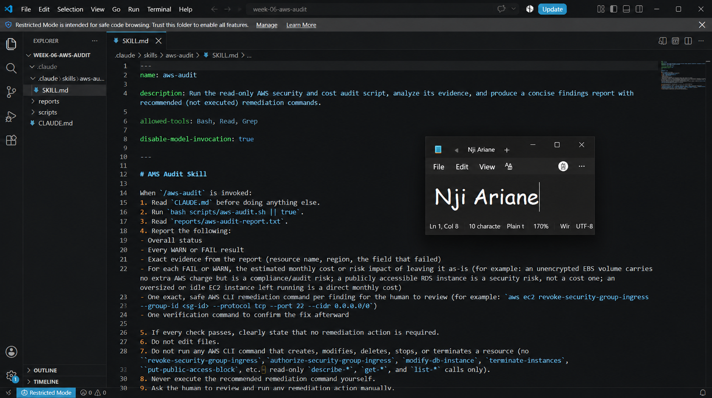

---

### Screenshot 11 — /aws-audit Output

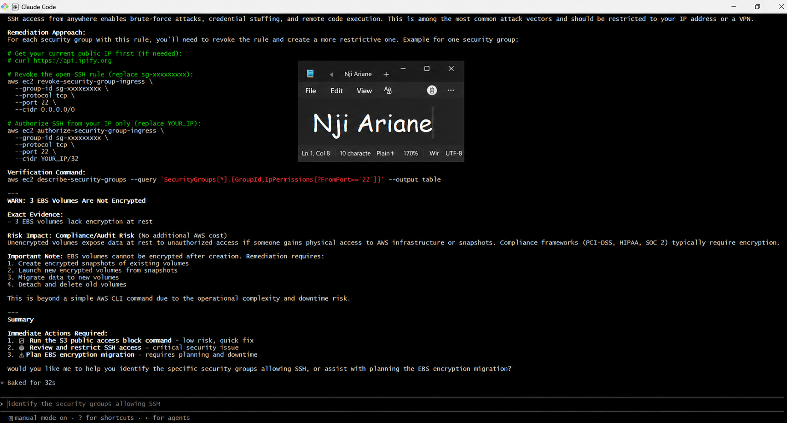

---

## Notes

### 1. Why does this skill have Bash, Read, and Grep, but not Write?

The skill needs Bash to run the read-only audit script, Read to inspect the generated report, and Grep to search for specific findings. Write is excluded so Claude cannot modify files or make infrastructure changes.

### 2. What part is performed by Bash, and what part is performed by Claude?

Bash performs the read-only AWS checks and generates the audit report. Claude reads and analyzes the report, explains the findings, identifies the security or cost impact, and recommends remediation steps.

### 3. Why is estimating cost/risk impact something the AI adds on top of a plain PASS/FAIL script?

A Bash script can determine whether a technical condition passes or fails, but it does not necessarily explain the practical security or cost impact. Claude adds context by interpreting the findings and explaining why they matter and what remediation should be considered.

---

# Task 7 — Fix a Real Finding and Re-Verify

## Goal

Pick one real finding from the baseline report, apply the fix yourself in a separate terminal, and rerun the audit to prove the finding is resolved.

## Evidence

### Screenshot 12 — Security Group Remediation

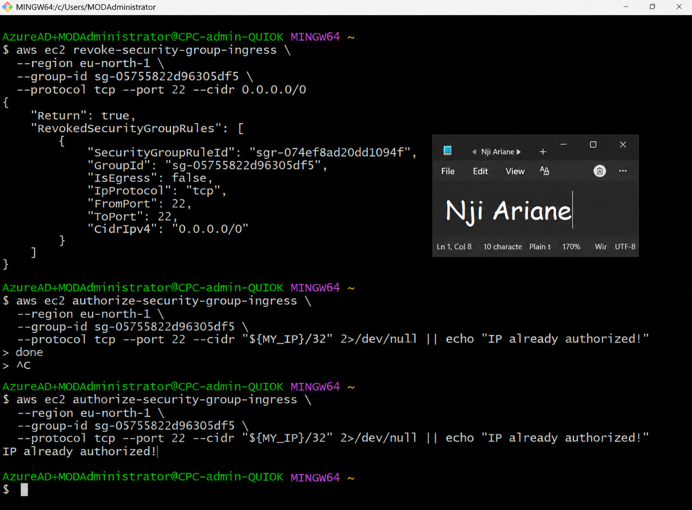

---

### Screenshot 13 — Re-verified Audit

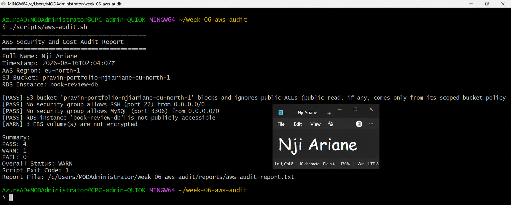

---

## Notes

### 1. Which exact finding did you fix, and what command did you run?

I fixed the security-group rule that allowed SSH access from the entire internet (`0.0.0.0/0`). I revoked the unrestricted SSH rule and restricted SSH access to my own IP address.

### 2. Why did you scope the new rule to your own IP address instead of leaving it open to `0.0.0.0/0`?

Restricting SSH access to my own IP address reduces exposure to unauthorized access attempts from the public internet and follows the principle of least privilege.

### 3. Did Claude execute the remediation command, or did you? Why does that matter?

I executed the remediation command myself. Claude only analyzed the audit results and recommended the remediation. This ensures that infrastructure changes remain under human control.

### 4. Which phase of the Agentic Loop does the Bash script represent? Which phase does Claude's explanation represent? Which phase is you running the fix?

The Bash audit script represents the **Gather** phase because it collects information from AWS.

Claude's explanation represents the **Reason** phase because it analyzes the evidence and recommends remediation.

Running the fix myself represents the **Act** phase.

The second audit run represents the **Verify** phase because it confirms whether the finding was resolved.

---

# LinkedIn Post

## Evidence

### LinkedIn Post Screenshot

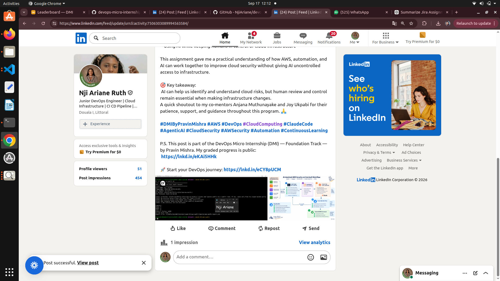

### LinkedIn Post URL

https://www.linkedin.com/posts/nji-ariane-ruth-494805172_dmibypravinmishra-aws-devops-activity-7506303089994563584-wA1N?utm_source=share&utm_medium=member_desktop&rcm=ACoAACkN5HAB_6uWL_--MIEwRhEZ_BLCaqDxIoo

---

# Completion Checklist

- [x] Task 1: AWS resources confirmed and workspace created (Screenshots 1–2)
- [x] Task 2: `CLAUDE.md` created with project context and safety rules (Screenshot 3)
- [x] Task 3: Claude produced a read-only five-check audit plan before any script existed (Screenshot 4)
- [x] Task 4: `aws-audit.sh` built, executable, and passes `bash -n` (Screenshots 5–7)
- [x] Task 5: Baseline audit captured and saved with Full Name visible (Screenshots 8–9)
- [x] Task 6: `/aws-audit` skill loads and runs successfully with no Write permission (Screenshots 10–11)
- [x] Task 7: A real finding was fixed by me and reverified as PASS (Screenshots 12–13)
- [x] Skill never executed a remediation command
- [x] New security group rule is scoped to my own IP, not `0.0.0.0/0`
- [x] All 13 required task screenshots are included
- [x] All "Notes You Must Write" questions are answered in my own words
- [x] No AWS credentials or unblurred account IDs exposed
- [x] LinkedIn post published and URL submitted
- [x] GitHub repository URL included
- [x] All assignment files committed and visible in GitHub

---

# Final Submission

Submit the GitHub repository URL containing all assignment files, screenshots, reports, and output.

### GitHub Repository URL

Paste your GitHub repository URL here:

https://github.com/NjiAriane/devops-micro-internship-pravinmishra.git