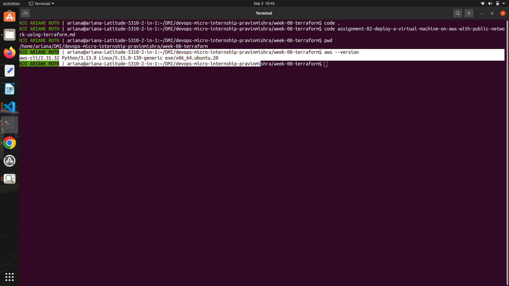
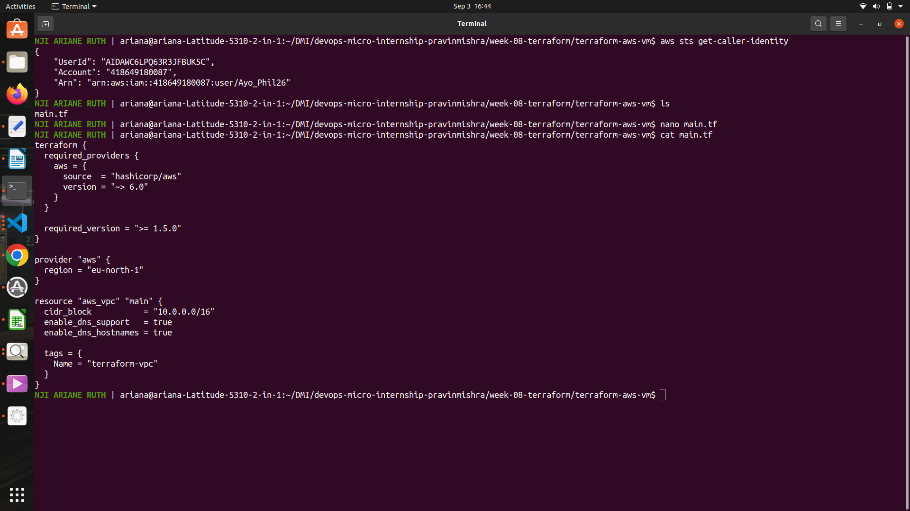
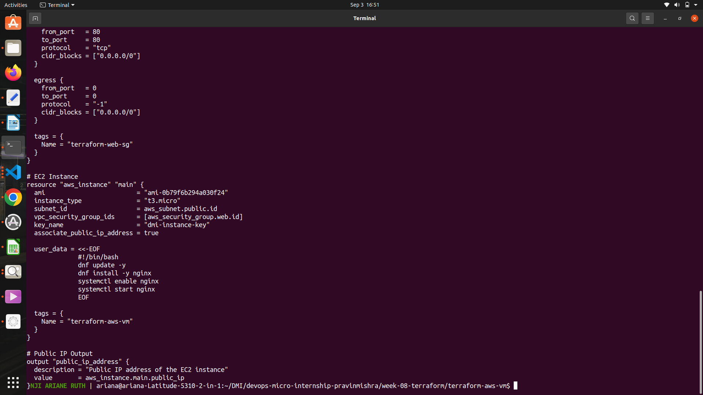
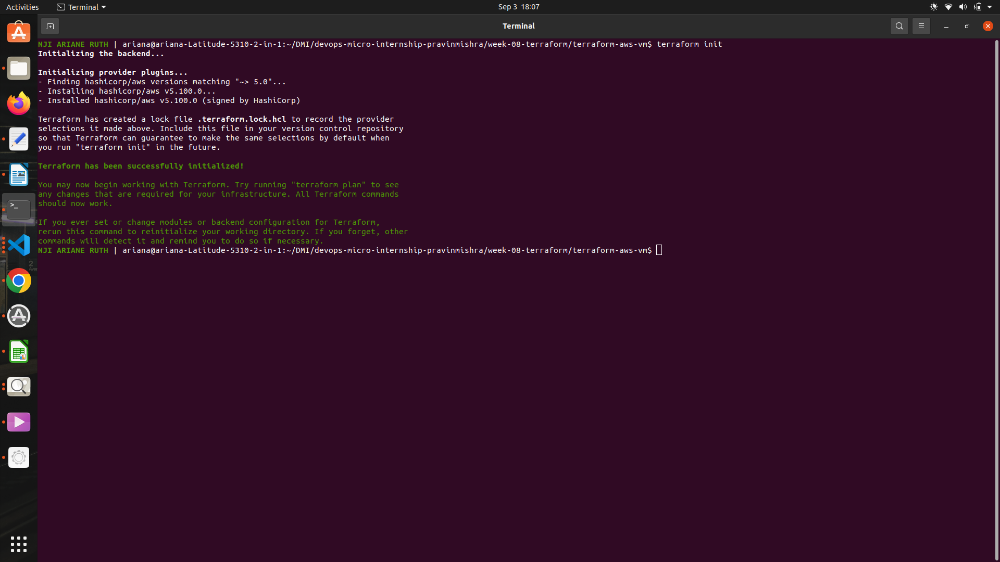
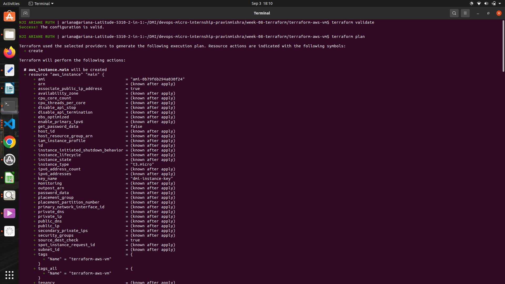
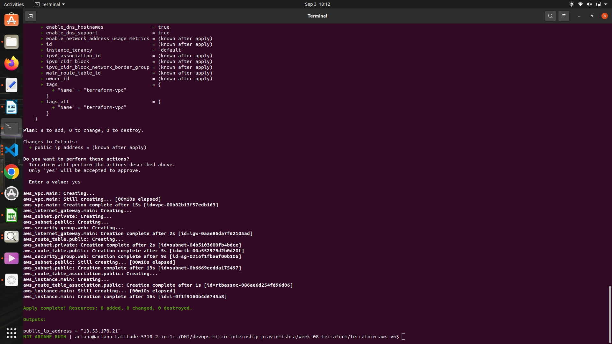
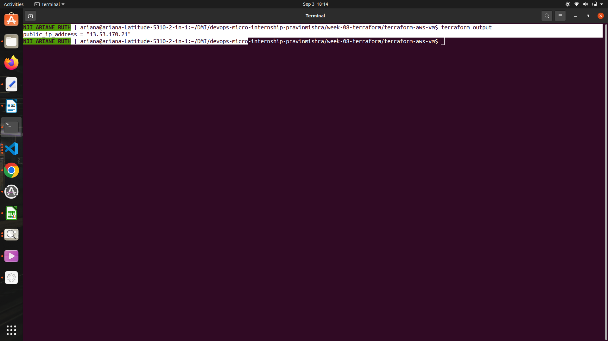
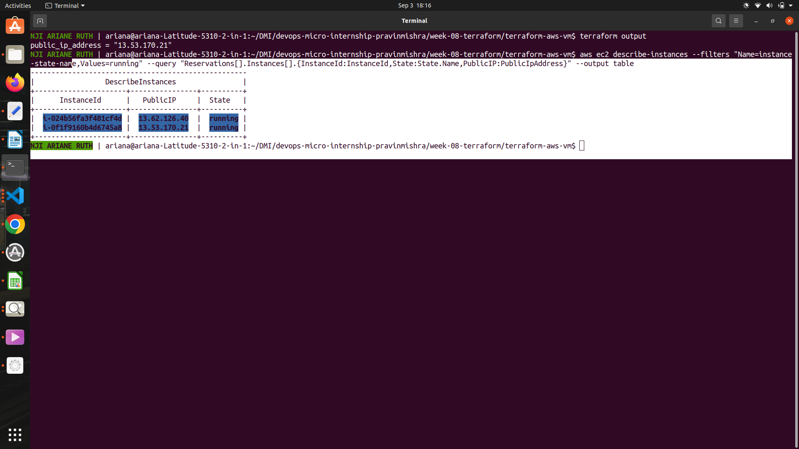
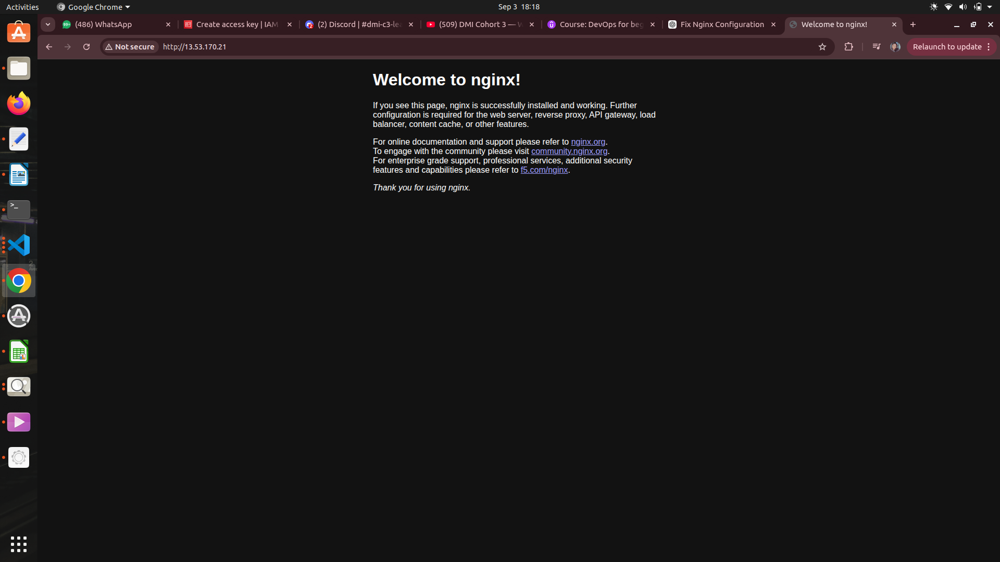
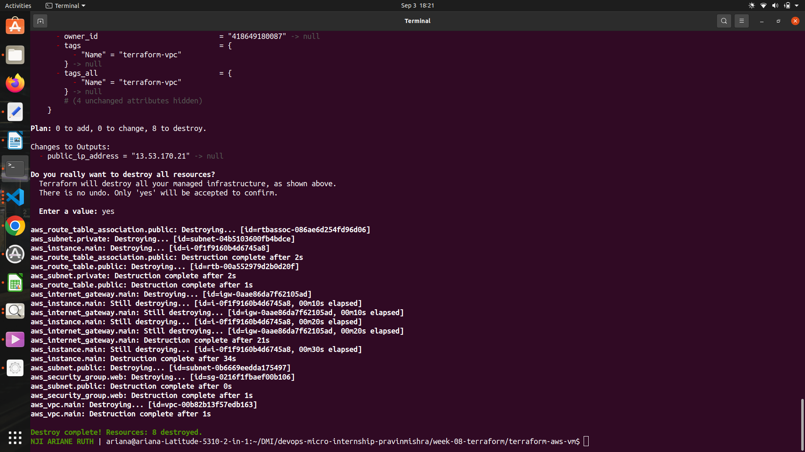

# Assignment 2 — Create an AWS EC2 Virtual Machine Using Terraform

Part of the DevOps Micro Internship (DMI) Cohort 3 with Agentic AI

---

## Purpose

In this assignment, I used Terraform to provision a complete AWS environment consisting of a custom VPC, public and private subnets, an Internet Gateway, a public route table, a security group, and an EC2 instance deployed inside the public subnet.

I configured SSH and HTTP access, installed Nginx, captured the EC2 instance's public IP address, verified the deployment using AWS CLI and a web browser, and destroyed all Terraform-managed resources after testing.

---

# Task 0 — Set Up and Verify the Terraform and AWS CLI Environment

## Goal

Prepare the local environment for Terraform deployment by installing Terraform, AWS CLI, and the HashiCorp Terraform extension in VS Code, configuring AWS CLI, and confirming that all required tools are working correctly.

### Evidence

#### Screenshot 1 — AWS CLI Version

The terminal shows the successful `aws --version` command.

---

# Task 1 — Create a New Terraform Project and Define the Infrastructure

## Goal

Create a new Terraform project and define the complete AWS EC2 environment in `main.tf`.

The configuration includes:

* Terraform and AWS provider configuration
* Custom VPC using the CIDR block `10.0.0.0/16`
* Public subnet using the CIDR block `10.0.1.0/24`
* Private subnet using the CIDR block `10.0.2.0/24`
* Internet Gateway
* Public route table with a route to `0.0.0.0/0`
* Public subnet route table association
* Security group allowing SSH on port `22`
* Security group allowing HTTP on port `80`
* EC2 instance deployed inside the public subnet
* SSH authentication configuration
* Public IP address association
* Public IP output block

### Evidence

#### Screenshot 2 — AWS Provider and VPC Configuration

The `main.tf` file shows the AWS provider configuration and VPC resources.

---

#### Screenshot 3 — EC2 and Public IP Configuration

The `main.tf` file shows the EC2 instance configuration and the public IP output block.

---

# Task 2 — Initialize Terraform

## Goal

Initialize the Terraform working directory and download the required provider components.

### Evidence

#### Screenshot 4 — Successful Terraform Init

The terminal shows that `terraform init` completed successfully.

---

# Task 3 — Plan and Apply the Configuration

## Goal

Review the Terraform execution plan, provision the AWS resources, and record the EC2 instance's public IP address.

### Evidence

#### Screenshot 5 — Terraform Plan

The terminal shows the Terraform execution plan for the AWS infrastructure.

---

#### Screenshot 6 — Terraform Apply

The terminal shows the successful completion of `terraform apply`.

---

#### Screenshot 7 — Terraform Output

The terminal shows the public IP address returned by Terraform.

### EC2 Public IP Address

The public IP address returned by Terraform was:

**`13.53.170.21`**

---

# Task 4 — Verify the Deployment

## Goal

Verify that the EC2 instance was created successfully and is running using AWS CLI, and confirm that Nginx is accessible through the instance's public IP address.

### Evidence

#### Screenshot 8 — AWS CLI EC2 Verification

The AWS CLI output shows the EC2 instance ID, running state, and public IP address.

---

#### Screenshot 9 — Nginx Browser Verification

The browser successfully displays the Nginx page using the EC2 instance's public IP address.

---

# Task 5 — Destroy the Resources

## Goal

Remove all AWS resources created by Terraform after completing the deployment and verification.

### Evidence

#### Screenshot 10 — Terraform Destroy

The terminal shows the successful completion of `terraform destroy`.

---

# Submission Instructions

* Complete all tasks in sequence.
* Include all 10 required screenshots.
* Ensure that your full name is visible where required.
* Record the EC2 public IP address in Task 3.
* Ensure that the submitted evidence clearly matches each task.
* Do not expose AWS access keys, secret keys, private keys, passwords, or account IDs.
* Do not upload the `.pem` private key to the GitHub repository.
* Review the submission carefully before submitting it.

---

# Completion Checklist

* [x] Installed AWS CLI and verified it using `aws --version`
* [x] Configured AWS CLI and verified account access
* [x] Confirmed the correct AWS Region
* [x] Installed and enabled the HashiCorp Terraform extension in VS Code
* [x] Created the `terraform-aws-vm` project directory and `main.tf`
* [x] Added the Terraform and AWS provider configuration
* [x] Defined the custom VPC, public subnet, and private subnet
* [x] Configured the Internet Gateway and public route table
* [x] Associated the public route table with the public subnet
* [x] Defined the security group for SSH and HTTP access
* [x] Defined the EC2 instance inside the public subnet
* [x] Configured SSH authentication without exposing the private key
* [x] Added the Terraform output for the EC2 public IP address
* [x] Completed `terraform init` successfully
* [x] Reviewed the Terraform execution plan using `terraform plan`
* [x] Completed `terraform apply` successfully
* [x] Captured and recorded the EC2 public IP using `terraform output`
* [x] Verified that the EC2 instance is running using AWS CLI
* [x] Verified that the AWS public IP matches the Terraform output
* [x] Verified Nginx access through the EC2 public IP
* [x] Completed `terraform destroy` successfully
* [x] Captured all 10 required screenshots
* [x] Checked that no AWS credentials, private keys, passwords, or account IDs are visible
* [x] Confirmed that no `.pem` private key file has been uploaded to the GitHub repository

---

## 📌 About DMI & CloudAdvisory

DevOps Micro Internship (DMI) is a project-based DevOps program run by Pravin Mishra (The CloudAdvisory), focused on real-world execution, systems thinking, and career readiness.

It helps learners build strong DevOps foundations through hands-on experience.

---

## 📌 Resources

* 🌐 DMI Official Website: https://dmi.pravinmishra.com
* 🎓 University: https://university.pravinmishra.com
* 💬 Discord Community: https://discord.pravinmishra.com
* 📝 Blog: https://dmi.pravinmishra.com/blog
* ▶️ YouTube Playlist: https://www.youtube.com/playlist?list=PLFeSNDtI4Cho
* 🔗 Pravin Mishra (LinkedIn): https://www.linkedin.com/in/pravin-mishra-aws-trainer/
* 🏢 CloudAdvisory (LinkedIn): https://www.linkedin.com/company/thecloudadvisory/

---

*This submission is part of the DevOps Micro Internship (DMI) Cohort 3 — Agentic AI Track.*